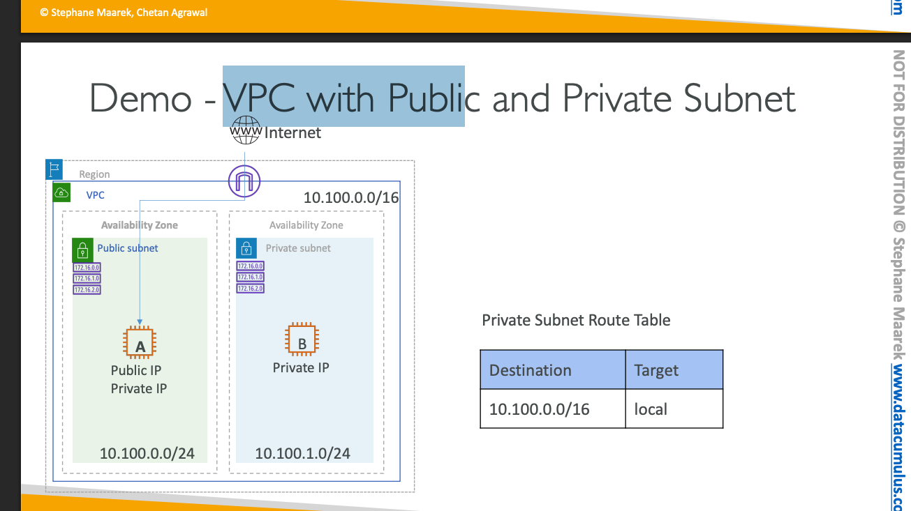

- create vpc - 10.100.0.0/16
- create internet gateway
- create 2 subnets
    - one public - 10.100.0.0/24 in az1
    - one private - 10.10.1.0/24 in az2
- create 2 route tables
    - route_table_1 (public)
        - default
        - 0.0.0.0/0 to internetgateway for subnet one
    - route_table_2 (private)
        - default
 
- 2 security groups
    - sg_1 -> public
        - inbound -> my_local_machine_ip -> ssh
    - sg_2 -> private
        - inbound -> sg_1 -> ssh 
        - inbount -> sg_1 -> dhcp (ipv4) for ping

- 2 ec2 instances
    - ec2_public 
    - ec2_private

<!-- Add Image -->
