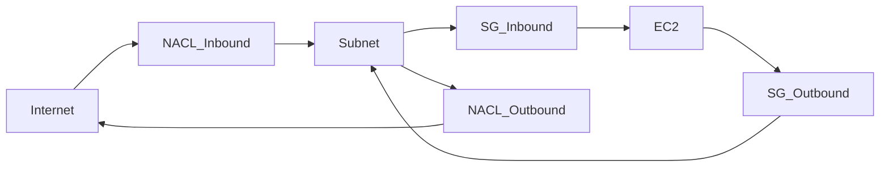
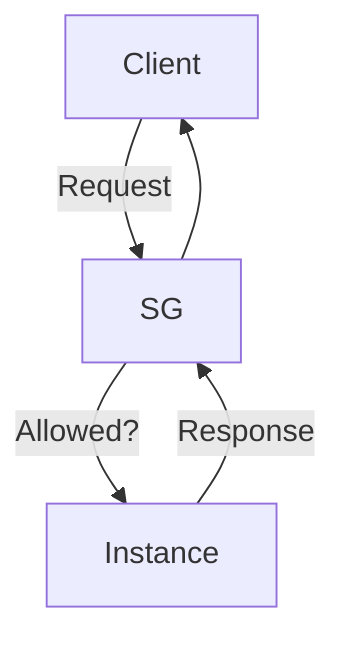
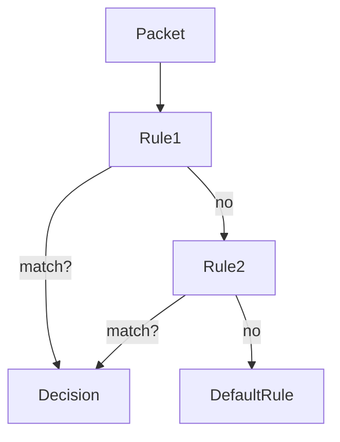
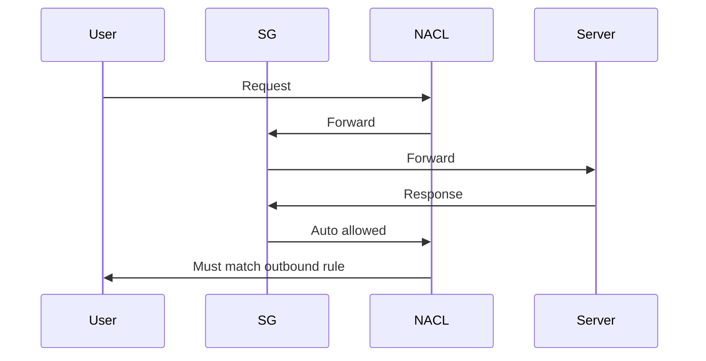
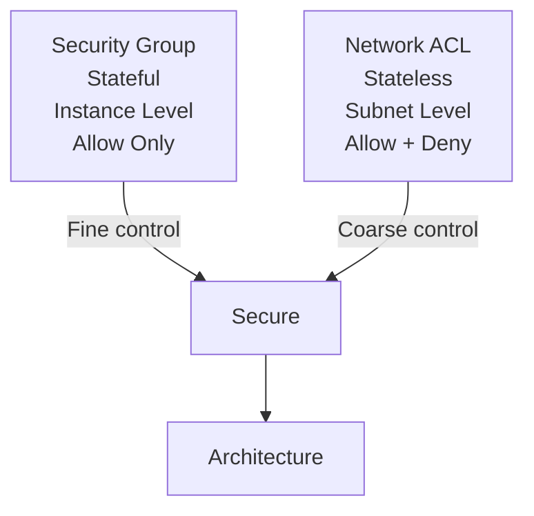

A VPC (Virtual Private Cloud) lives inside a Region. A Region is a geographical area like Mumbai or Frankfurt. Inside a Region, you have Availability Zones (AZs). AZs are physically separate data centers. Think: Region = city, AZ = separate power-grid-protected buildings inside that city.

VPC → tied to one Region only.
Subnets → tied to one Availability Zone only.

A VPC can span multiple AZs. A subnet cannot.

Now the IP brain.

CIDR (Classless Inter-Domain Routing) is how you define your VPC’s address space.

Format:
IP_ADDRESS / prefix_length

Example:
10.0.0.0/16

The “/16” means first 16 bits are network bits. Remaining bits are for hosts.

Total addresses = 2^(32 - prefix)
For /16 → 2^(32-16) = 2^16 = 65,536 total
Usable hosts in normal networking = 65,536 - 2 = 65,534

But here’s the twist many people forget:

In AWS, 5 IP addresses per subnet are reserved. Not 2.

So a /24 subnet in AWS:
2^(32-24) = 256 total
Usable in AWS = 256 - 5 = 251

Why? AWS reserves:

* Network address
* VPC router
* DNS
* Future use
* Broadcast

Cloud networking is practical, not textbook-pure.

Now let’s architect properly.

VPC Building Blocks (cleaned up)

1. VPC
   Your logically isolated network. You define CIDR here (example: 10.0.0.0/16).

2. Subnets
   Smaller segments of the VPC’s IP range. Each subnet:

   * Lives in one AZ
   * Has its own CIDR (must be within VPC range)
   * Can be public or private

Example splitting:
VPC: 10.0.0.0/16

Public Subnet AZ-1: 10.0.0.0/24
Private Subnet AZ-1: 10.0.1.0/24
Public Subnet AZ-2: 10.0.2.0/24
Private Subnet AZ-2: 10.0.3.0/24

Notice pattern. Clean, scalable, predictable.

3. Route Tables
   Route tables decide where traffic goes.

Each route table contains:
Destination → Target

Example:
0.0.0.0/0 → Internet Gateway
10.0.0.0/16 → local

“local” is automatically created and allows internal VPC communication.

Subnets are associated with route tables. That association defines whether a subnet is public or private.

4. Internet Gateway (IGW)
   An IGW is attached to the VPC (not subnet).

It allows:

* Public subnets to reach the internet
* Internet to reach instances (if security rules allow)

Public subnet =
Has route:
0.0.0.0/0 → IGW
AND
Instance has public IP

Without both, it’s not truly public.

5. NAT Gateway
   Used by private subnets.

It allows:
Private instances → internet
Internet → cannot initiate connection back

NAT Gateway must:

* Be in a public subnet
* Have an Elastic IP
* Private route table points:
  0.0.0.0/0 → NAT Gateway

It’s like a one-way mirror. You can see outside. Outside cannot see you.

6. VPC Endpoints
   Allow private access to AWS services without internet.

Two main types:

* Gateway Endpoint (S3, DynamoDB)
* Interface Endpoint (PrivateLink)

This removes need for:

* NAT
* IGW
* Public IP

Your traffic stays inside AWS backbone. Lower latency, better security.

7. Security Groups
   Stateful firewall. Applied at instance level.

Stateful means:
If inbound allowed, response outbound is automatically allowed.

You define:

* Inbound rules
* Outbound rules

Security Groups are allow-only. No deny rules.

They are like bouncers with a whitelist.

8. Network ACLs (NACLs)
   Stateless firewall at subnet level.

Stateless means:
If you allow inbound 80,
You must explicitly allow outbound ephemeral ports.

NACLs support:

* Allow
* Deny
* Rule order matters

Security Groups = instance guard
NACLs = subnet gate

Now the “scope” question.

Which AWS services live inside a VPC?

Inside VPC:

* EC2
* RDS
* ECS tasks (when using awsvpc mode)
* EKS nodes
* Lambda (if configured for VPC)
* ElastiCache

Outside VPC (managed public service layer):

* S3
* DynamoDB
* IAM
* CloudFront
* Route 53

But VPC Endpoints let you privately connect to many of them.

Now let’s sharpen CIDR splitting logic.

If VPC is:
10.0.0.0/16

And you want 4 equal subnets:

You increase prefix by 2 bits (because 2^2 = 4)

So:
10.0.0.0/18
10.0.64.0/18
10.0.128.0/18
10.0.192.0/18

Each /18 gives:
2^(32-18) = 2^14 = 16,384 addresses
Usable in AWS = 16,384 - 5 = 16,379

Binary thinking makes this easier:
Every bit you add to prefix halves the network.

Add 1 bit → split into 2
Add 2 bits → split into 4
Add 3 bits → split into 8

Networking is just disciplined binary arithmetic wearing a suit.

Final architectural mental model:

VPC = your private continent
Subnets = cities
Route tables = road rules
IGW = airport
NAT = outbound customs desk
Security Groups = house-level locks
NACL = city border checkpoint
VPC Endpoint = private tunnel to Amazon’s internal warehouse

Cloud networking is like hosting a party in a fortress floating in hyperspace. Two bouncers guard your packets: **Security Groups** and **Network ACLs**. They both decide who gets in and out, but they think very differently about trust. Understanding their personalities is the key to mastering AWS network security.

---

# The Core Idea (Mental Model)

**Security Group = Stateful firewall attached to instances**
**NACL = Stateless firewall attached to subnets**

Stateful means *it remembers conversations*. Stateless means *every packet must prove itself each time*. That one distinction explains almost everything.

---

# Architecture View

Traffic must pass:

**Inbound:** NACL → SG → Instance
**Outbound:** Instance → SG → NACL

If *any* layer blocks → packet dies a silent death.

---

# Security Groups — The Polite Gatekeepers

Think of them as guest lists for individual servers.

Key traits:

• Stateful
• Allow rules only (no explicit deny)
• Attached to ENIs (network interfaces / instances)
• Evaluates **all rules before deciding**
• Response traffic automatically allowed

If you allow inbound port 80, return traffic is automatically allowed even if outbound rules don’t mention it. Memory is power.

---

### Example Rule Set

| Type | Port | Source    |
| ---- | ---- | --------- |
| HTTP | 80   | 0.0.0.0/0 |
| SSH  | 22   | Your IP   |

Means:

* Anyone can access web server
* Only you can SSH

---

# Network ACLs — The Suspicious Border Guards

They guard **subnets**, not machines. They trust nothing.

Key traits:

• Stateless
• Supports Allow **and Deny**
• Rules evaluated **in order (lowest number first)**
• Must explicitly allow response traffic
• Attached to subnet

If inbound port 80 is allowed, you must also allow outbound ephemeral ports (1024–65535) or responses fail.

Stateless logic is brutally literal.

---

# Stateful vs Stateless Conversation

SG remembers. NACL re-checks.

---

# Differences That Matter in Real Life

Security Groups feel like **application-level trust policies**.
NACLs feel like **network perimeter firewalls**.

| Feature     | Security Group   | NACL      |
| ----------- | ---------------- | --------- |
| Stateful    | Yes              | No        |
| Allow rules | Yes              | Yes       |
| Deny rules  | No               | Yes       |
| Applies to  | Instance         | Subnet    |
| Rule order  | Ignored          | Important |
| Default     | Deny all inbound | Allow all |

---

# Default Behavior

Default Security Group
→ denies inbound
→ allows outbound

Default NACL
→ allows everything both ways

Which means a brand-new VPC is surprisingly open at subnet level but locked down at instance level.

---

# Real Production Pattern

Most architectures use:

• **Security Groups = primary protection**
• **NACLs = coarse safety net**

Example philosophy:

> SG handles application logic
> NACL handles “block entire IP ranges” or emergency isolation

---

# Practical Scenario Walkthrough

You run a web server.

Requirements:

* Public can access HTTP
* SSH only from office
* Block known malicious IP

Solution:

Security Group

* Allow HTTP 80 from 0.0.0.0/0
* Allow SSH 22 from office IP

NACL

* Deny malicious IP
* Allow rest

SG can’t deny. NACL can. That’s why both exist.

---

# When People Misconfigure Things

Most common mistake:

> “My port is open in Security Group but still not reachable.”

Cause:
NACL outbound or inbound missing rule.

Second most common:

> “SSH works but responses time out.”

Cause:
NACL missing ephemeral port range.

---

# Golden Rules Engineers Memorize

Security Group mindset:

> Allow only what you need.

NACL mindset:

> Block what you distrust.

---

# Visualization Summary

---

# Best Practice Strategy Used by Cloud Architects

Minimal NACL rules + strict Security Groups.

Reason:
Stateful logic is easier to reason about. Stateless rules scale poorly and cause debugging nightmares.

Many large companies leave NACLs mostly open and rely almost entirely on SGs plus WAF + Load Balancer rules.

---

# A Thought Experiment

Imagine networks as medieval castles.

Security Groups = guards at each room door
NACL = guards at castle gate

If a spy slips past the gate but room guards check IDs, the system survives. If gate is strict but rooms are open, intruders roam freely.

Defense in depth means both.

---

# Final Mental Shortcut

If debugging connectivity:

Step 1 → Check SG
Step 2 → Check NACL
Step 3 → Check Route Tables

Packets travel like bureaucrats through offices. One missing stamp and they never arrive.

---

If you want to level up further, the next layer of wizardry is combining these with Load Balancers, PrivateLink, and VPC endpoints to build networks where nothing public exists yet everything talks.
