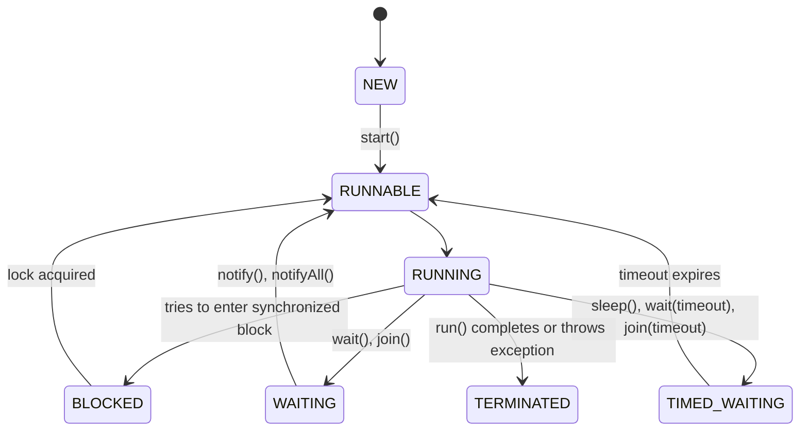
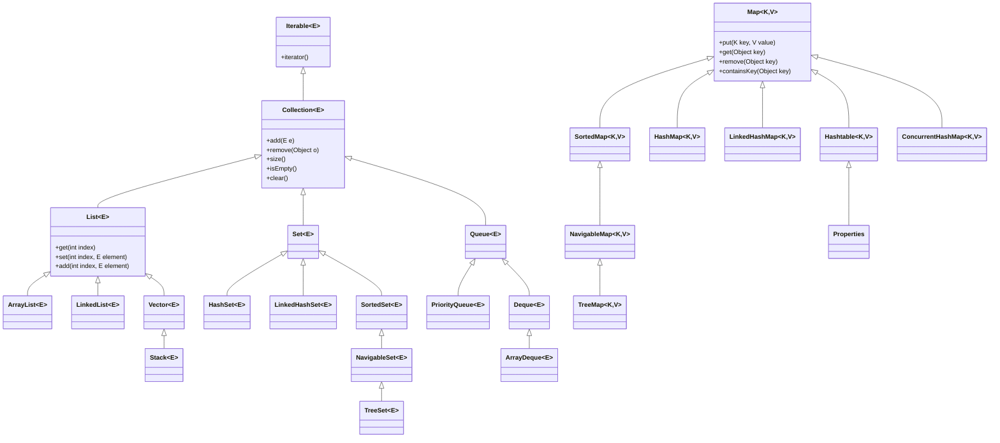

# 🧠 Java Data Types – Basic Theory

In Java, **data types** specify the kind of data a variable can hold. They are categorized into two main types:

---

### 1. Primitive Data Types

Java has **8 primitive data types** which are predefined by the language and named by a keyword.

| Type     | Description                            | Size        | Example              |
|----------|----------------------------------------|-------------|-----------------------|
| `byte`   | 8-bit signed integer                   | 1 byte      | `byte a = 100;`       |
| `short`  | 16-bit signed integer                  | 2 bytes     | `short s = 20000;`    |
| `int`    | 32-bit signed integer (default int)    | 4 bytes     | `int x = 10;`         |
| `long`   | 64-bit signed integer                  | 8 bytes     | `long l = 123456789L;`|
| `float`  | 32-bit floating point                  | 4 bytes     | `float f = 5.6f;`     |
| `double` | 64-bit floating point (default double) | 8 bytes     | `double d = 10.99;`   |
| `char`   | 16-bit Unicode character               | 2 bytes     | `char c = 'A';`       |
| `boolean`| true or false values                   | ~1 bit      | `boolean b = true;`   |

---

### 2. Non-Primitive (Reference/Object) Data Types

These refer to objects and include:

- **Strings** – e.g., `String name = "Java";`
- **Arrays** – e.g., `int[] arr = {1, 2, 3};`
- **Classes** – e.g., `Car myCar = new Car();`
- **Interfaces** and **Enums**

**Key Differences from Primitive Types:**

- Stored as references (memory address).
- Can be `null`.
- Provide built-in methods (e.g., `name.length()` for Strings).

---

### 🧾 Notes

- Java is **statically typed**, so every variable must be declared with a type.
- **Default values** exist for primitives (e.g., `int` → `0`, `boolean` → `false`).
- Use **wrapper classes** like `Integer`, `Double`, etc., to work with primitives as objects (e.g., in collections).


## 🔁 Type Casting in Java (Primitive Data Types)

**Type casting** is the process of converting one data type into another. In Java, it applies to **compatible data types only** and is of two types:

---

### 1. Implicit Type Casting (Widening Conversion)

- Automatically done by Java.
- Converts a smaller type to a larger type (no data loss).
- Example: `byte` → `short` → `int` → `long` → `float` → `double`

#### ✅ Example:
```java
int x = 100;
double y = x; // int to double (automatic)
System.out.println(y); // Output: 100.0
```


```java
double a = 9.7;
int b = (int) a; // double to int (manual)
System.out.println(b); // Output: 9 (fraction lost)


int big = 130;
byte small = (byte) big;
System.out.println(small); // Output: -126 (due to overflow)
char c = 'A';
int ascii = (int) c; // 65
char again = (char) 66; // 'B'
System.out.println(ascii); // 65
System.out.println(again); // B


```

| From Type | To Type  | Casting Type | Example                    |
| --------- | -------- | ------------ | -------------------------- |
| `int`     | `double` | Implicit     | `double d = intVal;`       |
| `double`  | `int`    | Explicit     | `int i = (int) doubleVal;` |
| `char`    | `int`    | Implicit     | `int ascii = c;`           |
| `int`     | `char`   | Explicit     | `char c = (char) i;`       |


## 📈 Type Promotion in Java

**Type promotion** is a process where smaller data types are automatically promoted to larger types during operations to prevent data loss.

---

### 🔧 When It Happens

1. In expressions with different data types.
2. During arithmetic calculations.
3. When assigning to a larger compatible type.

---

### 🔁 Promotion Rules

- `byte`, `short`, `char` → automatically promoted to `int`
- If one operand is `long` → result is `long`
- If one operand is `float` → result is `float`
- If one operand is `double` → result is `double`

---

### 🧪 Examples

#### 1. `byte` to `int`
```java
byte a = 10;
byte b = 20;
// byte c = a + b; // Compile error
int c = a + b;     // Works because of promotion to int
```

## 🔣 Java Operators: Assignment, Relational, Logical

Java provides various operators to perform operations on variables and values. Here, we'll focus on:

- Assignment Operators
- Relational (Comparison) Operators
- Logical Operators

---

### 🟢 1. Assignment Operators

Used to assign values to variables.

| Operator | Description              | Example                |
|----------|--------------------------|----------------        |
| `=`      | Assign                   | `a = 10`               |
| `+=`     | Add and assign           | `a += 5` → `a = a + 5` |
| `-=`     | Subtract and assign      | `a -= 3` → `a = a - 3` |
| `*=`     | Multiply and assign      | `a *= 2` → `a = a * 2` |
| `/=`     | Divide and assign        | `a /= 4` → `a = a / 4` |
| `%=`     | Modulus and assign       | `a %= 3` → `a = a % 3` |

#### ✅ Example:
```java
int x = 10;
x += 5; // x becomes 15


```

### 🔵 Relational Operators

| Operator | Description           | Example  | Result     |
| -------- | --------------------- | -------- | ---------- |
| `==`     | Equal to              | `a == b` | true/false |
| `!=`     | Not equal to          | `a != b` | true/false |
| `>`      | Greater than          | `a > b`  | true/false |
| `<`      | Less than             | `a < b`  | true/false |
| `>=`     | Greater than or equal | `a >= b` | true/false |
| `<=`     | Less than or equal    | `a <= b` | true/false |

```java
int a = 10, b = 20;
System.out.println(a < b); // true
System.out.println(a == b); // false

```


### 🟠 3. Logical Operators

| Operator | Description | Example           | Result            |         |   |         |                     |
| -------- | ----------- | ----------------- | ----------------- | ------- | - | ------- | ------------------- |
| `&&`     | Logical AND | `a > 5 && a < 10` | true if both true |         |   |         |                     |
| \|\|`       |             | \`                | Logical OR        | \`a > 5 |   | a < 3\` | true if one is true |
| `!`      | Logical NOT | `!(a > 5)`        | inverts result    |         |   |         |                     |


```java
    int a = 8;
    System.out.println(a > 5 && a < 10); // true
    System.out.println(a < 5 || a > 10); // false
    System.out.println(!(a == 8));       // false

```


## 🔀 Conditional Statements in Java

Conditional statements in Java are used to execute blocks of code based on specific conditions. They control the **flow of execution** in your program.

---

### 🧱 Types of Conditional Statements

1. `if` statement  
2. `if-else` statement  
3. `if-else-if` ladder  
4. `switch` statement  
5. Ternary operator `? :`

---

### ✅ 1. `if` Statement

Executes a block of code if the condition is `true`.

#### Syntax:
```java
if (condition) {
    // code to execute
}
```

#### Example:
```java
int age = 20;
if (age >= 18) {
    System.out.println("You are eligible to vote.");
}
```

---

### ✅ 2. `if-else` Statement

Executes one block if condition is `true`, another if `false`.

#### Syntax:
```java
if (condition) {
    // true block
} else {
    // false block
}
```

#### Example:
```java
int number = 5;
if (number % 2 == 0) {
    System.out.println("Even");
} else {
    System.out.println("Odd");
}
```

---

### ✅ 3. `if-else-if` Ladder

Multiple conditions can be checked sequentially.

#### Syntax:
```java
if (condition1) {
    // block 1
} else if (condition2) {
    // block 2
} else {
    // default block
}
```

#### Example:
```java
int marks = 75;
if (marks >= 90) {
    System.out.println("Grade A");
} else if (marks >= 75) {
    System.out.println("Grade B");
} else {
    System.out.println("Grade C");
}
```

---

### ✅ 4. `switch` Statement

Best for multiple constant value checks.

#### Syntax:
```java
switch (expression) {
    case value1:
        // block
        break;
    case value2:
        // block
        break;
    default:
        // default block
}
```

#### Example:
```java
int day = 3;
switch (day) {
    case 1:
        System.out.println("Monday");
        break;
    case 2:
        System.out.println("Tuesday");
        break;
    case 3:
        System.out.println("Wednesday");
        break;
    default:
        System.out.println("Invalid day");
}
```

---

### ✅ 5. Ternary Operator (`? :`)

Shortcut for `if-else` that returns a value.

#### Syntax:
```java
variable = (condition) ? value_if_true : value_if_false;
```

#### Example:
```java
int a = 10, b = 20;
int max = (a > b) ? a : b;
System.out.println("Max: " + max);
```

---

### 📌 Use Cases

- Making decisions based on user input.
- Validating conditions before executing logic.
- Replacing complex `if-else` ladders with `switch` or ternary when applicable.


## 🔁 Loops in Java

Loops in Java are used to execute a block of code repeatedly until a specified condition is met.

---

### 🧱 Types of Loops

1. `for` loop  
2. `while` loop  
3. `do-while` loop  
4. Enhanced `for` loop (for arrays/collections)

---

### ✅ 1. `for` Loop

Used when the number of iterations is known.

#### Syntax:
```java
for (initialization; condition; update) {
    // code block
}
```

#### Example:
```java
for (int i = 1; i <= 5; i++) {
    System.out.println(i);
}
```

---

### ✅ 2. `while` Loop

Used when the number of iterations is unknown and depends on a condition.

#### Syntax:
```java
while (condition) {
    // code block
}
```

#### Example:
```java
int i = 1;
while (i <= 5) {
    System.out.println(i);
    i++;
}
```

---

### ✅ 3. `do-while` Loop

Similar to `while`, but ensures the loop runs **at least once**.

#### Syntax:
```java
do {
    // code block
} while (condition);
```

#### Example:
```java
int i = 1;
do {
    System.out.println(i);
    i++;
} while (i <= 5);
```

---

### ✅ 4. Enhanced `for` Loop (For-Each)

Used for iterating over arrays or collections.

#### Syntax:
```java
for (type var : array) {
    // code block
}
```

#### Example:
```java
int[] numbers = {1, 2, 3, 4, 5};
for (int num : numbers) {
    System.out.println(num);
}
```

---

### 🔄 Loop Control Statements

| Keyword   | Description                                     |
|-----------|-------------------------------------------------|
| `break`   | Exits the loop immediately                      |
| `continue`| Skips the current iteration and continues       |

#### Example:
```java
for (int i = 1; i <= 5; i++) {
    if (i == 3) continue;
    System.out.println(i);
}
```

---

### 📌 Use Cases

- Automating repetitive tasks
- Iterating over data structures
- Validating input until correct


# Java String Pool

The **String Pool** (also known as the **String Literal Pool**) is a special area in the Java heap memory that stores **literal** `String` instances. It helps save memory by reusing immutable `String` objects.

---

## 1. Why a String Pool?

- **Immutability**: Java `String`s are immutable. Once created, their value cannot change.
- **Memory efficiency**: Many identical string literals often appear in code. Pooling avoids multiple copies.
- **Performance**: Reusing pooled strings reduces object creation and garbage collection overhead.

---

## 2. How It Works

1. **Compile time**: When the compiler sees a string literal (e.g. `"Hello"`), it adds it to the pool.
2. **Runtime**:  
   - If code refers to a literal, JVM checks the pool:
     - **Exists** → returns reference from pool.
     - **Not exist** → creates new `String` in pool, then returns it.

---

## 3. String Creation: Literal vs `new`

```java
String s1 = "Java";          // literal → added to pool
String s2 = "Java";          // reuses pooled "Java"
String s3 = new String("Java");  
// new String(...) always creates a new object on the heap (outside pool)
```

- `s1 == s2` → `true` (same pooled reference)  
- `s1 == s3` → `false` (different heap object)

---

## 4. `intern()` Method

You can manually intern a `String` to the pool:

```java
String heapStr = new String("Hello");
String pooled = heapStr.intern(); 
// pooled now refers to the pooled "Hello" literal
```

- If `"Hello"` was already in the pool, `intern()` returns existing reference.
- Otherwise, it adds `heapStr`’s content to the pool and returns its reference.

---

## 5. Memory Layout

```
+------------------+      +--------------------+
| String Literal   | ---> | "Hello, World!"    |
| Pool (in Heap)   |      +--------------------+
+------------------+
          ^
          |   
      compile-time   
```

- **Heap**: Contains the String pool and other objects.
- **Metaspace** / **PermGen** (pre-Java 8): Stored the *class* definitions, not string data.

---

## 6. Best Practices

- **Prefer literals** when you have known, repeated `String` values.
- **Avoid** unnecessary `new String(...)` calls unless you explicitly need a distinct object.
- **Use** `intern()` sparingly for large sets of dynamic strings to avoid pool bloat.

---

## 7. Example

```java
public class StringPoolDemo {
    public static void main(String[] args) {
        String a = "foo";
        String b = "f" + "o" + "o";     // compile-time concatenation → "foo" literal
        String c = new String("foo");   // new object
        String d = c.intern();          // pooled reference

        System.out.println(a == b); // true
        System.out.println(a == c); // false
        System.out.println(a == d); // true
    }
}
```

---

**Key Takeaway:**  
The String Pool leverages Java’s immutable `String` design to reduce memory footprint and improve performance by reusing literal instances. Understanding and using it correctly can help you write more efficient Java code.


# Java StringBuffer and StringBuilder

The **StringBuffer** and **StringBuilder** classes are mutable sequence of characters in Java. They are alternatives to the immutable `String` class when you need to modify or build strings dynamically.

---

## 1. Overview

- **Mutable**: Both allow modification without creating new objects each time.
- **Thread Safety**:  
  - `StringBuffer` is **synchronized** (thread-safe).  
  - `StringBuilder` is **not synchronized** (not thread-safe), offering better performance in single-threaded contexts.

---

## 2. StringBuffer

- **Package**: `java.lang`
- **Introduced**: Java 1.0
- **Synchronization**: All public methods are synchronized.
- **Typical Use Case**: Multi-threaded applications where thread safety is required.

### Key Constructors
```java
StringBuffer sb1 = new StringBuffer();              // default capacity 16
StringBuffer sb2 = new StringBuffer("Hello");       // capacity = 16 + length of string
```

### Common Methods
- `append(...)`  
- `insert(int offset, ...)`  
- `replace(int start, int end, String str)`  
- `delete(int start, int end)`  
- `reverse()`  
- `capacity()` / `ensureCapacity(int minimumCapacity)`  

```java
StringBuffer sb = new StringBuffer("Java");
sb.append(" Buffer");
System.out.println(sb); // Java Buffer
```

---

## 3. StringBuilder

- **Package**: `java.lang`
- **Introduced**: Java 5
- **Synchronization**: Not synchronized.
- **Typical Use Case**: Single-threaded applications or local string manipulations where performance matters.

### Key Constructors
```java
StringBuilder sb1 = new StringBuilder();            // default capacity 16
StringBuilder sb2 = new StringBuilder("Hello");     // capacity = 16 + length of string
```

### Common Methods
- `append(...)`  
- `insert(int offset, ...)`  
- `replace(int start, int end, String str)`  
- `delete(int start, int end)`  
- `reverse()`  
- `capacity()` / `ensureCapacity(int minimumCapacity)`  

```java
StringBuilder sb = new StringBuilder("Java");
sb.append(" Builder");
System.out.println(sb); // Java Builder
```

---

## 4. Key Differences

| Feature             | StringBuffer           | StringBuilder         |
|---------------------|------------------------|-----------------------|
| Thread Safety       | Synchronized (safe)    | Not synchronized      |
| Performance         | Slower due to locking  | Faster in single-threaded code |
| Introduced Version  | Java 1.0               | Java 5                |

---

## 5. Example: When to Use Which

```java
// Thread-safe usage
public class SafeString {
    private StringBuffer buffer = new StringBuffer();

    public void add(String s) {
        buffer.append(s);
    }
}

// High-performance single-threaded usage
public class FastString {
    public static void main(String[] args) {
        StringBuilder builder = new StringBuilder();
        for (int i = 0; i < 1000; i++) {
            builder.append(i);
        }
        System.out.println(builder);
    }
}
```

---

## 6. Best Practices

- Use **StringBuilder** by default for better performance.
- Switch to **StringBuffer** only when you need thread-safe mutable strings.
- Avoid mixing `String`, `StringBuilder`, and `StringBuffer` conversions unnecessarily.

---

**Key Takeaway:**  
Choose `StringBuilder` for most mutable string operations in single-threaded contexts and prefer `StringBuffer` when thread safety is a requirement.


# Thread Safety

In concurrent programming, **thread safety** means that a piece of code (method, class, or data structure) functions correctly when accessed by multiple threads simultaneously, without causing data corruption, unexpected behavior, or race conditions.

---

## 1. Why Thread Safety Matters

- **Concurrency**: Modern applications often perform many tasks in parallel to improve performance.  
- **Shared Resources**: When threads share mutable data (e.g., collections, counters, buffers), unsynchronized access can lead to inconsistent state.  
- **Reliability**: Thread-safe code guarantees predictable results regardless of thread scheduling.

---

## 2. Common Concurrency Hazards

1. **Race Conditions**  
   Two or more threads read and write shared data in an interleaved way, producing incorrect results.
2. **Visibility Issues**  
   Changes made by one thread may not be immediately visible to others due to CPU caching and memory reordering.
3. **Deadlocks**  
   Two or more threads wait indefinitely for locks held by each other.
4. **Livelocks and Starvation**  
   Threads remain active but fail to make progress due to repeated contention.

---

## 3. Techniques for Achieving Thread Safety

| Technique                  | Description                                                                 |
|----------------------------|-----------------------------------------------------------------------------|
| **`synchronized` blocks**  | Java keyword that acquires an object’s monitor for exclusive access.        |
| **Locks (java.util.concurrent.locks)** | More flexible lock implementations (e.g., `ReentrantLock`).       |
| **Immutable Objects**      | Objects whose state cannot change after creation (e.g., `String`).          |
| **Atomic Variables**       | Lock-free thread-safe single variables (e.g., `AtomicInteger`, `AtomicReference`). |
| **Thread-safe Collections**| Collections designed for concurrency (e.g., `ConcurrentHashMap`, `CopyOnWriteArrayList`). |
| **Volatile Fields**        | Ensures visibility of changes across threads without full locking.          |

---

## 4. Example: Synchronized Counter

```java
public class SafeCounter {
    private int count = 0;

    public synchronized void increment() {
        count++;
    }

    public synchronized int getCount() {
        return count;
    }
}
```


## Java: `super`, Constructors, and Inheritance

### 🧠 What is `super` in Java?

The `super` keyword in Java is used to:

1. Access **parent class methods** (even if overridden).
2. Access **parent class constructors**.
3. Access **parent class variables** (if shadowed by child class variables).

---

### 🧱 Constructors in Java

#### Constructor Basics

- A constructor is a special method used to **initialize objects**.
- It has the **same name as the class**.
- It has **no return type** (not even `void`).
- If no constructor is defined, Java provides a **default constructor**.

#### Types of Constructors

1. **Default Constructor**
   ```java
   class Animal {
       Animal() {
           System.out.println("Animal created");
       }
   }
   ```

2. **Parameterized Constructor**
   ```java
   class Animal {
       Animal(String name) {
           System.out.println("Animal name: " + name);
       }
   }
   ```

---

### 🧬 Using `super()` in Constructors

#### Why use `super()`?

- To explicitly **call the parent class constructor**.
- Must be the **first line** in the child class constructor.

#### Example

```java
class Animal {
    Animal() {
        System.out.println("Animal constructor called");
    }
}

class Dog extends Animal {
    Dog() {
        super(); // Calls Animal()
        System.out.println("Dog constructor called");
    }
}
```

**Output:**
```
Animal constructor called
Dog constructor called
```

#### With Parameters

```java
class Animal {
    Animal(String name) {
        System.out.println("Animal name: " + name);
    }
}

class Dog extends Animal {
    Dog() {
        super("Buddy"); // Call parent class constructor with parameter
        System.out.println("Dog is ready");
    }
}
```

---

### 💡 Notes

- If you **don't call `super()`**, Java **implicitly calls the no-arg constructor** of the parent.
- If the **parent does not have a no-arg constructor**, you **must** explicitly call a parameterized constructor using `super(...)`.

---

### 📌 Accessing Parent Members

```java
class Animal {
    int age = 10;

    void show() {
        System.out.println("Animal age: " + age);
    }
}

class Dog extends Animal {
    int age = 5;

    void display() {
        System.out.println("Dog age: " + age);
        System.out.println("Animal age: " + super.age); // Access parent class variable
        super.show(); // Call parent class method
    }
}
```

---

### ✅ Best Practices

- Use `super()` for **constructor chaining**.
- Use `super.method()` to **reuse parent class logic**.
- Avoid overusing `super` in deeply nested inheritance to maintain readability.


## Java: `this` Keyword

### 📌 What is `this` in Java?

The `this` keyword is a reference variable in Java that refers to the **current object**.

---

### 🔑 Uses of `this` Keyword

#### 1. To refer current class instance variable

Used when **instance variables** and **parameters** have the same name.

```java
class Student {
    int id;
    String name;

    Student(int id, String name) {
        this.id = id;
        this.name = name;
    }
}
```

---

#### 2. To invoke current class method

```java
class Test {
    void show() {
        System.out.println("Show called");
    }

    void display() {
        this.show();  // same as calling show()
    }
}
```

---

#### 3. To invoke current class constructor

Used for **constructor chaining**.

```java
class Book {
    int pages;
    String title;

    Book() {
        this("Unknown", 100);  // Calls parameterized constructor
    }

    Book(String title, int pages) {
        this.title = title;
        this.pages = pages;
    }
}
```

---

#### 4. To pass as argument in method call

```java
class A {
    void methodA(A obj) {
        System.out.println("Method called");
    }

    void call() {
        methodA(this); // Passing current object
    }
}
```

---

#### 5. To return current class instance

```java
class Demo {
    Demo getDemo() {
        return this;
    }
}
```

---

### 💡 Notes

- `this` is **not static** — it cannot be used inside static methods.
- Mostly used to avoid ambiguity or enable fluent/chained method calls.

---

### ✅ Best Practices

- Use `this` to make code **more readable and maintainable**.
- Use it **only when necessary** to resolve ambiguity or for chaining.


## 🔍 Core OOPs Concepts in Java

Object-Oriented Programming (OOPs) is a programming paradigm based on the concept of "objects". Java is inherently an object-oriented language.

---

## 1. ✅ **Class and Object**

- **Class**: Blueprint for creating objects.
- **Object**: Instance of a class.

```java
class Car {
    String color;
    void drive() {
        System.out.println("Driving...");
    }
}

public class Main {
    public static void main(String[] args) {
        Car c1 = new Car();
        c1.drive();
    }
}
```

---

## 2. 🔒 **Encapsulation**

- Wrapping data (variables) and code (methods) together as a single unit.
- Achieved using **private variables** and **public getters/setters**.

```java
class Student {
    private int age;

    public void setAge(int a) {
        age = a;
    }

    public int getAge() {
        return age;
    }
}
```

---

## 3. 🧬 **Inheritance**

- Mechanism where one class acquires properties of another.
- Uses `extends` keyword.

```java
class Animal {
    void eat() {
        System.out.println("Eating...");
    }
}

class Dog extends Animal {
    void bark() {
        System.out.println("Barking...");
    }
}
```

---

## 4. 🎭 **Polymorphism**

Means many forms. Two types:

### a. Compile-Time (Method Overloading)

```java
class MathUtil {
    int add(int a, int b) {
        return a + b;
    }

    double add(double a, double b) {
        return a + b;
    }
}
```

### b. Run-Time (Method Overriding)

```java
class Animal {
    void sound() {
        System.out.println("Animal sound");
    }
}

class Dog extends Animal {
    void sound() {
        System.out.println("Dog barks");
    }
}
```

---

## 5. 🧩 **Abstraction**

- Hiding internal details and showing only essential features.
- Achieved using **abstract classes** or **interfaces**.

```java
abstract class Shape {
    abstract void draw();
}

class Circle extends Shape {
    void draw() {
        System.out.println("Drawing Circle");
    }
}
```

---

## 6. 🧱 **Interface**

- Used to achieve **100% abstraction**.
- All methods in interface are abstract by default.

```java
interface Drawable {
    void draw();
}

class Rectangle implements Drawable {
    public void draw() {
        System.out.println("Drawing Rectangle");
    }
}
```

---

## 💡 Summary Table

| Concept        | Description                                  |
|----------------|----------------------------------------------|
| Class          | Blueprint for creating objects               |
| Object         | Instance of a class                          |
| Encapsulation  | Binding data & code using access modifiers   |
| Inheritance    | Acquiring features from parent class         |
| Polymorphism   | One interface, many implementations          |
| Abstraction    | Hiding internal details                      |
| Interface      | Full abstraction using `interface` keyword   |

## 📦 Packages in Java

## 🔰 What is a Package?

A **package** in Java is a namespace that organizes a set of related classes and interfaces. Conceptually, it's similar to directories on your computer.

**Benefits of using packages:**
- Avoids name conflicts
- Easier access control
- Makes searching/locating classes/interfaces easier
- Provides modular structure to programs

---

## 📂 Types of Packages

1. **Built-in Packages** – provided by the Java API  
   Example:
   - `java.lang`
   - `java.util`
   - `java.io`
   - `java.net`

2. **User-defined Packages** – created by the programmer to group related classes

---

## ✍️ Creating a Package

### 1. Define a package:
```java
package com.example.utilities;

public class MathUtils {
    public static int square(int n) {
        return n * n;
    }
}
```

### 2. Use the class from another package:
```java
import com.example.utilities.MathUtils;

public class Test {
    public static void main(String[] args) {
        System.out.println(MathUtils.square(5));
    }
}
```

> 📁 Folder structure should match the package structure:  
> `com/example/utilities/MathUtils.java`

---

## 🧭 Access Modifiers and Packages

| Modifier      | Same Class | Same Package | Subclass | Other Packages |
|---------------|------------|--------------|----------|----------------|
| `public`      | ✅         | ✅           | ✅       | ✅             |
| `protected`   | ✅         | ✅           | ✅       | ❌             |
| (default)     | ✅         | ✅           | ❌       | ❌             |
| `private`     | ✅         | ❌           | ❌       | ❌             |

---

## 🚀 Sub-Packages

Java doesn't support explicit sub-packages.  
If `com.example` is a package, `com.example.util` is a completely different package.

---

## 🧪 Compiling and Running with Packages

```sh
# Compile:
javac -d . MathUtils.java

# Run:
java com.example.utilities.MathUtils
```

`-d .` tells `javac` to create the package directories as per declaration.

---

## 📌 Static Import

Allows you to access static members without the class name.

```java
import static java.lang.Math.*;

public class Test {
    public static void main(String[] args) {
        System.out.println(sqrt(16)); // No need to write Math.sqrt
    }
}
```

---

## 📚 Commonly Used Java Packages

| Package Name    | Description |
|------------------|-------------|
| `java.lang`      | Core classes like `String`, `Math`, `Object`, `System` (auto-imported) |
| `java.util`      | Data structures: `ArrayList`, `HashMap`, etc. |
| `java.io`        | Input/output handling |
| `java.net`       | Networking |
| `java.sql`       | JDBC API for database operations |
| `java.time`      | Date and time API |
| `javax.swing`    | GUI development |

---

## ✅ Best Practices

- Use domain-reversed naming for packages: `com.company.project`
- Keep related classes in the same package
- Avoid using default package for large projects
- Separate API and implementation classes into different packages

---

## 📎 Resources

- [Java Docs – Package](https://docs.oracle.com/javase/tutorial/java/package/index.html)
- [Oracle Java Naming Conventions](https://www.oracle.com/java/technologies/javase/codeconventions-namingconventions.html)


## Method Overloading

**Definition:**  
Method overloading is a feature of Java that allows a class to have more than one method with the same name, but different parameter lists. It is a form of compile-time (static) polymorphism.

**Rules:**
- Same method name  
- Different parameter type, number, or both  
- Return type can be same or different  
- Access modifiers can vary  
- Can throw different exceptions  

**Example:**
```java
public class MathUtils {
    public int add(int a, int b) {
        return a + b;
    }

    public double add(double a, double b) {
        return a + b;
    }

    public int add(int a, int b, int c) {
        return a + b + c;
    }
}
```

---

## Method Overriding

**Definition:**  
Method overriding occurs when a subclass provides a specific implementation for a method that is already defined in its superclass. It is a form of runtime (dynamic) polymorphism.

**Rules:**
- Same method name, return type, and parameter list  
- Subclass method must have same or more accessible visibility  
- Cannot override methods marked as `final`  
- Can throw same, narrower, or no exceptions, but not broader ones  
- `@Override` annotation is recommended  

**Example:**
```java
class Animal {
    public void makeSound() {
        System.out.println("Some sound");
    }
}

class Dog extends Animal {
    @Override
    public void makeSound() {
        System.out.println("Bark");
    }
}
```

---

## Dynamic Method Dispatch

**Definition:**  
Dynamic Method Dispatch is the mechanism by which a call to an overridden method is resolved at runtime rather than compile-time. It enables calling the subclass's method implementation through a superclass reference.

**How it works:**
- A superclass reference variable points to a subclass object.  
- At runtime, the JVM determines the actual object's type and invokes the appropriate overridden method.  

**Example:**
```java
class Animal {
    public void makeSound() {
        System.out.println("Some sound");
    }
}

class Dog extends Animal {
    @Override
    public void makeSound() {
        System.out.println("Bark");
    }
}

public class TestPolymorphism {
    public static void main(String[] args) {
        Animal myAnimal = new Dog(); // Superclass reference, subclass object
        myAnimal.makeSound();        // Prints "Bark"
    }
}
```

## The `final` Keyword in Java

The `final` keyword in Java is used to restrict the user. It can be applied to variables, methods, and classes.

---

## 1. Final Variables

- A **final variable** can be initialized only once.
- Must be initialized at the time of declaration or inside a constructor (for instance variables).
- After initialization, its value cannot change.

```java
public class Constants {
    public static final double PI = 3.1415926535; // Initialized at declaration

    private final int id; // Blank final instance variable

    public Constants(int id) {
        this.id = id; // Initialized in constructor
    }

    public void changeId() {
        // this.id = 10; // Compilation error: cannot assign a value to final variable id
    }
}
```

---

## 2. Blank Final Variables

- A **blank final variable** is a final variable not initialized at the point of declaration.
- Must be initialized in every constructor of the class.

```java
public class Employee {
    private final String name; // Blank final

    public Employee(String name) {
        this.name = name; // Mandatory initialization
    }
}
```

---

## 3. Final Methods

- A **final method** cannot be overridden by subclasses.
- Used to prevent altering method behavior in subclasses.

```java
class Animal {
    public final void eat() {
        System.out.println("Animal eats");
    }
}

class Dog extends Animal {
    // @Override
    // public void eat() {} // Compilation error: cannot override final method
}
```

---

## 4. Final Classes

- A **final class** cannot be subclassed.
- Often used for utility or immutable classes.

```java
public final class MathUtils {
    public static int add(int a, int b) {
        return a + b;
    }
}

// class AdvancedMath extends MathUtils {} // Compilation error: cannot subclass final class
```

---

## 5. Final Parameters

- A **final parameter** cannot be reassigned within the method body.
- Useful to prevent accidental modification.

```java
public void printMessage(final String message) {
    // message = "Hello"; // Compilation error: cannot assign a value to final parameter
    System.out.println(message);
}
```

---

## 6. Benefits of Using `final`

- **Immutability:** Helps create immutable classes.
- **Thread-safety:** Final fields are safely published after construction.
- **Clarity:** Indicates that values or behaviors should not change.
- **Security:** Prevents misuse by subclasses.

---

## 7. Summary

| Use Case                 | Effect                                    |
|--------------------------|-------------------------------------------|
| `final` variable         | Single assignment, constant behavior      |
| Blank final variable     | Assignment in constructor required        |
| `final` method           | Cannot be overridden                      |
| `final` class            | Cannot be subclassed                      |
| `final` parameter        | Parameter reassignment prohibited         |


## `java.lang.Object` Class in Java

The `Object` class is the root of the Java class hierarchy. Every class in Java implicitly inherits from `Object` if no other superclass is specified.

---

## 1. Declaration and Constructor

- **Declaration:**
  ```java
  public class Object {
      // ...
  }
  ```
- **Constructor:**
  ```java
  protected Object() { }
  ```
  - The constructor is `protected` to prevent direct instantiation except by subclasses.

---

## 2. Core Methods

### 2.1 `equals(Object obj)`
- **Signature:**  
  ```java
  public boolean equals(Object obj)
  ```
- **Default Behavior:**  
  Compares object references (i.e., `this == obj`).
- **Override Recommendation:**  
  When overriding, ensure consistency with `hashCode()`.

### 2.2 `hashCode()`
- **Signature:**  
  ```java
  public int hashCode()
  ```
- **Default Behavior:**  
  Returns a hash code based on the object’s memory address.
- **Contract:**  
  - If `a.equals(b)`, then `a.hashCode() == b.hashCode()`.  
  - Overriding `equals` should also override `hashCode`.

### 2.3 `toString()`
- **Signature:**  
  ```java
  public String toString()
  ```
- **Default Behavior:**  
  Returns a string in the format `ClassName@HashCodeInHex`.  
- **Override Recommendation:**  
  Provide a meaningful string representation of the object.

### 2.4 `getClass()`
- **Signature:**  
  ```java
  public final Class<?> getClass()
  ```
- **Behavior:**  
  Returns the runtime class of the object. The method is `final` and cannot be overridden.

---

## 3. Cloning and Finalization

### 3.1 `clone()`
- **Signature:**  
  ```java
  protected Object clone() throws CloneNotSupportedException
  ```
- **Behavior:**  
  Performs a field-by-field copy of the object.  
- **Usage:**  
  - Class must implement `Cloneable` interface.  
  - Often overridden with public visibility and deeper cloning logic.

### 3.2 `finalize()`
- **Signature:**  
  ```java
  protected void finalize() throws Throwable
  ```
- **Behavior:**  
  Called by the garbage collector before object reclamation.  
- **Deprecated:**  
  As of Java 9, `finalize()` is deprecated; use try-with-resources or cleaners instead.

---

## 4. Thread Coordination Methods

### 4.1 `wait()`, `wait(long timeout)`, `wait(long timeout, int nanos)`
- **Behavior:**  
  Causes the current thread to wait until notified or timeout expires.  
- **Usage:**  
  Must be called within a `synchronized` context on the object.

### 4.2 `notify()` and `notifyAll()`
- **Behavior:**  
  Wakes up one (`notify()`) or all (`notifyAll()`) threads waiting on the object’s monitor.  
- **Usage:**  
  Must be called within a `synchronized` context on the object.

---

## 5. Native Method Registration

- **`private static native void registerNatives()`**  
  Used internally to link native methods to JVM implementations.

---

## 6. Summary of Key Methods

| Method Signature                                   | Purpose                                        |
|----------------------------------------------------|------------------------------------------------|
| `protected Object()`                               | Constructor for subclasses                     |
| `public boolean equals(Object obj)`                | Reference equality (can be overridden)          |
| `public int hashCode()`                            | Hash code for hash-based collections            |
| `public String toString()`                         | String representation of the object             |
| `public final Class<?> getClass()`                 | Runtime class information (cannot override)     |
| `protected Object clone() throws CloneNotSupportedException` | Object cloning (requires `Cloneable`) |
| `protected void finalize() throws Throwable`        | Cleanup before GC (deprecated)                 |
| `public final void wait()` / overloads             | Thread waits for notification                   |
| `public final void notify()` / `notifyAll()`       | Thread notification                             |

---

## 7. Example Usage

```java
public class Person {
    private String name;

    public Person(String name) {
        this.name = name;
    }

    @Override
    public boolean equals(Object obj) {
        if (this == obj) return true;
        if (!(obj instanceof Person)) return false;
        Person other = (Person) obj;
        return name.equals(other.name);
    }

    @Override
    public int hashCode() {
        return name.hashCode();
    }

    @Override
    public String toString() {
        return "Person{name='" + name + "'}";
    }
}
```


# Type Casting in Java

Type casting in Java is the process of converting a variable from one data type to another.

---

## 1. Widening Casting (Implicit)

- **Definition:** Automatic conversion from a smaller to a larger primitive type.
- **Order:**  
  ```
  byte -> short -> char -> int -> long -> float -> double
  ```
- **Example:**
  ```java
  int myInt = 9;
  double myDouble = myInt; // Widening: int to double
  System.out.println(myDouble); // Outputs 9.0
  ```

---

## 2. Narrowing Casting (Explicit)

- **Definition:** Manual conversion from a larger to a smaller primitive type.
- **Syntax:** Must use parentheses with the target type.
- **Order:**  
  ```
  double -> float -> long -> int -> char -> short -> byte
  ```
- **Example:**
  ```java
  double myDouble = 9.78;
  int myInt = (int) myDouble; // Narrowing: double to int
  System.out.println(myInt); // Outputs 9
  ```

---

# Wrapper Classes in Java

Wrapper classes provide a way to use primitive data types (`int`, `boolean`, etc.) as objects.

---

## 1. Primitive and Corresponding Wrapper

| Primitive Type | Wrapper Class |
|----------------|---------------|
| `byte`         | `Byte`        |
| `short`        | `Short`       |
| `int`          | `Integer`     |
| `long`         | `Long`        |
| `float`        | `Float`       |
| `double`       | `Double`      |
| `char`         | `Character`   |
| `boolean`      | `Boolean`     |

---

## 2. Boxing and Unboxing

- **Autoboxing:** Automatic conversion from primitive to wrapper object.
  ```java
  Integer myIntObj = 5; // Autoboxing
  ```
- **Unboxing:** Automatic conversion from wrapper object to primitive.
  ```java
  int myInt = myIntObj; // Unboxing
  ```

---

## 3. Common Methods

- **Parsing Strings:**
  ```java
  int num = Integer.parseInt("123");
  double d = Double.parseDouble("3.14");
  boolean b = Boolean.parseBoolean("true");
  ```
- **ValueOf:**
  ```java
  Integer iObj = Integer.valueOf(123);
  ```
- **Primitive Value Extraction:**
  ```java
  int i = iObj.intValue();
  double d = dObj.doubleValue();
  ```
- **Constants:**
  ```java
  int max = Integer.MAX_VALUE;
  int min = Integer.MIN_VALUE;
  ```

---

## 4. Usage Example

```java
public class WrapperDemo {
    public static void main(String[] args) {
        // Autoboxing
        Integer boxedInt = 42;
        // Unboxing
        int primitiveInt = boxedInt;

        // Parsing from String
        String str = "256";
        int parsed = Integer.parseInt(str);

        // Using constants
        System.out.println("Max int: " + Integer.MAX_VALUE);
        System.out.println("Min int: " + Integer.MIN_VALUE);
    }
}
```


# The `abstract` Keyword in Java

The `abstract` keyword in Java is used to declare a method or a class that cannot be instantiated directly and may contain unimplemented methods. It is a fundamental feature for defining abstract classes and methods, enabling abstraction and polymorphism.

---

## 1. Abstract Classes

- **Declaration:**  
  ```java
  public abstract class Shape {
      // ...
  }
  ```
- **Characteristics:**  
  - Cannot be instantiated: `new Shape()` is illegal.  
  - Can have both abstract and concrete methods.  
  - May contain fields, constructors, and static methods.  

---

## 2. Abstract Methods

- **Declaration:**  
  ```java
  public abstract void draw();
  ```
- **Characteristics:**  
  - No method body (no implementation).  
  - Must be declared within an abstract class.  
  - Concrete subclasses must override abstract methods or be declared abstract themselves.

---

## 3. Rules for Abstract Classes and Methods

1. If a class has at least one abstract method, the class must be declared abstract.  
2. An abstract class can have zero abstract methods.  
3. Abstract methods cannot be `final`, `static`, or `private`.  
4. A subclass must implement all inherited abstract methods unless it is abstract.

---

## 4. Example

```java
// Abstract class with abstract and concrete methods
public abstract class Shape {
    protected String color;

    public Shape(String color) {
        this.color = color;
    }

    // Abstract method
    public abstract double area();

    // Concrete method
    public void display() {
        System.out.println("Shape color: " + color);
    }
}

// Concrete subclass
public class Circle extends Shape {
    private double radius;

    public Circle(String color, double radius) {
        super(color);
        this.radius = radius;
    }

    @Override
    public double area() {
        return Math.PI * radius * radius;
    }
}

// Usage
public class TestShapes {
    public static void main(String[] args) {
        Shape myCircle = new Circle("Red", 5.0);
        myCircle.display();             // Prints "Shape color: Red"
        System.out.println("Area: " + myCircle.area());
    }
}
```

---

## 5. Abstract vs Interface

| Feature                    | Abstract Class                                     | Interface                                      |
|----------------------------|----------------------------------------------------|-----------------------------------------------|
| Methods                    | Abstract & concrete methods                        | (Java 8+) default, static, and abstract methods |
| Fields                     | Instance variables allowed                         | `public static final` constants only           |
| Multiple Inheritance       | Not supported                                      | Supported                                      |
| Constructors               | Can define constructors                            | Cannot have constructors                       |

---

## 6. Benefits of Using `abstract`

- Enforces a contract for subclasses.  
- Promotes code reuse through concrete methods and fields.  
- Supports polymorphic behavior.  
- Enables defining common behavior while leaving implementation details to subclasses.


# Inner Classes in Java

Inner classes in Java are classes defined within another class. They help logically group classes, increase encapsulation, and can access members of the enclosing class.

---

## 1. Types of Inner Classes

1. **Member Inner Class**  
   - Defined at the member level (like methods or fields).  
   - Non-static.  
   - Has access to all members (including private) of the outer class.

2. **Static Nested Class**  
   - Declared static.  
   - Behaves like a static member.  
   - Cannot access non-static members of the outer class directly.

3. **Local Inner Class**  
   - Defined within a block (e.g., method or loop).  
   - Scope limited to the block.  
   - Can access final or effectively final variables from the enclosing scope.

4. **Anonymous Inner Class**  
   - No class name.  
   - Defined and instantiated in a single expression.  
   - Used for quick implementations of interfaces or subclasses.

---

## 2. Member Inner Class

```java
public class Outer {
    private String message = "Hello from Outer";

    class MemberInner {
        public void print() {
            System.out.println(message);
        }
    }

    public static void main(String[] args) {
        Outer outer = new Outer();
        Outer.MemberInner inner = outer.new MemberInner();
        inner.print(); // Outputs "Hello from Outer"
    }
}
```

---

## 3. Static Nested Class

```java
public class Outer {
    private static String staticMessage = "Hello from Static";

    static class StaticNested {
        public void print() {
            System.out.println(staticMessage);
        }
    }

    public static void main(String[] args) {
        Outer.StaticNested nested = new Outer.StaticNested();
        nested.print(); // Outputs "Hello from Static"
    }
}
```

---

## 4. Local Inner Class

```java
public class Outer {
    public void display() {
        final String localMsg = "Hello from Local";

        class LocalInner {
            public void print() {
                System.out.println(localMsg);
            }
        }

        LocalInner li = new LocalInner();
        li.print(); // Outputs "Hello from Local"
    }

    public static void main(String[] args) {
        new Outer().display();
    }
}
```

---

## 5. Anonymous Inner Class

```java
public class Outer {
    interface Greeting {
        void sayHello();
    }

    public void greet() {
        Greeting g = new Greeting() {
            @Override
            public void sayHello() {
                System.out.println("Hello from Anonymous");
            }
        };
        g.sayHello();
    }

    public static void main(String[] args) {
        new Outer().greet(); // Outputs "Hello from Anonymous"
    }
}
```

---

## 6. Benefits of Inner Classes

- **Encapsulation:** Groups related classes together.  
- **Namespace Management:** Avoids polluting the outer class namespace.  
- **Access to Outer Members:** Simplifies code by accessing outer class members directly.  
- **Event Handling:** Common in GUI code for listeners.

---

## 7. Summary

| Inner Class Type     | Declaration                    | Access                                |
|----------------------|--------------------------------|---------------------------------------|
| Member Inner Class   | `class Inner { }`              | Instance members of outer class      |
| Static Nested Class  | `static class Nested { }`      | Static members of outer class        |
| Local Inner Class    | Inside method/block            | Final or effectively final locals    |
| Anonymous Inner Class| `new Interface/Class(){...}`   | Depends on implemented type          |


# In-Depth Guide to Interfaces in Java

Interfaces in Java define a contract that classes can implement. They specify methods that the implementing class must provide, and with Java 8+, can contain default and static methods with implementations.

---

## 1. Declaration and Syntax

```java
public interface Vehicle {
    // abstract method
    void start();

    // default method (Java 8+)
    default void stop() {
        System.out.println("Vehicle stopped");
    }

    // static method (Java 8+)
    static int getMaxSpeed() {
        return 120;
    }
}
```

- **Modifiers:** `public` (default package-private if omitted).  
- **Fields:** implicitly `public static final`.

---

## 2. Types of Methods

| Method Type       | Signature Visibility      | Implementation Requirement    |
|-------------------|---------------------------|-------------------------------|
| Abstract          | `public` (implicit)       | Must be implemented by class |
| Default           | `public default`          | Optional override            |
| Static            | `public static`           | Not overrideable             |
| Private (Java 9+) | `private` or `private static` | For code reuse inside interface |

---

## 3. Fields in Interfaces

- Declared fields are implicitly:
  ```java
  public static final TYPE NAME = value;
  ```
- Example:
  ```java
  int MAX_CAPACITY = 100; // public static final
  ```

---

## 4. Implementing Interfaces

- A class can implement multiple interfaces:
  ```java
  public class Car implements Vehicle, Serializable {
      @Override
      public void start() {
          System.out.println("Car started");
      }
  }
  ```
- **Diamond Problem:** If two interfaces provide the same default method, the implementing class must override it:
  ```java
  @Override
  public void stop() {
      Vehicle.super.stop();
      Flyable.super.stop();
  }
  ```

---

## 5. Functional Interfaces

- An interface with exactly one abstract method.
- Annotate with `@FunctionalInterface` (optional but recommended).
- Enables use with lambda expressions and method references.
  ```java
  @FunctionalInterface
  public interface Calculator {
      int operate(int a, int b);
  }

  // Usage
  Calculator add = (a, b) -> a + b;
  System.out.println(add.operate(5, 3)); // 8
  ```

---

## 6. Marker Interfaces

- Interfaces with no methods.
- Used to convey metadata to the JVM or frameworks.
  - Examples: `Serializable`, `Cloneable`, `Remote`

---

## 7. Interface Evolution and Versioning

- **Java 8:** Introduced default and static methods to evolve interfaces without breaking existing implementations.
- **Java 9:** Added private methods to share common code between default methods.

  ```java
  interface Logger {
      default void info(String msg) {
          log("INFO", msg);
      }
      default void error(String msg) {
          log("ERROR", msg);
      }
      private void log(String level, String msg) {
          System.out.println("[" + level + "] " + msg);
      }
  }
  ```

---

## 8. Interface vs Abstract Class

| Feature                | Interface                         | Abstract Class                   |
|------------------------|-----------------------------------|----------------------------------|
| Multiple inheritance   | Yes                               | No                               |
| Constructors           | No                                | Yes                              |
| State (fields)         | `public static final` only        | Any visibility, mutable allowed  |
| Method Types           | Abstract, default, static, private| Abstract, concrete               |
| Use case               | Define contract & behavior mixin  | Define partial implementation    |

---

## 9. Best Practices

1. Keep interfaces focused: follow the Interface Segregation Principle.  
2. Use default methods sparingly; avoid logic-heavy defaults.  
3. Prefer composition over multiple inheritance of behavior.  
4. Document semantic contracts clearly (e.g., null handling, thread-safety).  
5. Leverage functional interfaces for single-method contracts.

---

## 10. Example: Complex Interface Usage

```java
public interface Shape {
    double area();
    double perimeter();

    default void describe() {
        System.out.println(this.getClass().getSimpleName() +
            " with area=" + area() + " and perimeter=" + perimeter());
    }
}

public class Rectangle implements Shape {
    private double width, height;
    public Rectangle(double w, double h) { width = w; height = h; }
    @Override public double area() { return width * height; }
    @Override public double perimeter() { return 2 * (width + height); }
}

public class Demo {
    public static void main(String[] args) {
        Shape rect = new Rectangle(4, 5);
        rect.describe();  // Rectangle with area=20.0 and perimeter=18.0
    }
}
```

---

## 11. Summary

Interfaces are a powerful tool for defining contracts, enabling polymorphism, and supporting multiple inheritance of type. With modern enhancements (default, static, and private methods), they offer flexibility while maintaining backward compatibility.


# Enums in Java

Enums (short for *enumerations*) are a special type in Java used to define collections of constants with type safety and additional behavior.

---

## 1. Basic Declaration

```java
public enum Day {
    SUNDAY,
    MONDAY,
    TUESDAY,
    WEDNESDAY,
    THURSDAY,
    FRIDAY,
    SATURDAY
}
```

- Implicitly extends `java.lang.Enum`.  
- Cannot extend other classes.

---

## 2. Enum Methods

All enums implicitly have the following methods:

- **`values()`**  
  Returns an array of all enum constants in declaration order.
  ```java
  for (Day d : Day.values()) {
      System.out.println(d);
  }
  ```

- **`valueOf(String name)`**  
  Returns the enum constant with the specified name.
  ```java
  Day d = Day.valueOf("MONDAY");
  ```

- **`name()`**  
  Returns the name of the enum constant, exactly as declared.

- **`ordinal()`**  
  Returns the zero-based position of the constant in the enum declaration.

---

## 3. Adding Fields, Constructors, and Methods

Enums can have fields, constructors, and methods:

```java
public enum Severity {
    LOW(1),
    MEDIUM(5),
    HIGH(10);

    private final int level;

    private Severity(int level) {
        this.level = level;
    }

    public int getLevel() {
        return level;
    }

    @Override
    public String toString() {
        return name() + "(" + level + ")";
    }
}
```

- **Constructor** is always `private` (or package-private).  
- Fields are typically `final`.  
- Methods can be added like any class.

---

## 4. Using Enums in `switch`

```java
Day today = Day.WEDNESDAY;
switch (today) {
    case MONDAY:
        System.out.println("Start of week");
        break;
    case FRIDAY:
        System.out.println("End of workweek");
        break;
    default:
        System.out.println("Midweek");
}
```

---

## 5. Implementing Interfaces and Abstract Methods

Enums can implement interfaces and even contain abstract methods overridden by each constant:

```java
public interface Operation {
    double apply(double x, double y);
}

public enum Calculator implements Operation {
    ADD {
        public double apply(double x, double y) { return x + y; }
    },
    SUBTRACT {
        public double apply(double x, double y) { return x - y; }
    },
    MULTIPLY {
        public double apply(double x, double y) { return x * y; }
    },
    DIVIDE {
        public double apply(double x, double y) { return x / y; }
    };
}
```

- Each constant provides its own implementation of the abstract method.

---

## 6. Specialized Enum Collections

- **`EnumSet`**: High-performance `Set` for enum types.
  ```java
  EnumSet<Day> weekend = EnumSet.of(Day.SATURDAY, Day.SUNDAY);
  ```
- **`EnumMap`**: Map with enum keys.
  ```java
  EnumMap<Day, String> map = new EnumMap<>(Day.class);
  map.put(Day.MONDAY, "Start work");
  ```

---

## 7. Benefits of Enums

- **Type Safety**: Prevent invalid values.  
- **Namespace**: Group related constants.  
- **Functionality**: Enums can have behavior (methods, fields).  
- **Singleton Guarantee**: One instance per constant.

---

## 8. Summary

| Feature                       | Description                                    |
|-------------------------------|------------------------------------------------|
| Basic Constants               | Named instances of the enum type               |
| `values()`, `valueOf()`       | Built-in static methods                        |
| Fields & Constructors         | Custom data per constant                       |
| Methods & Override            | Add behavior; override `toString()`, etc.      |
| `switch` Support              | Use enums directly in `switch` statements      |
| Implementing Interfaces       | Polymorphic behavior per constant              |
| `EnumSet`, `EnumMap`            | Specialized collections for enum types         |


## Annotations in Java

Annotations provide metadata about the code and can be processed by the compiler or at runtime via reflection. They do not directly affect program semantics but can be used by tools and frameworks.

```java
@interface MyAnnotation {
    String value();
    int count() default 1;
}
```

- Introduced in Java 5.
- Annotations can be applied to classes, methods, fields, parameters, local variables, and more.

---

### Built-in Annotations

| Annotation           | Description                                                      |
|----------------------|------------------------------------------------------------------|
| `@Override`          | Indicates that a method overrides a superclass method.          |
| `@Deprecated`        | Marks an element as deprecated; generates a warning if used.    |
| `@SuppressWarnings`  | Instructs the compiler to suppress specified warnings.          |
| `@SafeVarargs`       | Suppresses unchecked warnings for varargs methods.              |
| `@FunctionalInterface` | Indicates a functional interface for lambda compatibility.   |
| `@Retention`         | Meta-annotation: specifies retention policy of an annotation.   |
| `@Target`            | Meta-annotation: specifies applicable element types.            |

---

### Meta-Annotations

- **@Retention**  
  ```java
  @Retention(RetentionPolicy.RUNTIME)
  public @interface MyAnnotation { ... }
  ```
  - `SOURCE`: Discarded by compiler.
  - `CLASS`: Included in class file, not available at runtime.
  - `RUNTIME`: Available at runtime via reflection.

- **@Target**  
  ```java
  @Target({ElementType.METHOD, ElementType.TYPE})
  public @interface MyAnnotation { ... }
  ```
  - Common ElementType constants: TYPE, FIELD, METHOD, PARAMETER, CONSTRUCTOR, LOCAL_VARIABLE, ANNOTATION_TYPE, PACKAGE.

- **@Documented**  
  ```java
  @Documented
  public @interface MyAnnotation { ... }
  ```
  - Indicates that elements using the annotation should be documented by javadoc.

- **@Inherited**  
  ```java
  @Inherited
  public @interface MyAnnotation { ... }
  ```
  - Annotation on superclass is inherited by subclasses.

- **@Repeatable**  
  ```java
  @Repeatable(Authors.class)
  public @interface Author { String name(); }

  @Retention(RetentionPolicy.RUNTIME)
  public @interface Authors { Author[] value(); }
  ```
  - Allows multiple annotations of the same type on a single element.

---

### Defining a Custom Annotation

```java
import java.lang.annotation.Retention;
import java.lang.annotation.RetentionPolicy;
import java.lang.annotation.Target;
import java.lang.annotation.ElementType;

@Retention(RetentionPolicy.RUNTIME)
@Target({ElementType.FIELD, ElementType.METHOD})
public @interface JsonField {
    String name();
    boolean required() default false;
}
```

- Elements in an annotation behave like methods.
- Default values are provided with `default`.

---

### Using Annotations

```java
public class User {

    @JsonField(name = "user_id", required = true)
    private int id;

    @JsonField(name = "username")
    private String name;

    @Deprecated(since="2.0", forRemoval=true)
    public void oldMethod() {
        // ...
    }

    @SuppressWarnings("unchecked")
    public void legacyCode() {
        // ...
    }
}
```

---

### Processing Annotations

1. **Compile-time**: via annotation processors (JSR 269)  
   - Create a class extending `javax.annotation.processing.AbstractProcessor`.
   - Use `@SupportedAnnotationTypes` and `@SupportedSourceVersion`.

2. **Runtime**: via reflection  
   ```java
   Class<User> clazz = User.class;
   for (Field field : clazz.getDeclaredFields()) {
       if (field.isAnnotationPresent(JsonField.class)) {
           JsonField jf = field.getAnnotation(JsonField.class);
           System.out.println(jf.name() + ", required: " + jf.required());
       }
   }
   ```

---

### Best Practices

- Use standard built-in annotations whenever possible.
- Keep custom annotations simple and focused.
- Define clear retention and target policies.
- Document annotations with Javadoc.
- Avoid overusing annotations, which can clutter code.

---

### Summary

Annotations are a powerful feature for adding metadata and enabling framework-driven behaviors, such as dependency injection, serialization, and code generation.


## Functional Interfaces

A **functional interface** in Java is an interface that has exactly one abstract method (a _Single Abstract Method_, or SAM). They serve as the target types for lambda expressions and method references.

```java
@FunctionalInterface
public interface Converter<F, T> {
    T convert(F from);
}
```

- The `@FunctionalInterface` annotation is optional but helps the compiler enforce the single-abstract-method rule.
- Besides your own, Java provides many in `java.util.function` (e.g., `Function`, `Predicate`, `Consumer`, `Supplier`, `UnaryOperator`, `BiFunction`).

### Common Built-in Functional Interfaces

| Interface           | Method Signature            | Use Case                       |
|---------------------|-----------------------------|--------------------------------|
| `Function<T,R>`     | `R apply(T t)`              | Transform `T` to `R`           |
| `Predicate<T>`      | `boolean test(T t)`         | Boolean-valued condition       |
| `Consumer<T>`       | `void accept(T t)`          | Perform action on `T`          |
| `Supplier<T>`       | `T get()`                   | Provide `T` without input      |
| `BiFunction<T,U,R>` | `R apply(T t, U u)`         | Two-arg transform to `R`       |

---

## Lambda Expressions

A **lambda expression** is a concise way to implement a functional interface:

```java
parameters -> expression
// or
(parameters) -> { statements; }
```

### Examples

1. **Runnable**  
   ```java
   // Before (anonymous class)
   Runnable r1 = new Runnable() {
       @Override
       public void run() {
           System.out.println("Hello from Runnable");
       }
   };
   // With lambda
   Runnable r2 = () -> System.out.println("Hello from Runnable");
   ```

2. **Comparator<String>**  
   ```java
   // Anonymous class
   Comparator<String> cmp1 = new Comparator<>() {
       @Override
       public int compare(String a, String b) {
           return a.length() - b.length();
       }
   };
   // Lambda
   Comparator<String> cmp2 = (a, b) -> a.length() - b.length();
   ```

3. **Custom Converter**  
   ```java
   Converter<String, Integer> stringToInt = s -> Integer.parseInt(s);
   Integer result = stringToInt.convert("123");  // 123
   ```

4. **Using java.util.function**  
   ```java
   Function<String, Integer> parse = Integer::parseInt;
   Predicate<Integer> isEven = x -> x % 2 == 0;
   Consumer<String> printer = System.out::println;
   Supplier<Double> randomSupplier = Math::random;
   ```

---

## Method References

Method references are shorthand for lambdas that call a method:

```java
// Static method
Function<String, Integer> parseInt = Integer::parseInt;

// Instance method of a particular object
List<String> list = List.of("a", "bb", "ccc");
list.forEach(System.out::println);

// Instance method of an arbitrary object of a type
BiFunction<String, String, Integer> cmpLen = String::compareToIgnoreCase;
```

---

## Why Use Functional Interfaces & Lambdas?

- **Conciseness**: Less boilerplate than anonymous classes.
- **Readability**: Code expresses “what” more than “how.”
- **Functional Programming**: Enables use of streams, filters, maps, and higher-order functions.

---

### Tips

- Use **target typing**: the compiler infers the functional interface from the assignment context.
- Keep lambdas **short**—if logic grows complex, revert to a named method or class.
- Leverage the **Streams API**:
  ```java
  List<String> names = List.of("Alice", "Bob", "Charlie");
  List<String> upper = names.stream()
                            .filter(s -> s.length() > 3)
                            .map(String::toUpperCase)
                            .collect(Collectors.toList());
  ```

## Exceptions in Java

Exceptions in Java are events that disrupt the normal flow of a program's instructions. They provide a way to handle runtime anomalies gracefully.

```java
try {
    // code that may throw an exception
} catch (ExceptionType name) {
    // handler
} finally {
    // optional cleanup
}
```

---

### Exception Hierarchy

```
java.lang.Throwable
├── java.lang.Error
└── java.lang.Exception
    ├── java.lang.RuntimeException   (unchecked)
    └── other Checked Exceptions
```

- **Error**: Serious problems a reasonable application should not try to catch (e.g., `OutOfMemoryError`).
- **Exception**: Conditions an application might want to catch.
  - **Checked Exceptions**: Must be declared or handled (e.g., `IOException`, `SQLException`).
  - **Unchecked Exceptions**: Subclasses of `RuntimeException` (e.g., `NullPointerException`, `IndexOutOfBoundsException`).

---

### Checked vs Unchecked

| Category          | Declaration Required | Examples                          |
|-------------------|----------------------|-----------------------------------|
| Checked           | Yes (throws)         | `IOException`, `ClassNotFoundException` |
| Unchecked         | No                   | `NullPointerException`, `IllegalArgumentException` |

---

## Handling Exceptions

### try-catch-finally

```java
try {
    FileReader fr = new FileReader("input.txt");
} catch (FileNotFoundException e) {
    System.err.println("File not found: " + e.getMessage());
} finally {
    // cleanup resources
    if (fr != null) fr.close();
}
```

### try-with-resources (Java 7+)

Automatically closes resources implementing `AutoCloseable`.

```java
try (BufferedReader br = new BufferedReader(new FileReader("input.txt"))) {
    String line = br.readLine();
    System.out.println(line);
} catch (IOException e) {
    e.printStackTrace();
}
```

---

## Creating Custom Exceptions

```java
public class InvalidUserInputException extends Exception {
    public InvalidUserInputException(String message) {
        super(message);
    }
}

public class DataProcessingRuntimeException extends RuntimeException {
    public DataProcessingRuntimeException(String message, Throwable cause) {
        super(message, cause);
    }
}
```

- Extend `Exception` for checked custom exceptions.
- Extend `RuntimeException` for unchecked custom exceptions.
- Always provide meaningful messages and constructors.

---

## Common Exception Classes

| Exception                    | When Thrown                                      |
|------------------------------|---------------------------------------------------|
| `NullPointerException`       | Dereferencing a null object                       |
| `ArrayIndexOutOfBoundsException` | Invalid array index                         |
| `IllegalArgumentException`   | Invalid method argument                           |
| `NumberFormatException`      | Parsing invalid number format                     |
| `SQLException`               | Database access error                             |
| `IOException`                | I/O failures                                      |

---

## Best Practices

- **Catch Specific Exceptions**: Avoid catching `Exception` or `Throwable` unless necessary.
- **Clean Up Resources**: Use try-with-resources where possible.
- **Meaningful Messages**: Provide context in exception messages.
- **Logging**: Log exceptions with stack traces for debugging.
- **Fail Fast**: Validate arguments early and throw exceptions as soon as an error is detected.

---

### Summary

Understanding and properly handling exceptions is crucial for building robust Java applications. By classifying errors, using appropriate catch blocks, and following best practices, you can ensure that your application behaves predictably even in error conditions.


## n  `throws` Clause and `throw` Statement in Java

In Java, `throws` and `throw` are used for exception handling. They serve different purposes:

- **`throws`**: Declares that a method may pass an exception to its caller.
- **`throw`**: Actually throws an exception instance from a method or block.

---

### The `throws` Clause

- **Syntax**:
  ```java
  returnType methodName(parameters) throws ExceptionType1, ExceptionType2 {
      // method body
  }
  ```
- **Purpose**: Signals to the compiler and caller that the method can propagate checked exceptions.
- **Placement**: After the method signature and before the method body.

#### Example
```java
public void readFile(String path) throws IOException {
    FileReader fr = new FileReader(path);
    // ...
}
```
- Any caller of `readFile` must handle or further declare `IOException`.

---

### The `throw` Statement

- **Syntax**:
  ```java
  throw new ExceptionType("error message");
  ```
- **Purpose**: Actively creates and throws an exception.
- **Usage**: Inside methods or blocks to signal error conditions.

#### Example
```java
public int divide(int a, int b) {
    if (b == 0) {
        throw new IllegalArgumentException("Divider cannot be zero");
    }
    return a / b;
}
```

---

### `throw` vs. `throws`

| Aspect               | `throws`                              | `throw`                                       |
|----------------------|---------------------------------------|-----------------------------------------------|
| Keyword Type         | Clause in method declaration          | Statement within method/block                |
| Purpose              | Declares possible exceptions thrown   | Throws an actual exception instance           |
| Used For             | Propagating checked exceptions        | Signaling both checked or unchecked exceptions|
| Syntax Location      | After method signature                | In method or block body                       |

---

### Propagating Exceptions

Methods can propagate exceptions up the call stack:

```java
public void processFile(String path) throws IOException {
    readFile(path);  // may throw IOException
}

public void execute() {
    try {
        processFile("data.txt");
    } catch (IOException e) {
        e.printStackTrace();
    }
}
```

---

### Best Practices

- **Declare Specific Exceptions**: Avoid broad declarations like `throws Exception`.
- **Use `throw` Judiciously**: Only when you need to signal a recoverable error or invalid input.
- **Wrap Exceptions**: When rethrowing, wrap lower-level exceptions in custom exceptions:
  ```java
  try {
      // some code
  } catch (SQLException e) {
      throw new DataAccessException("Failed to query database", e);
  }
  ```
- **Document Behavior**: Use Javadoc `@throws` tags to describe under what conditions exceptions are thrown:
  ```java
  /**
   * Reads data from file.
   *
   * @param path file path
   * @throws IOException if file cannot be read
   */
  public void readFile(String path) throws IOException { ... }
  ```

---

### Summary

- Use `throws` to declare checked exceptions a method can propagate.
- Use `throw` to actually generate and signal error conditions.
- Follow best practices to make exception handling clear, maintainable, and robust.


## Threads in Java

Threads in Java allow concurrent execution of code within a single process.

```java
public class MyThread extends Thread {
    @Override
    public void run() {
        System.out.println("Running in a thread");
    }
}
```

---

### Creating Threads

1. **By Extending `Thread`**  
   ```java
   MyThread t = new MyThread();
   t.start();  // invokes run() in a new thread
   ```

2. **By Implementing `Runnable`**  
   ```java
   public class MyRunnable implements Runnable {
       @Override
       public void run() {
           System.out.println("Running in Runnable");
       }
   }
   // ...
   Thread t = new Thread(new MyRunnable());
   t.start();
   ```

3. **With Lambda (Java 8+)**  
   ```java
   Thread t = new Thread(() -> System.out.println("Lambda thread"));
   t.start();
   ```

4. **Using Executor Framework**  
   ```java
   ExecutorService executor = Executors.newFixedThreadPool(5);
   executor.submit(() -> System.out.println("From executor"));
   executor.shutdown();
   ```

5. **Callable & Future**  
   ```java
   Callable<Integer> task = () -> 123;
   Future<Integer> future = executor.submit(task);
   Integer result = future.get();  // blocks until done
   ```

---

### Thread Lifecycle

```
NEW -> RUNNABLE -> (RUNNING) -> BLOCKED/WAITING/TIMED_WAITING -> TERMINATED
```

- **NEW**: Thread object created.
- **RUNNABLE**: Eligible to run.
- **RUNNING**: Executing `run()` (not a distinct state).
- **BLOCKED**: Waiting for monitor lock.
- **WAITING / TIMED_WAITING**: Invoked `wait()`, `join()`, or `sleep()`.
- **TERMINATED**: Completed execution or thrown uncaught exception.

---

### Common Thread Methods

| Method                | Description                                  |
|-----------------------|----------------------------------------------|
| `start()`             | Launches the thread                          |
| `run()`               | Entry point; do not call directly to start   |
| `sleep(long millis)`  | Pauses thread for given time                 |
| `join()`              | Waits for thread to finish                   |
| `yield()`             | Suggests scheduler to switch threads         |
| `interrupt()`         | Interrupts a thread                          |
| `isAlive()`           | Checks if thread is alive                    |
| `setDaemon(boolean)`  | Marks thread as daemon                       |

---

## Synchronization

### `synchronized` Keyword

```java
public synchronized void increment() {
    count++;
}
```

- Locks on `this` or specified object.
- Prevents race conditions.

### `volatile` Keyword

```java
private volatile boolean running = true;
```

- Ensures visibility of changes across threads.
- Does not provide atomicity.

### Locks and Other Utilities

```java
Lock lock = new ReentrantLock();
lock.lock();
try {
    // critical section
} finally {
    lock.unlock();
}
```

- `java.util.concurrent.locks` package provides explicit locks, read/write locks, etc.

---

## High-Level Concurrency Utilities

- **ExecutorService**: Thread pools, task submission.
- **Semaphore**: Controls access permits.
- **CountDownLatch** / **CyclicBarrier**: Coordination between threads.
- **Concurrent Collections**: `ConcurrentHashMap`, `ConcurrentLinkedQueue`.
- **Atomic Variables**: `AtomicInteger`, `AtomicReference` for lock-free thread-safe operations.

---

### Best Practices

- Prefer **Executors** over manually managing threads.
- Avoid **`synchronized`** on large scopes.
- Use **immutable** objects where possible.
- Apply **thread-safe** collections and atomic classes.
- Handle **interrupts** and **timeouts** properly.
- Keep concurrent code **simple** and **test** thoroughly.


## Thread Safety in Java

Thread safety ensures correct behavior of code when accessed by multiple threads concurrently.

### Key Concepts
- **Race Condition**: Occurs when two or more threads access shared data and try to change it simultaneously.
- **Atomicity**: A sequence of operations that completes as a single unit without interference.
- **Visibility**: Changes made by one thread should be visible to others promptly.

### Strategies for Thread Safety

1. **Immutability**
   - Immutable objects are inherently thread-safe.
2. **Synchronization**
   - `synchronized` methods or blocks:
     ```java
     public synchronized void increment() { count++; }
     ```
   - Locks (`ReentrantLock`):
     ```java
     Lock lock = new ReentrantLock();
     lock.lock();
     try {
         // critical section
     } finally {
         lock.unlock();
     }
     ```
3. **Volatile Variables**
   - Ensures visibility of writes across threads:
     ```java
     private volatile boolean running = true;
     ```
4. **Atomic Variables**
   - From `java.util.concurrent.atomic` (e.g., `AtomicInteger`):
     ```java
     AtomicInteger counter = new AtomicInteger(0);
     counter.incrementAndGet();
     ```
5. **Thread Confinement**
   - Restrict object access to a single thread or use `ThreadLocal<T>` for per-thread instances.
6. **Concurrent Collections**
   - Use thread-safe collections like `ConcurrentHashMap`, `CopyOnWriteArrayList`.

---

## Immutability in Java

An immutable object’s state cannot change after construction, providing built-in thread safety.

### Designing Immutable Classes

1. Declare class as `final`.
2. Make all fields `private` and `final`.
3. Don’t provide setters.
4. Initialize fields via constructor.
5. Perform **defensive copies** for mutable inputs/outputs.

### Example

```java
public final class Person {
    private final String name;
    private final int age;

    public Person(String name, int age) {
        this.name = name;
        this.age = age;
    }

    public String getName() { return name; }
    public int getAge() { return age; }
}
```

### Defensive Copy Example

```java
public final class Team {
    private final List<String> members;

    public Team(List<String> members) {
        this.members = new ArrayList<>(members); // copy input
    }

    public List<String> getMembers() {
        return Collections.unmodifiableList(members); // safe view
    }
}
```

---

## Best Practices

- Prefer **immutable objects** for shared data.
- Minimize scope of synchronization.
- Combine immutability with other strategies for complex scenarios.
- Follow **Effective Java** guidelines (Item 17: Design and document for inheritance or prohibition).

---

### Summary

- **Thread Safety** is achieved through synchronized blocks, atomic variables, immutability, and concurrent utilities.
- **Immutability** simplifies concurrency by eliminating shared mutable state.


## Thread States in Java

Java threads can exist in one of several states during their lifecycle:



### State Descriptions

| State            | Description                                                                 |
|------------------|-----------------------------------------------------------------------------|
| **NEW**          | Thread object created but not yet started (`start()` not called).           |
| **RUNNABLE**     | Thread is ready to run and waiting for CPU time.                            |
| **RUNNING**      | Thread scheduler selects the thread, and it is currently executing.         |
| **BLOCKED**      | Thread is blocked waiting for a monitor lock.                               |
| **WAITING**      | Thread waits indefinitely for another thread to perform a particular action (`wait()`, `join()`). |
| **TIMED_WAITING**| Thread waits for another thread for a specified period (`sleep()`, `wait(timeout)`, `join(timeout)`). |
| **TERMINATED**   | Thread has completed execution or terminated due to an exception.           |

---

### Lifecycle Transitions

- **start()**: NEW → RUNNABLE  
- **Scheduler**: RUNNABLE ↔ RUNNING  
- **synchronized block entry contention**: RUNNING → BLOCKED → RUNNABLE  
- **wait/notify**: RUNNING → WAITING → RUNNABLE  
- **sleep/join timeout**: RUNNING → TIMED_WAITING → RUNNABLE  
- **run() completion**: RUNNING → TERMINATED

---

This diagram and table summarize the possible thread states and transitions in the Java threading model.

# Java Versions and Features

| Version     | Release Year | Major Features                                                                 |
|-------------|--------------|----------------------------------------------------------------------------------|
| Java SE 1.0 | 1996         | Initial version, basic features like AWT, applets, JVM                         |
| Java SE 1.1 | 1997         | Inner classes, JDBC, RMI, JavaBeans                                            |
| Java SE 1.2 | 1998         | "Java 2", Collections Framework, JIT compiler, Swing                          |
| Java SE 1.3 | 2000         | HotSpot JVM, RMI over IIOP, JavaSound                                          |
| Java SE 1.4 | 2002         | assert keyword, Exception chaining, NIO, Logging API                          |
| Java SE 5.0 | 2004         | Generics, Enhanced for loop, Autoboxing, Annotations, Enum                    |
| Java SE 6   | 2006         | Scripting API, Web Services, Compiler API                                     |
| Java SE 7   | 2011         | try-with-resources, Diamond Operator, NIO.2, Switch on Strings                |
| Java SE 8   | 2014         | Lambda Expressions, Stream API, Optional, Date/Time API, Default methods      |
| Java SE 9   | 2017         | Project Jigsaw (Modules), JShell                                              |
| Java SE 10  | 2018         | Local-variable type inference (`var`)                                         |
| Java SE 11  | 2018 (LTS)   | HttpClient API, String methods (isBlank, lines), var in lambda params         |
| Java SE 12  | 2019         | Switch Expressions (preview), Compact Number Format                          |
| Java SE 13  | 2019         | Text Blocks (preview), Reimplement legacy socket API                          |
| Java SE 14  | 2020         | Records (preview), Switch Expressions (standard), Helpful NullPointerExceptions |
| Java SE 15  | 2020         | Text Blocks, Sealed Classes (preview), Hidden Classes                        |
| Java SE 16  | 2021         | Records (final), Pattern Matching for instanceof                              |
| Java SE 17  | 2021 (LTS)   | Sealed Classes, Pattern Matching, New macOS rendering pipeline                |
| Java SE 18  | 2022         | Simple Web Server, UTF-8 by default                                           |
| Java SE 19  | 2022         | Virtual Threads (preview), Structured Concurrency (preview)                   |
| Java SE 20  | 2023         | Record Patterns (preview), Scoped Values (preview)                           |
| Java SE 21  | 2023 (LTS)   | Virtual Threads (final), Pattern Matching enhancements                        |

> **LTS = Long Term Support**


# Java Collections Overview

Java Collections Framework (JCF) is a **unified architecture** for storing and manipulating groups of objects.

---

## 1. Collection API Hierarchy

```
           Iterable
               |
          Collection
         /    |     \
      List   Set   Queue
        |      |      |
  ArrayList HashSet  PriorityQueue
  LinkedList LinkedHashSet ArrayDeque
  Vector     TreeSet
```

---

## 2. Key Interfaces in Collections API

### 🔹 `Iterable<E>`
- Root interface.
- Has only one method: `iterator()`.

---

### 🔹 `Collection<E>`
- Base interface for all collection types.
- Common methods: `add()`, `remove()`, `size()`, `clear()`, `isEmpty()`.

---

### 🔹 `List<E>` – Ordered Collection
- Allows duplicates.
- Maintains insertion order.
- Allows index-based access.

#### Implementations:
- **ArrayList** – Resizable array.
- **LinkedList** – Doubly-linked list.
- **Vector** – Thread-safe (legacy).
- **Stack** – LIFO (extends Vector).

---

### 🔹 `Set<E>` – Unique Elements
- Does not allow duplicates.

#### Implementations:
- **HashSet** – No order, backed by HashMap.
- **LinkedHashSet** – Insertion order.
- **TreeSet** – Sorted, backed by TreeMap.

---

### 🔹 `Queue<E>` – FIFO Collection
- Used for holding elements prior to processing.

#### Implementations:
- **PriorityQueue** – Elements ordered by priority.
- **ArrayDeque** – Resizable, faster than Stack/LinkedList.

---

### 🔹 `Map<K, V>` – Not part of Collection Interface
- Stores key-value pairs.
- Unique keys, each maps to a single value.

#### Implementations:
- **HashMap**
- **LinkedHashMap**
- **TreeMap**
- **Hashtable** (legacy)
- **ConcurrentHashMap**

---

## 3. Collections Class (java.util.Collections)

- Utility class with **static methods** for operating on collections.

### Key Methods:
| Method                  | Description                               |
|-------------------------|-------------------------------------------|
| `sort(List<T>)`         | Sorts the list in natural order           |
| `reverse(List<T>)`      | Reverses the order                        |
| `shuffle(List<T>)`      | Randomly permutes the list                |
| `min(Collection<T>)`    | Returns min element                       |
| `max(Collection<T>)`    | Returns max element                       |
| `frequency(Collection<T>, Object)` | Counts occurrences            |
| `binarySearch(List<T>, key)` | Performs binary search on sorted list |
| `synchronizedList(List<T>)` | Thread-safe version of list         |
| `unmodifiableList(List<T>)` | Returns immutable list               |

---

## 4. Differences

| Feature     | Collection Interface | Collections Class             |
|-------------|----------------------|-------------------------------|
| Type        | Interface            | Final Utility Class           |
| Purpose     | Defines data structure | Utility operations           |
| Extends     | `Iterable`           | Extends nothing               |
| Located in  | `java.util`          | `java.util`                   |

---

## 5. Common Use Cases

```java
List<String> names = new ArrayList<>();
Collections.sort(names);
Collections.reverse(names);
Collections.shuffle(names);
```

---

## 6. Thread-Safety with Collections

```java
List<String> syncList = Collections.synchronizedList(new ArrayList<>());
```

---

## 7. Immutability

```java
List<String> immutable = Collections.unmodifiableList(Arrays.asList("A", "B"));
```

---

## 📚 References
- [Oracle Docs - Collections Framework](https://docs.oracle.com/javase/8/docs/technotes/guides/collections/index.html)


# Java Collections Framework (Mermaid Diagram)




# Comparable vs Comparator in Java

Java provides two interfaces to **compare objects**:

---

## 1. Comparable Interface (java.lang.Comparable)

- Used to define the **natural ordering** of objects.
- Contains the method:  
  ```java
  int compareTo(T o);
  ```
- The class itself **implements** this interface.

### 🔸 Example:
```java
public class Student implements Comparable<Student> {
    int marks;

    public Student(int marks) {
        this.marks = marks;
    }

    @Override
    public int compareTo(Student other) {
        return this.marks - other.marks; // Ascending order
    }
}
```

---

## 2. Comparator Interface (java.util.Comparator)

- Used to define **custom orderings** of objects.
- Contains the method:
  ```java
  int compare(T o1, T o2);
  ```
- Passed as an argument to sorting utilities.

### 🔸 Example:
```java
public class Student {
    int marks;
    String name;

    public Student(String name, int marks) {
        this.name = name;
        this.marks = marks;
    }
}

Comparator<Student> nameComparator = new Comparator<Student>() {
    @Override
    public int compare(Student s1, Student s2) {
        return s1.name.compareTo(s2.name); // Alphabetical order
    }
};
```

---

## 3. Key Differences

| Feature            | Comparable                  | Comparator                        |
|--------------------|------------------------------|------------------------------------|
| Package            | java.lang                    | java.util                          |
| Method             | `compareTo(T o)`             | `compare(T o1, T o2)`              |
| Implementation     | In the class itself          | External to the class              |
| Usage              | One natural sorting order    | Multiple custom sorting orders     |
| Functional Interface | ❌ (not used as Lambda)     | ✅ Can be used as Lambda           |

---

## 4. Java 8 Enhancements

### Lambda with Comparator:
```java
List<Student> list = new ArrayList<>();
Collections.sort(list, (a, b) -> a.marks - b.marks);
```

### Comparator Utility Methods:
- `Comparator.comparing()`
- `thenComparing()`
- `reversed()`

```java
list.sort(Comparator.comparing(Student::getName).thenComparing(Student::getMarks));
```

---

## 5. When to Use?

- **Comparable** → If there is a single natural order.
- **Comparator** → If you want **multiple sorting criteria** or the class can’t implement Comparable.

---

## 📌 Tip:
You can override `compareTo()` and still pass custom `Comparator` as needed.


# Java Stream API

Introduced in **Java 8**, the Stream API provides a **functional-style** approach to process collections of objects.

---

## 1. What is a Stream?

- A **stream** is a sequence of elements supporting **sequential** and **parallel** aggregate operations.
- Streams **do not store** elements. They **convey** elements from a source through a pipeline of computational operations.

---

## 2. Stream Pipeline

A Stream pipeline consists of:

1. **Source** – Collection, Arrays, I/O channels, etc.
2. **Intermediate Operations** – map, filter, sorted (return Stream)
3. **Terminal Operations** – forEach, collect, reduce (return non-stream)

---

## 3. Creating Streams

```java
List<String> list = Arrays.asList("a", "b", "c");

// From Collection
Stream<String> stream1 = list.stream();

// From Array
Stream<Integer> stream2 = Stream.of(1, 2, 3);

// Infinite Stream
Stream<Double> randoms = Stream.generate(Math::random).limit(5);
```

---

## 4. Intermediate Operations

| Operation   | Description                          |
|-------------|--------------------------------------|
| `filter()`  | Filters elements based on condition  |
| `map()`     | Transforms elements                  |
| `sorted()`  | Sorts elements                       |
| `distinct()`| Removes duplicates                   |
| `limit()`   | Limits the size of the stream        |
| `skip()`    | Skips the first N elements           |

```java
list.stream().filter(s -> s.startsWith("a")).map(String::toUpperCase);
```

---

## 5. Terminal Operations

| Operation     | Description                                 |
|---------------|---------------------------------------------|
| `forEach()`   | Iterates over elements                      |
| `collect()`   | Converts Stream to List, Set, Map etc.      |
| `reduce()`    | Aggregates elements into a single result    |
| `count()`     | Counts number of elements                   |
| `anyMatch()`  | Checks if any match predicate               |
| `allMatch()`  | Checks if all match predicate               |
| `noneMatch()` | Checks if none match predicate              |

```java
List<String> result = list.stream()
                          .filter(s -> s.length() > 3)
                          .collect(Collectors.toList());
```

---

## 6. Collectors Utility

```java
import java.util.stream.Collectors;

Map<String, Integer> map = list.stream()
    .collect(Collectors.toMap(
        s -> s,         // key
        s -> s.length() // value
    ));
```

---

## 7. Stream vs Collection

| Aspect         | Stream                           | Collection                        |
|----------------|-----------------------------------|-----------------------------------|
| Memory         | No storage                        | Stores elements                   |
| Evaluation     | Lazy                              | Eager                             |
| Mutability     | Immutable                         | Mutable                           |
| Operations     | Functional-style, pipelined       | Iterative                         |
| Reusability    | Not reusable                      | Reusable                          |

---

## 8. Parallel Streams

For better performance on multi-core processors:

```java
list.parallelStream().forEach(System.out::println);
```

---

## 9. Optional with Stream

Use `findFirst()`, `findAny()` with Optional:

```java
Optional<String> opt = list.stream()
                           .filter(s -> s.startsWith("x"))
                           .findFirst();
```

---

## 📌 Tips

- Stream can be **consumed only once**.
- Always end with a **terminal operation**.
- Use `peek()` for debugging (not for side-effects).

---

## 📚 Reference

- [Oracle Docs - Stream API](https://docs.oracle.com/javase/8/docs/api/java/util/stream/package-summary.html)


# 📘 Java Local Variable Type Inference (`var`)

Introduced in **Java 10**, local variable type inference allows you to use `var` in place of explicit types when declaring local variables. The compiler infers the type based on the initializer.

---

## ✅ Syntax

```java
var name = "Harshith"; // Inferred as String
var number = 42;       // Inferred as int
```

> ⚠️ `var` **is not** a keyword, it’s a reserved type name used for inference.

---

## 📌 Rules and Restrictions

| Rule | Description |
|------|-------------|
| 🟢 **Must be initialized** | `var x;` ❌ Invalid. Must assign a value immediately. |
| 🟢 **Only for local variables** | Cannot be used for fields, method parameters, or return types. |
| 🟢 **Readability matters** | Use only when type is obvious or enhances clarity. |
| 🔴 **Cannot be null without cast** | `var x = null;` ❌, but `var x = (String) null;` ✅ |
| 🔴 **Not allowed in lambda params** | `var x -> x + 1` ❌ |

---

## 🔍 Examples

```java
public class InferenceExample {
    public static void main(String[] args) {
        var message = "Hello";      // String
        var count = 10;             // int
        var price = 99.99;          // double
        var list = new ArrayList<String>(); // ArrayList<String>

        for (var item : list) {
            System.out.println(item);
        }

        try (var stream = Files.lines(Path.of("file.txt"))) {
            stream.forEach(System.out::println);
        } catch (IOException e) {
            e.printStackTrace();
        }
    }
}
```

---

## 🚫 Bad Practices

```java
var result = getSomething(); // Type not obvious
```

Use meaningful variable names and clear initializer expressions.

---

## ✅ Good Use Cases

- For iterating collections
- For complex generic types
- In `try-with-resources`
- When the type is obvious from context

---

## 💡 Notes

- Improves **readability** and **reduces verbosity**
- Does **not make Java dynamically typed**
- Type is still statically known at compile-time

---

## 📚 Reference

- [JEP 286: Local-Variable Type Inference](https://openjdk.org/jeps/286)


# 📘 SOLID Principles in Java

The **SOLID** principles are five design principles intended to make software designs more understandable, flexible, and maintainable. They are commonly used in **Object-Oriented Programming** and especially relevant in Java development.

---

## 1. ✅ **S - Single Responsibility Principle (SRP)**

> A class should have **only one reason to change**.

**💡 Meaning:** One class = One job.

```java
// ❌ Violates SRP
class User {
    void saveToDatabase() { ... }
    void validate() { ... }
}

// ✅ SRP
class User {
    // fields, getters, setters
}

class UserValidator {
    void validate(User user) { ... }
}

class UserRepository {
    void save(User user) { ... }
}
```

---

## 2. ✅ **O - Open/Closed Principle (OCP)**

> Software entities should be **open for extension, but closed for modification**.

**💡 Meaning:** Add new behavior via inheritance or composition, without modifying existing code.

```java
// ❌ Violates OCP
class Invoice {
    double calculateTotal(String type) {
        if ("Grocery".equals(type)) return ...;
        if ("Electronics".equals(type)) return ...;
        return 0;
    }
}

// ✅ OCP
interface Invoice {
    double calculateTotal();
}

class GroceryInvoice implements Invoice {
    public double calculateTotal() { return ...; }
}

class ElectronicsInvoice implements Invoice {
    public double calculateTotal() { return ...; }
}
```

---

## 3. ✅ **L - Liskov Substitution Principle (LSP)**

> Objects of a superclass should be replaceable with objects of a subclass without affecting the correctness of the program.

**💡 Meaning:** Subtypes must be usable in place of their base types.

```java
class Bird {
    void fly() { ... }
}

class Sparrow extends Bird { ... }

// ❌ Violates LSP
class Ostrich extends Bird {
    void fly() {
        throw new UnsupportedOperationException();
    }
}

// ✅ LSP with better design
interface Bird { }
interface Flyable extends Bird {
    void fly();
}

class Sparrow implements Flyable {
    public void fly() { ... }
}

class Ostrich implements Bird {
    // doesn't fly
}
```

---

## 4. ✅ **I - Interface Segregation Principle (ISP)**

> Clients should not be forced to depend on interfaces they do not use.

**💡 Meaning:** Prefer multiple small interfaces over a large one.

```java
// ❌ Violates ISP
interface Worker {
    void work();
    void eat();
}

// ✅ ISP
interface Workable {
    void work();
}

interface Eatable {
    void eat();
}

class Robot implements Workable {
    public void work() { ... }
}
```

---

## 5. ✅ **D - Dependency Inversion Principle (DIP)**

> High-level modules should not depend on low-level modules. Both should depend on **abstractions**.

**💡 Meaning:** Depend on interfaces, not concrete classes.

```java
// ❌ Violates DIP
class Keyboard {
    ...
}

class Computer {
    private Keyboard keyboard = new Keyboard();
}

// ✅ DIP
interface Keyboard { }

class WiredKeyboard implements Keyboard { }
class WirelessKeyboard implements Keyboard { }

class Computer {
    private Keyboard keyboard;

    public Computer(Keyboard keyboard) {
        this.keyboard = keyboard;
    }
}
```

---

## 📌 Summary

| Principle | Description |
|----------|-------------|
| SRP | One class, one reason to change |
| OCP | Open for extension, closed for modification |
| LSP | Subtypes must be substitutable |
| ISP | Use small, specific interfaces |
| DIP | Rely on abstractions, not concretions |

---

## 📚 Resources

- [Clean Code by Robert C. Martin](https://www.oreilly.com/library/view/clean-code/9780136083238/)
- [SOLID Principles JEP](https://openjdk.org/)


# 📘 Records in Java

**Records** were introduced in **Java 14 (Preview)** and became a **standard feature in Java 16**.

They are a special kind of class designed to hold **immutable data** in a concise and transparent way.

---

## ✅ Purpose

To reduce boilerplate code for **plain data carriers** like DTOs (Data Transfer Objects), where you usually need:

- fields
- constructors
- getters
- `equals()`, `hashCode()`, `toString()` methods

---

## 🔍 Syntax

```java
public record User(String name, int age) {}
```

This single line generates:

- `private final String name;`
- `private final int age;`
- Constructor
- Getters `name()` and `age()`
- `equals()`, `hashCode()`, `toString()`

---

## 🧱 Key Characteristics

| Feature | Description |
|--------|-------------|
| ✅ Immutable | Fields are `final` and cannot be changed |
| ✅ Concise | Less boilerplate code |
| ✅ Transparent | Clear intention of storing data |
| ❌ Cannot extend other classes | Records implicitly extend `java.lang.Record` |
| ✅ Can implement interfaces | Including sealed interfaces |

---

## 🧪 Example Usage

```java
public record Product(String name, double price) {}

class Main {
    public static void main(String[] args) {
        Product p = new Product("Book", 299.99);
        System.out.println(p.name());  // Book
        System.out.println(p);         // Product[name=Book, price=299.99]
    }
}
```

---

## ⚙️ Customization

You can define additional methods or override default methods:

```java
public record Product(String name, double price) {
    public Product {
        if (price < 0) throw new IllegalArgumentException("Price cannot be negative");
    }

    public String display() {
        return name + " - ₹" + price;
    }
}
```

---

## 🛑 Limitations

- Cannot extend other classes
- All fields must be declared in the header
- All fields are `private final`
- No `setters`

---

## 🧠 Common Use Cases

- DTOs
- Immutable configuration objects
- Event objects (in event-driven systems)
- Value types (when modeling algebraic data)

---

## 💡 Difference from Normal Class

| Feature        | Regular Class        | Record              |
|----------------|----------------------|---------------------|
| Boilerplate    | Needs manual creation| Auto-generated      |
| Mutability     | Mutable by default   | Immutable by default|
| Inheritance    | Can extend classes   | Cannot extend       |

---

## 📚 References

- [JEP 395: Records](https://openjdk.org/jeps/395)


# 🔒 Sealed Classes in Java

Introduced in **Java 15 (Preview)** and stabilized in **Java 17**, **sealed classes** restrict which other classes or interfaces may extend or implement them.

---

## ✅ Purpose

Sealed classes allow **controlled inheritance**. You can specify a limited set of subclasses for a class or interface.

---

## 🧪 Syntax

```java
public sealed class Shape permits Circle, Square {
    // common behavior
}

final class Circle extends Shape {
    // specific behavior
}

non-sealed class Square extends Shape {
    // allows further extension
}
```

---

## 🧱 Keywords

| Keyword | Description |
|---------|-------------|
| `sealed` | Restricts which classes can extend or implement it |
| `non-sealed` | A subclass that removes sealing and allows open extension |
| `final` | A subclass that cannot be extended further |
| `permits` | Lists allowed subclasses explicitly |

---

## 🛡️ Rules

1. **Explicit `permits`** clause is required (or use classes in the same file).
2. Permitted classes must be:
   - In the same package/module
   - Declared `final`, `sealed`, or `non-sealed`
3. All permitted classes must **directly extend** the sealed class.

---

## 📦 Example with Interface

```java
public sealed interface Vehicle permits Car, Bike { }

final class Car implements Vehicle {
    // ...
}

non-sealed class Bike implements Vehicle {
    // can be extended further
}
```

---

## 🧠 Why Use Sealed Classes?

- Enforce **domain modeling constraints**
- Provide **exhaustiveness checking** (great with `switch` expressions)
- Safer alternative to traditional inheritance

---

## 🧪 `switch` Example

```java
public sealed interface Result permits Success, Failure { }

record Success(String data) implements Result { }
record Failure(String error) implements Result { }

public String handle(Result result) {
    return switch (result) {
        case Success s -> "Success: " + s.data();
        case Failure f -> "Failure: " + f.error();
    };
}
```

---

## ⚖️ Sealed vs Final vs Abstract

| Modifier | Can be extended? | Allows controlled extension? |
|----------|------------------|------------------------------|
| `final` | ❌ No | ❌ No |
| `abstract` | ✅ Yes | ❌ No |
| `sealed` | ✅ Yes | ✅ Yes (restricted via `permits`) |

---

## 📚 References

- [JEP 360: Sealed Classes (Preview)](https://openjdk.org/jeps/360)
- [JEP 409: Sealed Classes (Final)](https://openjdk.org/jeps/409)


# ✅ JUnit Testing Framework (Java)

**JUnit** is a widely used testing framework in the Java ecosystem, designed for unit testing Java applications. It provides annotations, assertions, and test runners for writing and executing tests.

---

## 🚀 JUnit Versions

- **JUnit 4** – Annotation-based, widely adopted.
- **JUnit 5 (Jupiter)** – Modular architecture, includes:
  - `junit-jupiter-api`: Test APIs
  - `junit-jupiter-engine`: Test engine
  - `junit-platform-launcher`: Running tests

---

## 📌 Core Annotations (JUnit 5)

| Annotation       | Description                                 |
|------------------|---------------------------------------------|
| `@Test`          | Marks a test method                         |
| `@BeforeEach`    | Runs before each test method                |
| `@AfterEach`     | Runs after each test method                 |
| `@BeforeAll`     | Runs once before all test methods (static)  |
| `@AfterAll`      | Runs once after all test methods (static)   |
| `@Disabled`      | Skips the test                              |
| `@Nested`        | Groups related test classes                 |
| `@DisplayName`   | Sets a custom name for tests                |

---

## 🧪 Sample Test Case

```java
import org.junit.jupiter.api.*;

class CalculatorTest {

    Calculator calculator;

    @BeforeEach
    void init() {
        calculator = new Calculator();
    }

    @Test
    void testAdd() {
        Assertions.assertEquals(4, calculator.add(2, 2));
    }

    @Test
    void testSubtract() {
        Assertions.assertEquals(0, calculator.subtract(2, 2));
    }

    @AfterEach
    void cleanup() {
        calculator = null;
    }
}
```

---

## ✅ Assertions in JUnit

| Method                  | Description                    |
|-------------------------|--------------------------------|
| `assertEquals(a, b)`    | Asserts a == b                 |
| `assertTrue(cond)`      | Asserts condition is true      |
| `assertFalse(cond)`     | Asserts condition is false     |
| `assertNull(obj)`       | Asserts object is null         |
| `assertNotNull(obj)`    | Asserts object is not null     |
| `assertThrows()`        | Checks if exception is thrown  |

---

## ⚙️ Maven Dependency (JUnit 5)

```xml
<dependency>
  <groupId>org.junit.jupiter</groupId>
  <artifactId>junit-jupiter</artifactId>
  <version>5.10.0</version>
  <scope>test</scope>
</dependency>
```

---

## 📦 Test Lifecycle

```txt
@BeforeAll    → once before all tests
@BeforeEach   → before every test
@Test         → actual test method
@AfterEach    → after every test
@AfterAll     → once after all tests
```

---

## 🧠 Best Practices

- Use descriptive method names
- Isolate unit tests (no external dependencies)
- Follow Arrange-Act-Assert pattern
- Keep tests fast and independent

---

## 🔧 Advanced Features

- Parameterized Tests with `@ParameterizedTest`
- Custom Display Names
- Dynamic Tests via `@TestFactory`
- Integration with Mockito for mocking

---

## 📚 References

- [JUnit 5 Official Docs](https://junit.org/junit5/)
- [Mockito Framework](https://site.mockito.org/)


# 🔗 JDBC Connection in Java

**JDBC (Java Database Connectivity)** is a standard API for connecting and executing queries with databases in Java.

---

## ✅ Basic Steps for JDBC Connection

1. **Import JDBC packages**
2. **Register JDBC driver**
3. **Open a connection**
4. **Execute SQL statements**
5. **Process the results**
6. **Close resources**

---

## 🧪 Sample Code

```java
import java.sql.*;

public class JdbcExample {
    public static void main(String[] args) {
        String url = "jdbc:mysql://localhost:3306/testdb";
        String username = "root";
        String password = "root";

        try {
            // Step 1: Load and register JDBC driver (optional for modern JDBC)
            Class.forName("com.mysql.cj.jdbc.Driver");

            // Step 2: Open a connection
            Connection conn = DriverManager.getConnection(url, username, password);

            // Step 3: Create a statement
            Statement stmt = conn.createStatement();

            // Step 4: Execute a query
            ResultSet rs = stmt.executeQuery("SELECT * FROM users");

            // Step 5: Process the result set
            while (rs.next()) {
                System.out.println("ID: " + rs.getInt("id") +
                                   ", Name: " + rs.getString("name"));
            }

            // Step 6: Clean-up environment
            rs.close();
            stmt.close();
            conn.close();

        } catch (Exception e) {
            e.printStackTrace();
        }
    }
}
```

---

## 🧰 Common JDBC Interfaces

| Interface     | Description                       |
|---------------|-----------------------------------|
| `Driver`      | Interface for database drivers    |
| `Connection`  | Connection to the database        |
| `Statement`   | Used to execute SQL queries       |
| `PreparedStatement` | Precompiled SQL statement |
| `ResultSet`   | Holds data from a SELECT query    |

---

## ⚠️ Important Tips

- Always close `Connection`, `Statement`, and `ResultSet`
- Use **`PreparedStatement`** for parameterized queries and preventing SQL injection
- Prefer **try-with-resources** for automatic resource management

---

## 🛠 Maven Dependency for MySQL

```xml
<dependency>
  <groupId>mysql</groupId>
  <artifactId>mysql-connector-java</artifactId>
  <version>8.0.33</version>
</dependency>
```

---

## 📚 References

- [JDBC Tutorial - Oracle Docs](https://docs.oracle.com/javase/tutorial/jdbc/)
- [MySQL JDBC Driver](https://dev.mysql.com/downloads/connector/j/)


# 📘 Servlet Concepts in Java

Servlets are Java programs that run on a web server and handle requests/responses in a web application.

---

## 🚀 What is a Servlet?

A **Servlet** is a Java class that extends the capabilities of servers that host applications accessed via a request-response programming model (usually HTTP).

---

## 🧱 Servlet Lifecycle

| Phase       | Method           | Description |
|-------------|------------------|-------------|
| Initialization | `init()`         | Called once when the servlet is first created |
| Request Handling | `service()`      | Called each time the servlet is requested |
| Destruction | `destroy()`      | Called once when the servlet is being removed |

---

## 🧪 Example Servlet

```java
import java.io.*;
import javax.servlet.*;
import javax.servlet.http.*;

public class HelloServlet extends HttpServlet {
    public void doGet(HttpServletRequest request, HttpServletResponse response)
      throws ServletException, IOException {
        response.setContentType("text/html");
        PrintWriter out = response.getWriter();
        out.println("<h1>Hello from Servlet</h1>");
    }
}
```

---

## ⚙️ Web Deployment Descriptor (`web.xml`)

```xml
<servlet>
    <servlet-name>hello</servlet-name>
    <servlet-class>HelloServlet</servlet-class>
</servlet>

<servlet-mapping>
    <servlet-name>hello</servlet-name>
    <url-pattern>/hello</url-pattern>
</servlet-mapping>
```

---

## 🧰 HttpServletRequest & HttpServletResponse

| Method | Purpose |
|--------|---------|
| `getParameter()` | Read form values |
| `getSession()` | Access session data |
| `getAttribute()/setAttribute()` | Pass data between servlets |
| `sendRedirect()` | Redirect client to another resource |

---

## 🧠 Servlet Features

- Platform-independent
- Scalable and secure
- Supports **session management**
- Works with **filters**, **listeners**, **annotations**

---

## 🛡 Filters and Listeners

- **Filters**: Intercept requests/responses (used for logging, authentication, etc.)
- **Listeners**: Listen to lifecycle events (e.g., context initialized, session created)

---

## 🔒 Sessions and Cookies

- `HttpSession` for storing user data across multiple requests
- `Cookie` for client-side state tracking

---

## 📌 Key Interfaces and Classes

| Interface/Class | Description |
|-----------------|-------------|
| `Servlet` | Core interface every servlet implements |
| `GenericServlet` | Simplifies writing protocol-independent servlets |
| `HttpServlet` | Provides HTTP-specific methods like `doGet()`, `doPost()` |
| `ServletContext` | Provides information about the web application |
| `ServletConfig` | Provides configuration info to a servlet |

---

## 📚 References

- [Oracle Servlet Tutorial](https://docs.oracle.com/javaee/7/tutorial/servlets.htm)
- [Servlet API Javadoc](https://docs.oracle.com/javaee/7/api/javax/servlet/package-summary.html)


# 🔄 Servlet Methods: `doGet`, `doPost`, and `service`

In Java Servlets, HTTP requests are handled through the `service` method, which delegates to `doGet`, `doPost`, etc., based on the request type.

---

## 🔧 `service()` Method

### 🔹 Description:
The `service()` method is called by the servlet container for **every incoming request**. It determines the HTTP method (GET, POST, etc.) and calls the corresponding method like `doGet()` or `doPost()`.

### 🔹 Signature:
```java
protected void service(HttpServletRequest req, HttpServletResponse res)
        throws ServletException, IOException
```

### 🔹 When to Override:
- Only override `service()` if you want to **handle all HTTP methods manually**.
- Normally, you override `doGet()` or `doPost()` instead.

---

## 📥 `doGet()` Method

### 🔹 Description:
Handles **HTTP GET** requests — usually when the user requests a page or submits a form with method="GET".

### 🔹 Signature:
```java
protected void doGet(HttpServletRequest req, HttpServletResponse res)
        throws ServletException, IOException
```

### 🔹 Typical Use:
- Fetch data from the server
- Return HTML or JSON responses

### 🔹 Example:
```java
protected void doGet(HttpServletRequest req, HttpServletResponse res)
        throws ServletException, IOException {
    res.setContentType("text/html");
    PrintWriter out = res.getWriter();
    out.println("<h1>Hello from GET!</h1>");
}
```

---

## 📤 `doPost()` Method

### 🔹 Description:
Handles **HTTP POST** requests — typically when submitting form data that needs to be processed or stored.

### 🔹 Signature:
```java
protected void doPost(HttpServletRequest req, HttpServletResponse res)
        throws ServletException, IOException
```

### 🔹 Typical Use:
- Process form submissions
- Perform updates or insert data into a database

### 🔹 Example:
```java
protected void doPost(HttpServletRequest req, HttpServletResponse res)
        throws ServletException, IOException {
    String name = req.getParameter("name");
    res.setContentType("text/html");
    PrintWriter out = res.getWriter();
    out.println("<h1>Welcome, " + name + "!</h1>");
}
```

---

## 🔁 Lifecycle Flow

```text
Client Request → service() → doGet() or doPost() → Response
```

---

## 📌 Summary

| Method     | Purpose                 | Called For        |
|------------|-------------------------|-------------------|
| `service()`| Routes requests         | All requests      |
| `doGet()`  | Read/display data       | HTTP GET          |
| `doPost()` | Process/submit data     | HTTP POST         |

---

## 📚 References

- [Oracle Servlet Docs](https://docs.oracle.com/javaee/7/api/javax/servlet/http/HttpServlet.html)


# 🔁 RequestDispatcher in Java Servlet

The **RequestDispatcher** in Java Servlet is used to **forward** or **include** content from another resource (like another servlet, JSP, or HTML) **within the same server**.

---

## 📦 Package

```java
import javax.servlet.RequestDispatcher;
```

---

## 🧰 Use Cases

| Use Case       | Method       | Description                          |
|----------------|--------------|--------------------------------------|
| Forwarding     | `forward()`  | Passes control to another resource without returning to the caller |
| Including      | `include()`  | Includes content of another resource in the response |

---

## 🔧 How to Get a RequestDispatcher

```java
RequestDispatcher rd = request.getRequestDispatcher("target.jsp");
```

> 🔹 Path can be relative (to current path) or absolute (`/path` from app root).

---

## 🚚 forward()

### 🔹 Description:
Forwards request to another servlet or JSP. The original request is **not returned** to the caller.

### 🔹 Example:
```java
RequestDispatcher rd = request.getRequestDispatcher("success.jsp");
rd.forward(request, response);
```

### 🔹 Notes:
- Response must not be committed yet (i.e., no output before `forward()`)
- URL in browser remains unchanged

---

## 🔗 include()

### 🔹 Description:
Includes the output of another resource in the current response.

### 🔹 Example:
```java
RequestDispatcher rd = request.getRequestDispatcher("header.jsp");
rd.include(request, response);
```

### 🔹 Notes:
- Useful for including headers, footers, sidebars, etc.
- Unlike `forward()`, execution continues after `include()`

---

## 🧠 Key Differences

| Feature      | `forward()`                       | `include()`                    |
|--------------|-----------------------------------|--------------------------------|
| Browser URL  | Does not change                   | Does not change                |
| Output Flow  | Transfers control                 | Appends output                 |
| Execution    | Stops calling servlet             | Continues after include        |

---

## ⚠️ Common Mistakes

- Calling `forward()` after output is already written (will throw `IllegalStateException`)
- Wrong path in `getRequestDispatcher()` — always test with both relative and absolute paths

---

## 📚 Reference

- [Oracle Servlet Tutorial](https://docs.oracle.com/javaee/7/tutorial/servlets.htm)


# 🛠️ Hibernate ORM - Java Persistence Framework

**Hibernate** is a powerful, high-performance **Object-Relational Mapping (ORM)** framework for Java. It provides a bridge between the object-oriented world of Java and the relational world of databases.

---

## 🔍 Core Concepts

### 1. **ORM (Object Relational Mapping)**
Maps Java objects to database tables using metadata (XML or annotations).

---

### 2. **Hibernate Configuration**
Defines DB connection details and Hibernate properties via:
- `hibernate.cfg.xml`
- `hibernate.properties`
- Java-based configuration

---

### 3. **Hibernate SessionFactory**

- Created once per application.
- Responsible for creating `Session` objects.
```java
SessionFactory factory = new Configuration().configure().buildSessionFactory();
```

---

### 4. **Session**

- Represents a single-threaded unit of work.
- Used to perform CRUD operations.
```java
Session session = factory.openSession();
```

---

### 5. **Transaction**

- Atomic unit of work.
- Used to wrap a group of operations into a single transaction.
```java
Transaction tx = session.beginTransaction();
```

---

### 6. **Entity Class**

- A POJO mapped to a DB table using `@Entity`.
```java
@Entity
@Table(name = "students")
public class Student {
    @Id
    @GeneratedValue
    private int id;

    @Column(name = "name")
    private String name;
}
```

---

## ⚙️ Hibernate Annotations

| Annotation        | Description                     |
|------------------|---------------------------------|
| `@Entity`        | Marks a class as a Hibernate entity |
| `@Table`         | Maps to a database table        |
| `@Id`            | Primary key                     |
| `@GeneratedValue`| Auto-generates PK values        |
| `@Column`        | Maps a field to a column        |
| `@OneToOne`      | One-to-one relationship         |
| `@OneToMany`     | One-to-many relationship        |
| `@ManyToOne`     | Many-to-one relationship        |

---

## 🔁 Hibernate Lifecycle

```
Transient → Persistent → Detached → Removed
```

---

## 🔧 Configuration Example (`hibernate.cfg.xml`)

```xml
<hibernate-configuration>
  <session-factory>
    <property name="hibernate.connection.driver_class">com.mysql.cj.jdbc.Driver</property>
    <property name="hibernate.connection.url">jdbc:mysql://localhost:3306/hibernatedb</property>
    <property name="hibernate.connection.username">root</property>
    <property name="hibernate.connection.password">root</property>
    <property name="hibernate.dialect">org.hibernate.dialect.MySQL8Dialect</property>
    <property name="hibernate.hbm2ddl.auto">update</property>
    <property name="show_sql">true</property>

    <mapping class="com.example.Student"/>
  </session-factory>
</hibernate-configuration>
```

---

## 🧠 Benefits of Hibernate

- Simplifies DB interaction
- Eliminates boilerplate JDBC code
- Caching support
- Supports inheritance and relationships
- Database independence

---

## ❗ Common APIs

| API               | Description |
|------------------|-------------|
| `Configuration`  | Loads Hibernate config |
| `SessionFactory` | Creates `Session` |
| `Session`        | Manages DB connection |
| `Transaction`    | Manages transaction boundaries |

---

## 📚 References

- [Hibernate Official Documentation](https://hibernate.org/orm/documentation/)
- [JPA vs Hibernate](https://www.baeldung.com/hibernate-jpa)


# 📘 Hibernate Concepts & Usage in Java

---

## 1️⃣ Transient State

### 🔹 Definition
A **transient** object is one that is **not associated with any Hibernate session** and **not persisted** in the database yet.

```java
Student student = new Student();  // Transient
student.setName("Harshith");
```

The object only exists in memory and will be garbage collected unless saved.

---

## 2️⃣ Hibernate Annotations

### 🔹 `@Entity`

Marks a class as a Hibernate-managed entity.

```java
@Entity
public class Student { ... }
```

### 🔹 `@Table`

Specifies the table name in the database.

```java
@Entity
@Table(name = "students")
public class Student { ... }
```

### 🔹 `@Column`

Defines the column mapping for a field.

```java
@Column(name = "student_name", nullable = false)
private String name;
```

---

## 3️⃣ Show SQL & Auto Table Creation

### 🔹 Show SQL queries

```xml
<property name="show_sql">true</property>
<property name="format_sql">true</property>
```

### 🔹 Auto create/update table schema

```xml
<property name="hibernate.hbm2ddl.auto">update</property>
```

Other options:
- `create`: Drops and re-creates tables
- `update`: Updates schema without deleting data
- `validate`: Validates schema matches entities
- `none`: Disables DDL management

---

## 4️⃣ Getting Data from Table

### 🔹 `session.get()`

```java
Student student = session.get(Student.class, 1);
```

### 🔹 `session.createQuery()`

```java
List<Student> list = session.createQuery("from Student", Student.class).list();
```

---

## 5️⃣ Inserting Data into Table

```java
Student student = new Student("Harshith");

Session session = factory.openSession();
Transaction tx = session.beginTransaction();

session.save(student);

tx.commit();
session.close();
```

---

## 6️⃣ Embeddable Fields with `@Embeddable`

Use when one class contains reusable value objects.

### 🔹 Example

```java
@Embeddable
public class Address {
    private String city;
    private String state;
}

@Entity
public class Student {
    @Id
    @GeneratedValue
    private int id;

    private String name;

    @Embedded
    private Address address;
}
```

The fields of `Address` will be embedded in the `Student` table.

---

## 📚 References

- [Hibernate ORM Docs](https://hibernate.org/orm/documentation/)
- [Baeldung Hibernate](https://www.baeldung.com/hibernate-5)


# 🔗 Hibernate Relationships & Annotations

Hibernate supports mapping **entity relationships** using annotations. These include one-to-one, one-to-many, many-to-one, and many-to-many associations between tables/entities.

---

## 1️⃣ One-to-One (`@OneToOne`)

### 📌 Use Case
Each record in table A is linked to exactly one record in table B.

### 🧪 Example
```java
@Entity
public class Person {
    @Id @GeneratedValue
    private int id;

    private String name;

    @OneToOne
    @JoinColumn(name = "passport_id")
    private Passport passport;
}

@Entity
public class Passport {
    @Id @GeneratedValue
    private int id;

    private String number;
}
```

---

## 2️⃣ One-to-Many (`@OneToMany`) and Many-to-One (`@ManyToOne`)

### 📌 Use Case
One entity relates to many (e.g., one department has many employees).

### 🧪 Example

```java
@Entity
public class Department {
    @Id @GeneratedValue
    private int id;

    private String name;

    @OneToMany(mappedBy = "department")
    private List<Employee> employees;
}

@Entity
public class Employee {
    @Id @GeneratedValue
    private int id;

    private String name;

    @ManyToOne
    @JoinColumn(name = "dept_id")
    private Department department;
}
```

---

## 3️⃣ Many-to-Many (`@ManyToMany`)

### 📌 Use Case
Entities have multiple relations on both sides (e.g., students and courses).

### 🧪 Example

```java
@Entity
public class Student {
    @Id @GeneratedValue
    private int id;

    private String name;

    @ManyToMany
    @JoinTable(
        name = "student_course",
        joinColumns = @JoinColumn(name = "student_id"),
        inverseJoinColumns = @JoinColumn(name = "course_id")
    )
    private List<Course> courses;
}

@Entity
public class Course {
    @Id @GeneratedValue
    private int id;

    private String title;

    @ManyToMany(mappedBy = "courses")
    private List<Student> students;
}
```

---

## 🔖 Annotations Summary

| Annotation       | Purpose |
|------------------|---------|
| `@OneToOne`      | Maps one-to-one relationship |
| `@OneToMany`     | Maps one-to-many relationship |
| `@ManyToOne`     | Maps many-to-one relationship |
| `@ManyToMany`    | Maps many-to-many relationship |
| `@JoinColumn`    | Defines foreign key column |
| `@JoinTable`     | Intermediate join table (for many-to-many) |
| `mappedBy`       | Inverse side of bidirectional relation |

---

## 🧠 Best Practices

- Always specify ownership using `mappedBy`
- Use `CascadeType` and `FetchType` where needed:
  ```java
  @OneToMany(mappedBy = "department", cascade = CascadeType.ALL, fetch = FetchType.LAZY)
  ```
- Avoid unidirectional `@OneToMany` — use bidirectional for performance

---

## 📚 References

- [Hibernate ORM Docs](https://hibernate.org/orm/documentation/)
- [Baeldung - Hibernate Relationships](https://www.baeldung.com/hibernate-one-to-many)


# ⚡ Hibernate Fetching Strategies: EAGER vs LAZY

Hibernate allows you to control how related entities are fetched from the database using **fetch types**.

---

## 🧠 What is Fetching?

Fetching is the process of retrieving related entities when accessing an entity object from the database.

---

## 🎯 Fetch Types

| Fetch Type | Description |
|------------|-------------|
| `EAGER`    | Loads the related entity **immediately** with the parent entity |
| `LAZY`     | Loads the related entity **on demand** (only when accessed) |

---

## 📌 Default Fetch Types

| Annotation    | Default Fetch |
|---------------|----------------|
| `@OneToOne`   | EAGER          |
| `@ManyToOne`  | EAGER          |
| `@OneToMany`  | LAZY           |
| `@ManyToMany` | LAZY           |

---

## 🧪 Example: LAZY vs EAGER

### 🔹 Entity Example

```java
@Entity
public class Department {
    @Id
    @GeneratedValue
    private int id;

    private String name;

    @OneToMany(mappedBy = "department", fetch = FetchType.LAZY)
    private List<Employee> employees;
}

@Entity
public class Employee {
    @Id
    @GeneratedValue
    private int id;

    private String name;

    @ManyToOne
    @JoinColumn(name = "dept_id")
    private Department department;
}
```

---

## 🚀 Lazy Loading Behavior

```java
Department dept = session.get(Department.class, 1);
System.out.println(dept.getName()); // ok
System.out.println(dept.getEmployees()); // triggers SELECT from employee
```

> ⚠️ Lazy loading can throw **LazyInitializationException** if accessed outside session scope.

---

## 🚀 Eager Loading Behavior

```java
@OneToMany(mappedBy = "department", fetch = FetchType.EAGER)
private List<Employee> employees;
```

```java
Department dept = session.get(Department.class, 1);
System.out.println(dept.getEmployees()); // already loaded
```

---

## ✅ When to Use What?

| Use Case                        | Strategy |
|---------------------------------|----------|
| Large datasets or collections   | LAZY     |
| Always needed data              | EAGER    |
| DTO-based projections           | LAZY     |
| Preventing `N+1` select problem | Use `JOIN FETCH` or batch fetching |

---

## 🧰 How to Override with HQL

```java
String hql = "FROM Department d JOIN FETCH d.employees WHERE d.id = :id";
Department dept = session.createQuery(hql, Department.class)
                         .setParameter("id", 1)
                         .uniqueResult();
```

---

## 📚 References

- [Hibernate Fetching Strategies](https://docs.jboss.org/hibernate/orm/current/userguide/html_single/Hibernate_User_Guide.html#fetching)
- [Baeldung - Lazy vs Eager](https://www.baeldung.com/hibernate-lazy-eager-loading)


# 🧠 Hibernate Caching: First-Level & Second-Level

Caching in Hibernate improves performance by reducing the number of database hits during entity retrieval and transactions.

---

## 1️⃣ First-Level Cache (Session Cache)

### 🔹 Description
- Enabled by default
- Lives within the **Hibernate `Session`** scope
- Caches entities only during the session lifetime

### 🔹 Example
```java
Session session = sessionFactory.openSession();

Student s1 = session.get(Student.class, 1); // DB hit
Student s2 = session.get(Student.class, 1); // Fetched from cache

session.close();
```

> ✅ No need to configure — always on  
> ❌ Cleared when the session is closed

---

## 2️⃣ Second-Level Cache (SessionFactory Cache)

### 🔹 Description
- Optional
- Shared across multiple sessions
- Must be explicitly enabled
- Stores objects in a global cache (e.g., EhCache, Infinispan)

---

## ✅ How to Enable Second-Level Cache

### 1. Add dependencies (e.g., EhCache)

```xml
<dependency>
  <groupId>org.hibernate.orm</groupId>
  <artifactId>hibernate-ehcache</artifactId>
  <version>5.6.15.Final</version>
</dependency>
```

### 2. Update `hibernate.cfg.xml`

```xml
<property name="hibernate.cache.use_second_level_cache">true</property>
<property name="hibernate.cache.region.factory_class">org.hibernate.cache.ehcache.EhCacheRegionFactory</property>
<property name="net.sf.ehcache.configurationResourceName">ehcache.xml</property>
```

### 3. Annotate Entities

```java
@Entity
@Cacheable
@org.hibernate.annotations.Cache(usage = CacheConcurrencyStrategy.READ_WRITE)
public class Student {
    @Id
    private int id;

    private String name;
}
```

---

## 3️⃣ Query Cache (Optional)

### 🔹 Enable via:

```xml
<property name="hibernate.cache.use_query_cache">true</property>
```

### 🔹 Example:

```java
Query<Student> query = session.createQuery("from Student where name = :name", Student.class);
query.setParameter("name", "Harshith");
query.setCacheable(true);
```

---

## 🧠 Cache Strategies

| Strategy           | Description                        |
|--------------------|------------------------------------|
| `READ_ONLY`        | Good for reference/read-only data  |
| `NONSTRICT_READ_WRITE` | Caching with less consistency   |
| `READ_WRITE`       | Strong consistency via timestamps  |
| `TRANSACTIONAL`    | Full ACID caching (requires JTA)   |

---

## 🚫 Cache Eviction

You can clear caches when needed:

```java
sessionFactory.getCache().evict(Student.class);
```

---

## 📚 References

- [Hibernate Caching Guide](https://docs.jboss.org/hibernate/orm/current/userguide/html_single/Hibernate_User_Guide.html#caching)
- [Baeldung - Hibernate Caching](https://www.baeldung.com/hibernate-second-level-cache)


# 🔍 Hibernate Query Language (HQL)

**HQL** is an **object-oriented query language** similar to SQL but operates on entity objects instead of database tables.

---

## 🧠 Key Features

- Case-insensitive (except for Java class and property names)
- Uses class names and property names
- Supports joins, aggregations, subqueries, etc.
- Works with `Session.createQuery()`

---

## 🧾 Basic Syntax

```java
from EntityName
select alias.property from EntityName alias
where alias.property = :value
```

---

## 🧪 Example: Simple Queries

```java
// Get all students
List<Student> list = session.createQuery("from Student", Student.class).list();

// Get student by ID
Student student = session.createQuery("from Student s where s.id = :id", Student.class)
                         .setParameter("id", 1)
                         .uniqueResult();
```

---

## 🎯 SELECT Queries

```java
select s.name from Student s
select s from Student s where s.name like '%Harshith%'
```

---

## 🔄 UPDATE & DELETE Queries

```java
// Update
Query q1 = session.createQuery("update Student set name = :name where id = :id");
q1.setParameter("name", "Updated Name");
q1.setParameter("id", 1);
q1.executeUpdate();

// Delete
Query q2 = session.createQuery("delete from Student where id = :id");
q2.setParameter("id", 1);
q2.executeUpdate();
```

> ⚠️ Requires transaction and `executeUpdate()` to apply changes.

---

## 🔗 Joins in HQL

```java
// Inner Join
select e.name, d.name from Employee e join e.department d

// Left Join
select e.name, d.name from Employee e left join e.department d
```

---

## 🧰 Named Parameters

```java
Query<Student> query = session.createQuery("from Student where name = :name", Student.class);
query.setParameter("name", "Harshith");
```

---

## 📦 Aggregation Functions

```java
select count(*) from Student
select avg(s.score) from Student s
```

---

## 🔂 Pagination

```java
query.setFirstResult(0);
query.setMaxResults(10);
```

---

## 🚫 Native SQL (Alternative to HQL)

```java
Query<Student> query = session.createNativeQuery("SELECT * FROM students", Student.class);
```

---

## 📚 References

- [Hibernate HQL Documentation](https://docs.jboss.org/hibernate/orm/current/userguide/html_single/Hibernate_User_Guide.html#hql)
- [Baeldung - HQL](https://www.baeldung.com/hibernate-query)


# 🧾 Native SQL in Hibernate

Hibernate allows the use of **native SQL queries** when HQL is not flexible enough or when you want to use database-specific SQL.

---

## ✅ When to Use Native SQL

- Complex SQL queries
- Stored procedures
- Performance optimization
- Vendor-specific SQL features

---

## 📌 Syntax

```java
Query query = session.createNativeQuery("SELECT * FROM students");
```

---

## 🧪 Example: Native SQL without Entity Mapping

```java
List<Object[]> results = session.createNativeQuery("SELECT id, name FROM students").list();

for (Object[] row : results) {
    System.out.println("ID: " + row[0] + ", Name: " + row[1]);
}
```

---

## 🔄 Mapping to Entity

```java
Query<Student> query = session.createNativeQuery("SELECT * FROM students", Student.class);
List<Student> students = query.getResultList();
```

> Make sure entity and table are mapped correctly with `@Entity` and `@Table(name="students")`.

---

## 🔧 Using Parameters

```java
Query query = session.createNativeQuery("SELECT * FROM students WHERE name = :name", Student.class);
query.setParameter("name", "Harshith");

List<Student> list = query.getResultList();
```

---

## 📋 INSERT, UPDATE, DELETE

```java
Query query = session.createNativeQuery("UPDATE students SET name = :name WHERE id = :id");
query.setParameter("name", "Updated Name");
query.setParameter("id", 1);
query.executeUpdate();
```

---

## 🧠 Notes

- Native SQL bypasses Hibernate’s query translation.
- Still uses Hibernate's connection/session and transactions.
- Results must match the selected columns or entity fields.

---

## 🛑 Limitations

- No automatic mapping unless you specify entity class.
- Less portable across databases.
- You must handle column aliases manually for custom mappings.

---

## 📚 References

- [Hibernate Native SQL Queries](https://docs.jboss.org/hibernate/orm/current/userguide/html_single/Hibernate_User_Guide.html#sql)


# 🔄 Hibernate Object States

In Hibernate, an entity object can exist in one of **four main states** during its lifecycle. Understanding these is crucial for efficient session and transaction management.

---

## 1️⃣ Transient State

- Object is **just created** using `new`
- Not associated with any Hibernate `Session`
- Not mapped to any database row

```java
Student student = new Student(); // Transient
student.setName("Harshith");
```

> ✅ No DB record exists  
> ❌ Not managed by Hibernate

---

## 2️⃣ Persistent State

- Object is associated with an **open Hibernate session**
- Any change is automatically synchronized to the database (during flush or commit)

```java
Session session = factory.openSession();
Transaction tx = session.beginTransaction();

Student student = new Student("Harshith");
session.save(student); // Persistent

tx.commit();
```

> ✅ Changes auto-saved  
> ❗ Valid only during an active session

---

## 3️⃣ Detached State

- Object was once persistent, but the session is now **closed**
- Hibernate no longer tracks changes

```java
session.close(); // Student is now Detached

student.setName("Updated"); // change not saved unless re-attached
```

To reattach:

```java
Session newSession = factory.openSession();
newSession.update(student);
```

---

## 4️⃣ Removed State

- Object is **marked for deletion** using `session.delete()`
- Deleted upon committing the transaction

```java
session.delete(student); // Removed state
```

---

## 🔁 State Lifecycle Summary

```text
new -> Transient
session.save() -> Persistent
session.close() -> Detached
session.delete() -> Removed
```

---

## 🔍 Visual Flow

```text
[Transient] --save()--> [Persistent] --close()--> [Detached]
                            |
                        delete()
                            ↓
                        [Removed]
```

---

## 📚 References

- [Hibernate Docs: Object States](https://docs.jboss.org/hibernate/orm/current/userguide/html_single/Hibernate_User_Guide.html#pc-object-states)
- [Baeldung - Hibernate States](https://www.baeldung.com/hibernate-object-states)


# 🔍 Hibernate `get()` vs `load()` Methods

In Hibernate, both `get()` and `load()` are used to **retrieve data** from the database, but they behave differently in terms of loading strategy and exception handling.

---

## 📌 Common Syntax

```java
Student s1 = session.get(Student.class, 1);
Student s2 = session.load(Student.class, 1);
```

---

## 🧠 Differences

| Feature              | `get()`                            | `load()`                             |
|----------------------|------------------------------------|--------------------------------------|
| **Loading strategy** | Eager loading (hits DB immediately) | Lazy loading (returns proxy)         |
| **Return value**     | Returns `null` if not found        | Throws `ObjectNotFoundException` if not found |
| **Proxy returned**   | No                                 | Yes (returns proxy until accessed)   |
| **When to use**      | When you want to check nullability | When you are sure the object exists  |

---

## 🧪 `get()` Example

```java
Student student = session.get(Student.class, 1);
if (student != null) {
    System.out.println(student.getName());
}
```

- Immediately hits the DB
- Safe if you're unsure whether the object exists

---

## 🧪 `load()` Example

```java
Student student = session.load(Student.class, 1);
System.out.println(student.getName()); // DB hit only now
```

- Returns a proxy initially
- Only hits DB when the object is actually used
- Will throw `ObjectNotFoundException` if the object doesn’t exist

---

## ⚠️ Caution with `load()`

If you try to access any property of a non-existing object loaded via `load()`, you’ll get:

```text
org.hibernate.ObjectNotFoundException
```

---

## ✅ Use Cases

- Use `get()` when:
  - You want immediate data
  - You want to perform null checks

- Use `load()` when:
  - You are certain the object exists
  - You want performance optimization with lazy proxies

---

## 📚 References

- [Hibernate Docs - get vs load](https://docs.jboss.org/hibernate/orm/current/userguide/html_single/Hibernate_User_Guide.html#fetching-by-identifier)
- [Baeldung - Hibernate get/load](https://www.baeldung.com/hibernate-get-vs-load)


# Java Persistence API (JPA) – Notes

## 🧠 What is JPA?

- JPA stands for **Java Persistence API**.
- It is a **specification** (not an implementation) for managing **relational data** in Java applications using **ORM (Object Relational Mapping)**.
- It allows developers to work with databases using Java objects, eliminating the need for boilerplate SQL code.

---

## 📦 Core Concepts

| Concept | Description |
|--------|-------------|
| `Entity` | A Java class mapped to a database table |
| `Persistence Unit` | A set of all classes and settings related to persistence |
| `EntityManager` | Interface used to interact with persistence context |
| `Persistence Context` | Cache of managed entities within a transaction |
| `Transaction` | Unit of work for database operations |

---

## 🏷️ Important Annotations

### Entity Mapping
```java
@Entity
@Table(name = "users")
public class User {
    @Id
    @GeneratedValue(strategy = GenerationType.IDENTITY)
    private Long id;

    @Column(name = "username", nullable = false, unique = true)
    private String username;
}
```

| Annotation | Purpose |
|------------|---------|
| `@Entity` | Marks class as a persistent entity |
| `@Table` | Maps class to specific table |
| `@Id` | Marks primary key |
| `@GeneratedValue` | Specifies generation strategy |
| `@Column` | Maps field to a column with constraints |

---

## 🔁 Relationships

### OneToOne
```java
@OneToOne
@JoinColumn(name = "profile_id")
private Profile profile;
```

### OneToMany / ManyToOne
```java
@OneToMany(mappedBy = "user")
private List<Order> orders;

@ManyToOne
@JoinColumn(name = "user_id")
private User user;
```

### ManyToMany
```java
@ManyToMany
@JoinTable(
    name = "student_course",
    joinColumns = @JoinColumn(name = "student_id"),
    inverseJoinColumns = @JoinColumn(name = "course_id"))
private List<Course> courses;
```

---

## 🛠️ EntityManager Operations

```java
EntityManager em = emf.createEntityManager();
em.getTransaction().begin();

User user = new User();
em.persist(user);          // Insert
user.setUsername("John");
em.merge(user);            // Update
em.remove(user);           // Delete
User found = em.find(User.class, 1L); // Retrieve

em.getTransaction().commit();
em.close();
```

---

## 📜 JPQL (Java Persistence Query Language)

- Object-oriented query language similar to SQL but operates on **entities**, not tables.

```java
TypedQuery<User> query = em.createQuery("SELECT u FROM User u WHERE u.username = :username", User.class);
query.setParameter("username", "john");
List<User> users = query.getResultList();
```

---

## 📦 Persistence Unit (persistence.xml)

```xml
<persistence xmlns="http://jakarta.ee/xml/ns/persistence" version="3.0">
  <persistence-unit name="myJpaUnit">
    <class>com.example.User</class>
    <properties>
      <property name="jakarta.persistence.jdbc.driver" value="com.mysql.cj.jdbc.Driver"/>
      <property name="jakarta.persistence.jdbc.url" value="jdbc:mysql://localhost:3306/mydb"/>
      <property name="jakarta.persistence.jdbc.user" value="root"/>
      <property name="jakarta.persistence.jdbc.password" value="root"/>
      <property name="hibernate.hbm2ddl.auto" value="update"/>
      <property name="hibernate.show_sql" value="true"/>
    </properties>
  </persistence-unit>
</persistence>
```

---

## 🔄 JPA vs Hibernate

| Feature        | JPA              | Hibernate               |
|----------------|------------------|--------------------------|
| Type           | Specification    | Implementation (JPA Provider) |
| Portability    | High             | Limited to Hibernate     |
| Vendor Neutral | Yes              | No                       |

---

## ✅ Advantages of JPA

- Reduces boilerplate SQL code
- Works across multiple databases
- Enables complex relationships via annotations
- Integrated with Java EE and Spring ecosystem

---

## ❌ Limitations

- Limited control over native queries
- Some learning curve for beginners
- Performance tuning sometimes requires low-level access

---


# Jersey in Java - Comprehensive Notes

## What is Jersey?

Jersey is the reference implementation of JAX-RS (Java API for RESTful Web Services). It simplifies the development of RESTful web services in Java.

- **JAX-RS**: A Java API for creating RESTful web services.
- **Jersey**: A framework that implements JAX-RS and provides tools to develop REST endpoints.

---

## Key Features

- Easy POJO to JSON/XML binding
- Dependency injection support
- Exception handling
- Filters and interceptors
- Integration with containers (Tomcat, Jetty, Grizzly)
- Client API for consuming REST services

---

## Maven Dependency

```xml
<dependency>
    <groupId>org.glassfish.jersey.containers</groupId>
    <artifactId>jersey-container-servlet</artifactId>
    <version>3.1.3</version>
</dependency>
```

---

## Project Structure Example

```
src/
  main/
    java/
      com/example/resource/
        MyResource.java
    webapp/
      WEB-INF/
        web.xml
```

---

## Example: Hello World Resource

```java
package com.example.resource;

import jakarta.ws.rs.GET;
import jakarta.ws.rs.Path;
import jakarta.ws.rs.Produces;
import jakarta.ws.rs.core.MediaType;

@Path("/hello")
public class MyResource {

    @GET
    @Produces(MediaType.TEXT_PLAIN)
    public String hello() {
        return "Hello, Jersey!";
    }
}
```

---

## Configuring web.xml

```xml
<web-app>
    <servlet>
        <servlet-name>jersey-servlet</servlet-name>
        <servlet-class>org.glassfish.jersey.servlet.ServletContainer</servlet-class>
        <init-param>
            <param-name>jersey.config.server.provider.packages</param-name>
            <param-value>com.example.resource</param-value>
        </init-param>
        <load-on-startup>1</load-on-startup>
    </servlet>

    <servlet-mapping>
        <servlet-name>jersey-servlet</servlet-name>
        <url-pattern>/api/*</url-pattern>
    </servlet-mapping>
</web-app>
```

---

## Annotations

| Annotation      | Description                                     |
|----------------|-------------------------------------------------|
| @Path          | Defines the relative URI path                   |
| @GET, @POST    | HTTP methods supported                          |
| @Produces      | MIME types returned (JSON, XML, TEXT)           |
| @Consumes      | MIME types accepted                             |
| @PathParam     | Binds URI path parameters to method parameters  |
| @QueryParam    | Binds query parameters to method parameters     |
| @FormParam     | Binds form parameters                           |

---

## Example: PathParam & QueryParam

```java
@Path("/users")
public class UserResource {

    @GET
    @Path("/{id}")
    @Produces(MediaType.APPLICATION_JSON)
    public User getUser(@PathParam("id") int id) {
        return new User(id, "User" + id);
    }

    @GET
    @Produces(MediaType.APPLICATION_JSON)
    public List<User> getUsers(@QueryParam("limit") int limit) {
        return getAllUsers().stream().limit(limit).collect(Collectors.toList());
    }
}
```

---

## Exception Handling

```java
@Provider
public class CustomExceptionMapper implements ExceptionMapper<Throwable> {
    @Override
    public Response toResponse(Throwable e) {
        return Response.status(Response.Status.INTERNAL_SERVER_ERROR)
                       .entity("Something went wrong: " + e.getMessage())
                       .build();
    }
}
```

---

## Jersey Client API

```java
Client client = ClientBuilder.newClient();
WebTarget target = client.target("http://localhost:8080/api/hello");
String response = target.request(MediaType.TEXT_PLAIN).get(String.class);
```

---

## Use Cases

- Building REST APIs for web/mobile clients
- Microservices with Jersey and Docker
- Backend services for Angular/React apps
- Secure APIs using OAuth/JWT

---

## Tips

- Use `Response` class for flexible return types
- Integrate with frameworks like Spring using `jersey-spring`
- Add logging using Jersey filters/interceptors

---

## References

- [Jersey GitHub Repo](https://github.com/eclipse-ee4j/jersey)
- [Jersey Documentation](https://eclipse-ee4j.github.io/jersey/)
- [Jakarta EE - JAX-RS](https://jakarta.ee/specifications/restful-ws/)
- [Baeldung - Jersey](https://www.baeldung.com/jersey-rest)
- [Mkyong - Jersey](https://mkyong.com/tutorials/jersey/)

---

## Summary

Jersey is a powerful, production-ready framework for creating REST APIs in Java. With its simple annotation-based programming model and robust ecosystem, it's widely used for developing scalable backend services.

# Jersey in Java - Comprehensive Notes

## What is Jersey?

Jersey is the reference implementation of JAX-RS (Java API for RESTful Web Services). It simplifies the development of RESTful web services in Java.

- **JAX-RS**: A Java API for creating RESTful web services.
- **Jersey**: A framework that implements JAX-RS and provides tools to develop REST endpoints.

---

## Key Features

- Easy POJO to JSON/XML binding
- Dependency injection support
- Exception handling
- Filters and interceptors
- Integration with containers (Tomcat, Jetty, Grizzly)
- Client API for consuming REST services

---

## Maven Dependency

```xml
<dependency>
    <groupId>org.glassfish.jersey.containers</groupId>
    <artifactId>jersey-container-servlet</artifactId>
    <version>3.1.3</version>
</dependency>
```

---

## Project Structure Example

```
src/
  main/
    java/
      com/example/resource/
        MyResource.java
    webapp/
      WEB-INF/
        web.xml
```

---

## Example: Hello World Resource

```java
package com.example.resource;

import jakarta.ws.rs.GET;
import jakarta.ws.rs.Path;
import jakarta.ws.rs.Produces;
import jakarta.ws.rs.core.MediaType;

@Path("/hello")
public class MyResource {

    @GET
    @Produces(MediaType.TEXT_PLAIN)
    public String hello() {
        return "Hello, Jersey!";
    }
}
```

---

## Configuring web.xml

```xml
<web-app>
    <servlet>
        <servlet-name>jersey-servlet</servlet-name>
        <servlet-class>org.glassfish.jersey.servlet.ServletContainer</servlet-class>
        <init-param>
            <param-name>jersey.config.server.provider.packages</param-name>
            <param-value>com.example.resource</param-value>
        </init-param>
        <load-on-startup>1</load-on-startup>
    </servlet>

    <servlet-mapping>
        <servlet-name>jersey-servlet</servlet-name>
        <url-pattern>/api/*</url-pattern>
    </servlet-mapping>
</web-app>
```

---

## Annotations

| Annotation      | Description                                     |
|----------------|-------------------------------------------------|
| @Path          | Defines the relative URI path                   |
| @GET, @POST    | HTTP methods supported                          |
| @Produces      | MIME types returned (JSON, XML, TEXT)           |
| @Consumes      | MIME types accepted                             |
| @PathParam     | Binds URI path parameters to method parameters  |
| @QueryParam    | Binds query parameters to method parameters     |
| @FormParam     | Binds form parameters                           |

---

## Example: PathParam & QueryParam

```java
@Path("/users")
public class UserResource {

    @GET
    @Path("/{id}")
    @Produces(MediaType.APPLICATION_JSON)
    public User getUser(@PathParam("id") int id) {
        return new User(id, "User" + id);
    }

    @GET
    @Produces(MediaType.APPLICATION_JSON)
    public List<User> getUsers(@QueryParam("limit") int limit) {
        return getAllUsers().stream().limit(limit).collect(Collectors.toList());
    }
}
```

---

## CRUD Operations Example

### User POJO
```java
public class User {
    private int id;
    private String name;

    // Constructor, Getters, Setters
    public User() {}
    public User(int id, String name) {
        this.id = id;
        this.name = name;
    }
    public int getId() { return id; }
    public void setId(int id) { this.id = id; }
    public String getName() { return name; }
    public void setName(String name) { this.name = name; }
}
```

### Resource Class
```java
@Path("/users")
@Produces(MediaType.APPLICATION_JSON)
@Consumes(MediaType.APPLICATION_JSON)
public class UserResource {

    private static List<User> users = new ArrayList<>();

    @POST
    public Response createUser(User user) {
        users.add(user);
        return Response.status(Response.Status.CREATED).entity(user).build();
    }

    @GET
    public List<User> getAllUsers() {
        return users;
    }

    @GET
    @Path("/{id}")
    public Response getUser(@PathParam("id") int id) {
        for (User user : users) {
            if (user.getId() == id) return Response.ok(user).build();
        }
        return Response.status(Response.Status.NOT_FOUND).build();
    }

    @PUT
    @Path("/{id}")
    public Response updateUser(@PathParam("id") int id, User updatedUser) {
        for (User user : users) {
            if (user.getId() == id) {
                user.setName(updatedUser.getName());
                return Response.ok(user).build();
            }
        }
        return Response.status(Response.Status.NOT_FOUND).build();
    }

    @DELETE
    @Path("/{id}")
    public Response deleteUser(@PathParam("id") int id) {
        Iterator<User> iterator = users.iterator();
        while (iterator.hasNext()) {
            if (iterator.next().getId() == id) {
                iterator.remove();
                return Response.noContent().build();
            }
        }
        return Response.status(Response.Status.NOT_FOUND).build();
    }
}
```

---

## Exception Handling

```java
@Provider
public class CustomExceptionMapper implements ExceptionMapper<Throwable> {
    @Override
    public Response toResponse(Throwable e) {
        return Response.status(Response.Status.INTERNAL_SERVER_ERROR)
                       .entity("Something went wrong: " + e.getMessage())
                       .build();
    }
}
```

---

## Jersey Client API

```java
Client client = ClientBuilder.newClient();
WebTarget target = client.target("http://localhost:8080/api/hello");
String response = target.request(MediaType.TEXT_PLAIN).get(String.class);
```

---

## Use Cases

- Building REST APIs for web/mobile clients
- Microservices with Jersey and Docker
- Backend services for Angular/React apps
- Secure APIs using OAuth/JWT

---

## Tips

- Use `Response` class for flexible return types
- Integrate with frameworks like Spring using `jersey-spring`
- Add logging using Jersey filters/interceptors

---

## References

- [Jersey GitHub Repo](https://github.com/eclipse-ee4j/jersey)
- [Jersey Documentation](https://eclipse-ee4j.github.io/jersey/)
- [Jakarta EE - JAX-RS](https://jakarta.ee/specifications/restful-ws/)
- [Baeldung - Jersey](https://www.baeldung.com/jersey-rest)
- [Mkyong - Jersey](https://mkyong.com/tutorials/jersey/)

---

## Summary

Jersey is a powerful, production-ready framework for creating REST APIs in Java. With its simple annotation-based programming model and robust ecosystem, it's widely used for developing scalable backend services.


# Spring Core Comprehensive Notes

## Spring Framework Overview

Spring Core provides essential functionalities like Dependency Injection (DI), Aspect-Oriented Programming (AOP), and Transaction Management.

## Dependency Injection (DI)

DI is a design pattern used to implement IoC, allowing objects to be injected at runtime.

### Types of DI:

1. **Constructor-based DI:**

```java
@Component
public class UserService {
    private final UserRepository userRepository;

    @Autowired
    public UserService(UserRepository userRepository) {
        this.userRepository = userRepository;
    }
}
```

2. **Setter-based DI:**

```java
@Component
public class UserService {
    private UserRepository userRepository;

    @Autowired
    public void setUserRepository(UserRepository userRepository) {
        this.userRepository = userRepository;
    }
}
```

3. **Field-based DI:**

```java
@Component
public class UserService {
    @Autowired
    private UserRepository userRepository;
}
```

## Common Annotations in Spring Core

### @Component

Used to mark a class as a Spring-managed component.

```java
@Component
public class MyComponent {}
```

### @Autowired

Used for automatic dependency injection.

```java
@Autowired
private UserRepository userRepository;
```

### @Qualifier

Resolves ambiguity when multiple beans of the same type exist.

```java
@Autowired
@Qualifier("userRepoImpl")
private UserRepository userRepository;
```

### @Service, @Repository, @Controller

Specializations of @Component.

```java
@Service
public class UserService {}

@Repository
public class UserRepository {}

@Controller
public class UserController {}
```

### @Bean

Used in configuration classes to define a bean explicitly.

```java
@Configuration
public class AppConfig {
    @Bean
    public UserRepository userRepository() {
        return new UserRepositoryImpl();
    }
}
```

### @Configuration

Defines one or more @Bean methods.

```java
@Configuration
public class AppConfig {}
```

### @Scope

Defines bean scope (singleton, prototype, etc.).

```java
@Component
@Scope("prototype")
public class MyBean {}
```

### @Value

Injects property values.

```java
@Value("${user.name}")
private String username;
```

## Bean Scopes

* **singleton (default)**: One instance per Spring IoC container.
* **prototype**: New instance every time requested.
* **request**: One instance per HTTP request.
* **session**: One instance per HTTP session.
* **application**: One instance per ServletContext.

## Important Spring Core Topics

### Inversion of Control (IoC)

Objects don't create or manage dependencies themselves, Spring handles this responsibility.

### Bean Lifecycle

* Bean instantiation
* Populate properties
* Bean initialization (custom init-method)
* Bean ready to use
* Container shutdown (custom destroy-method)

```java
@Component
public class MyBean implements InitializingBean, DisposableBean {

    @Override
    public void afterPropertiesSet() {
        System.out.println("Initializing bean");
    }

    @Override
    public void destroy() {
        System.out.println("Destroying bean");
    }
}
```

### Aspect-Oriented Programming (AOP)

Cross-cutting concerns (logging, security, transactions).

```java
@Aspect
@Component
public class LoggingAspect {

    @Before("execution(* com.example..*(..))")
    public void logBefore(JoinPoint joinPoint) {
        System.out.println("Before method: " + joinPoint.getSignature().getName());
    }
}
```
