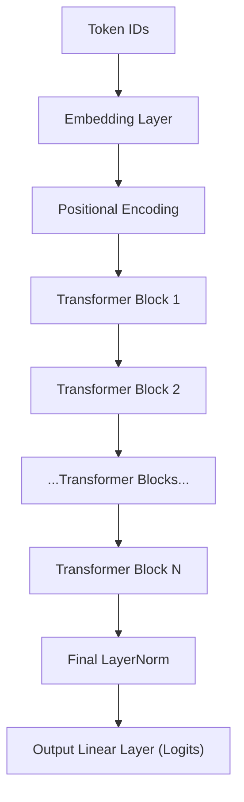

# Layers of a Large Language Model (LLM)

LLMs like GPT, BERT, and T5 are built using the Transformer architecture. Below is a breakdown of the essential layers/components.

---

## 🧱 1. Token Embedding Layer
- **Purpose**: Converts each input token into a dense vector.
- **Details**:
  - Maps token indices to vectors via an embedding matrix.
  - Output shape: `[batch_size, sequence_length, embedding_dim]`

---

## 🧭 2. Positional Encoding / Embedding
- **Purpose**: Adds order information to the token embeddings.
- **Types**:
  - **Learned positional embeddings** (e.g., GPT)
  - **Sinusoidal positional encodings** (e.g., original Transformer)
- **Shape**: Matches token embedding shape.

---

## 🔁 3. Transformer Blocks (Repeated N times)

Each Transformer block contains:

### a. Multi-Head Self-Attention
- Attends to different positions in the input.
- Uses multiple attention heads.

### b. Layer Normalization
- Stabilizes training.
- Applied before or after each sub-layer.

### c. Residual Connections
- Skip connections to help gradient flow.
- Form: `Output = Input + SubLayer(Input)`

### d. Feedforward Neural Network (FFN)
- Applied to each token position independently.
- Formula:
  ```text
  FFN(x) = max(0, xW1 + b1)W2 + b2
  ```

### Transformer Block Summary
```text
Input → LayerNorm → Self-Attention → Add & Norm → FFN → Add & Norm
```

---

## ✅ 4. Final LayerNorm
- Applied after the last Transformer block.
- Normalizes the final hidden state.

---

## 🔚 5. Output Head (Language Modeling Head)
- Maps hidden states to vocabulary logits.
- Often reuses weights from the token embedding layer (weight tying).

---

## 🔄 Full LLM (Decoder-Only) Architecture Flow



---

## 🧠 Summary Table

| Layer                    | Function                                      |
|-------------------------|-----------------------------------------------|
| Token Embedding         | Map token IDs to vectors                      |
| Positional Embedding    | Encode position of tokens                     |
| Multi-Head Attention    | Learn contextual relationships                |
| Feedforward Network     | Add depth and nonlinear transformations       |
| LayerNorm & Residual    | Stabilize and preserve information            |
| Output Projection       | Predict next token using vocab logits         |

---

## Want More?
Ask for:
- Encoder-only (BERT)
- Decoder-only (GPT)
- Encoder-Decoder (T5) architecture deep-dives!
