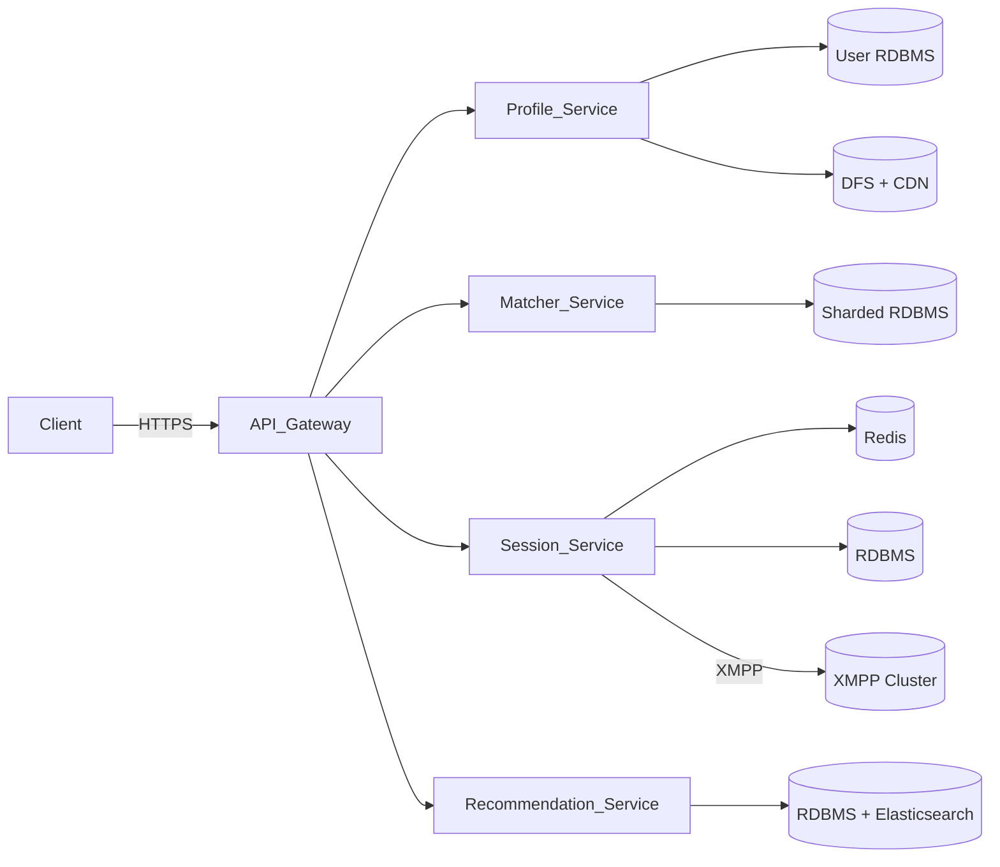

# Tinder System Design

## Table of Contents

1. [High‑Level Requirements](#high-level-requirements)  
2. [Capacity & Traffic Estimations](#capacity--traffic-estimations)  
3. [Architecture Overview](#architecture-overview)  
4. [Requirement 1: Profile Service](#requirement-1-profile-service)  
   - Design  
   - Storage Options & Trade‑Offs  
   - Best Practices  
5. [Requirement 2: One‑to‑One Chat](#requirement-2-one-to-one-chat)  
   - Design  
   - Protocol Choice: HTTP vs XMPP  
   - Best Practices  
6. [Requirement 3: Matching Service](#requirement-3-matching-service)  
   - Design  
   - Data Modeling & Trade‑Offs  
   - Best Practices  
7. [Requirement 4: Recommendation Service](#requirement-4-recommendation-service)  
   - Design  
   - Partitioning & Scaling  
   - Best Practices  
8. [Database Schema & Sharding](#database-schema--sharding)  
9. [API Endpoints](#api-endpoints)  
10. [Microservice Components](#microservice-components)  

## High‑Level Requirements

**Functional requirements** (prioritized):  
- **User profiles**: create/update/delete accounts, store name, age, location, up to 5 images  
- **Matching**: record mutual right‑swipes and generate recommendations  
- **Chat**: allow direct messaging only between matched users  
- **Moderation**: ability to remove abusive profiles  
- **Monetization**: subscription management, swipe‑limit enforcement for free users  

**Non‑functional requirements**:  
- Low latency for swiping and messaging  
- High availability (24×7 global usage)  
- Horizontal scalability to handle millions of active users  
- Strong data consistency for match status  

## Capacity & Traffic Estimations

- **Active users**: 10 million  
- **Daily matches**: 0.1% of active users ⇒ ~10 000 matches/day  
- **Image storage**: 5 images/user ⇒ 50 million images total  
- **Requests**:  
  - Profile API calls (signup/login/fetch/update) ~1 rps per 100 users  
  - Swipe actions ~10 rps per 100 users  
  - Chat messages ~5 rps per 100 matched pairs  

## Architecture Overview



- **API Gateway**: load balancing, auth validation, rate limiting  
- **Services**: microservices for each domain  
- **Data stores**: sharded RDBMS, object storage + CDN, in-memory cache  

## Requirement 1: Profile Service

### Design

1. **Signup & Auth**  
   - `POST /user/signup` → create user, hash password, return JWT  
   - `POST /user/login` → validate, issue JWT

2. **Profile CRUD**  
   - `GET /user/{userID}`  
   - `PUT /user/{userID}`  
   - `DELETE /user/{userID}` (admin)

### Storage Options

| Option                   | Pros                                 | Cons                            |
|--------------------------|--------------------------------------|---------------------------------|
| **BLOB in RDBMS**        | ACID, unified storage                | Poor large-file perf, cost      |
| **DFS + CDN (chosen)**   | Scalable, cost-effective, low-latency| Requires signed URL access      |

### Best Practices

- Use object storage (S3/GCS) with presigned URLs  
- Serve via CDN edge caches  
- Hash passwords (bcrypt/argon2)  
- Short-lived JWT + refresh tokens in Redis  

## Requirement 2: One‑to‑One Chat

### Design

- Chat only after mutual right-swipe  
- XMPP cluster for real-time messaging  
- Session table: `userID ↔ connectionID` in RDBMS + Redis

### Protocol Comparison

| HTTP Polling            | XMPP/WebSocket                |
|-------------------------|-------------------------------|
| High latency, overhead  | Low overhead, bi-directional  |
| Inefficient at scale    | Persistent connections        |

### Best Practices

- Consider WebSockets for simpler client integration  
- Implement ACKs for message delivery  
- Rate-limit per connection  
- Use pub/sub (Redis/Kafka) for horizontal scale  

## Requirement 3: Matching Service

### Design

- Store swipe events: `(fromID, toID, timestamp)`  
- On mutual swipe, create match record  
- Index on both user IDs

### Storage Trade‑Offs

| Client-side | Server-side (chosen)         |
|-------------|------------------------------|
| Saves server space | Single source of truth  |
| Ephemeral         | Secure, tamper-proof     |

### Best Practices

- Idempotent swipe API  
- Batch & buffer DB writes  
- Event sourcing (Kafka) for audit/analytics  
- TTL for stale swipes if needed  

## Requirement 4: Recommendation Service

### Design

- Input: user prefs + history  
- Filters: age, gender, geo (Elasticsearch geo)  
- Ranking: recency, mutual interests

### Scaling

- Shard by geo-region  
- Master-slave per shard  
- Elasticsearch for indexing & queries

### Best Practices

- Precompute N recommendations offline  
- Incremental re-ranking on events  
- A/B testing for algorithms  
- Use a feature store for ML features  

## Database Schema & Sharding

```sql
CREATE TABLE Users (
  userID BIGINT PRIMARY KEY,
  name VARCHAR(100),
  age INT,
  gender CHAR(1),
  location GEOGRAPHY(POINT),
  bio TEXT
);

CREATE TABLE Swipes (
  swipeID BIGINT PRIMARY KEY,
  fromUserID BIGINT,
  toUserID BIGINT,
  direction ENUM('right','left'),
  ts TIMESTAMP
);
CREATE INDEX idx_swipes_from ON Swipes(fromUserID);
CREATE INDEX idx_swipes_to ON Swipes(toUserID);

CREATE TABLE Matches (
  matchID BIGINT PRIMARY KEY,
  userAID BIGINT,
  userBID BIGINT,
  matchedAt TIMESTAMP
);
CREATE INDEX idx_matches_userA ON Matches(userAID);
CREATE INDEX idx_matches_userB ON Matches(userBID);

CREATE TABLE Sessions (
  connectionID VARCHAR(128) PRIMARY KEY,
  userID BIGINT,
  createdAt TIMESTAMP
);
```

- Hash or range-based sharding  
- Asynchronous replicas for reads, sync for critical writes  

## API Endpoints

```http
POST   /user/signup
POST   /user/login
GET    /user/{userID}
PUT    /user/{userID}
DELETE /user/{userID}

POST   /session/connection/{u1}/{u2}
GET    /session/users/{connID}
DELETE /session/connection/{connID}

GET    /match
DELETE /match/{userID}

GET    /recommendation
```

## Microservice Components

- **Profile Service**: auth, profile CRUD, image handling  
- **Session Service**: session management, messaging broker  
- **Matcher Service**: swipe ingestion, match logic  
- **Recommendation Service**: filtering, ranking, ML  
- **API Gateway**: gateway, auth, rate limiting  
