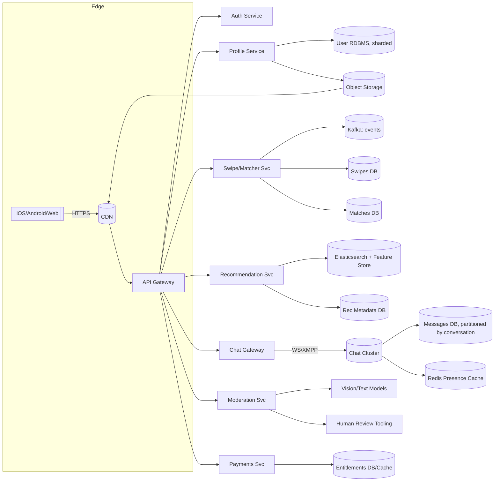

# Tinder‑Style System Design (Enhanced)

> Generated: 2025-08-11 13:56 UTC

This document takes your base design and deepens it with production‑grade details: concrete sizing, read/write paths, consistency choices, cache keys, indexes, failure modes, and operational playbooks. It’s structured to read top‑down and to be implementation‑ready.

---

## Table of Contents

1. [High‑Level Requirements](#high-level-requirements)  
2. [Assumptions, SLOs & SLAs](#assumptions-slos--slas)  
3. [Capacity & Traffic Estimations](#capacity--traffic-estimations)  
4. [Architecture Overview](#architecture-overview)  
5. [Requirement 1: Profile Service](#requirement-1-profile-service)  
   - Design  
   - Storage Options & Trade‑Offs  
   - Read/Write Paths  
   - Best Practices  
6. [Requirement 2: One‑to‑One Chat](#requirement-2-one-to-one-chat)  
   - Design  
   - Protocol Choice: HTTP vs XMPP/WebSocket  
   - Message Store & Ordering  
   - Best Practices  
7. [Requirement 3: Matching Service](#requirement-3-matching-service)  
   - Design  
   - Data Modeling & Trade‑Offs  
   - Consistency & Idempotency  
   - Best Practices  
8. [Requirement 4: Recommendation Service](#requirement-4-recommendation-service)  
   - Design  
   - Partitioning & Scaling  
   - ML & Feature Store  
   - Best Practices  
9. [Database Schema & Sharding](#database-schema--sharding)  
10. [API Endpoints](#api-endpoints)  
11. [Content Moderation & Safety](#content-moderation--safety)  
12. [Privacy, Security & Compliance](#privacy-security--compliance)  
13. [Caching Strategy](#caching-strategy)  
14. [Multi‑Region Strategy](#multi-region-strategy)  
15. [Observability & Operations](#observability--operations)  
16. [Disaster Recovery & Backfills](#disaster-recovery--backfills)  
17. [Cost Levers](#cost-levers)  
18. [Appendices](#appendices)  

---

## High‑Level Requirements

**Functional (prioritized):**
- **User profiles**: create/update/delete, name, age, location, up to 5 images, basic prefs.
- **Matching**: record right/left swipes; produce **match** on mutual right swipes.
- **Chat**: one‑to‑one messaging **only** between matched users, with receipts.
- **Moderation**: image/text scanning; abuse reporting; take‑downs; appeals.
- **Monetization**: SKU/plan management, swipe limits for free tier, boosts/super‑likes.

**Non‑functional:**
- P99 API latency: **<150 ms** for swipes, **<200 ms** for profile reads near cache.
- High availability: **99.95%** month (≈22 min downtime).
- Horizontal scalability to **million+ RPS** (swipes) at peak.
- Strong consistency for **match creation** and **entitlements**; eventual elsewhere.

---

## Assumptions, SLOs & SLAs

- **Traffic distribution**: diurnal peaks; ~6 peak hours/day used for sizing.
- **Mobile clients**: flaky networks → aggressive retries; server must be idempotent.
- **Image egress** dominated by CDN; **target cache hit ≥ 92%**.
- **SLOs** (internal):  
  - Swipe write path success ≥ 99.99% over 5 min windows.  
  - Message delivery success (server‑to‑server) ≥ 99.99% over 1 min windows.  
  - Fresh recommendations within **10 s** of a swipe (incremental re‑rank).

---

## Capacity & Traffic Estimations

> The following uses your (intentionally aggressive) per‑100‑user rates to size headroom.

| Metric | Formula | Value |
|---|---|---|
| **Profile API RPS** | (DAU/100) × 1 | **100,000 rps** |
| **Swipes RPS** | (DAU/100) × 10 | **1,000,000 rps** |
| **Chat RPS (example)** | (CMP/100) × 5 | **10,000 rps** for CMP=200,000 |

**Peak‑window volumes (≈ 6h):**
- Swipes: **21,600,000,000** events
- Profile calls: **2,160,000,000** events
- Chat messages (example): **216,000,000** events

**Images & storage:**
- Users × images = **50,000,000** images
- Avg 0.8 MB × 3 variants ⇒ **~114.44 TB** origin storage
- Expect ≥92% CDN hit for steady state (profiles heavily re‑viewed)

> When in doubt, size Kafka, storage IOPS, and connection pools for **peak**, not average.

---

## Architecture Overview



**Key calls:**
- **Gateway** handles auth, rate limits, canary, request shaping.
- **Event backbone** (Kafka) captures swipes, profile changes, moderation flags.
- **CDN** fronts images; origin signed URLs from Profile service.

---

## Requirement 1: Profile Service

### Design
- **Signup/Login**: `POST /user/signup`, `POST /user/login` (password or social/OAuth).  
- **Profile CRUD**: `GET/PUT/DELETE /user/{userId}`.  
- **Images**: clients upload via **pre‑signed URLs**; virus/NSFW scan on ingest; background resizing.

### Storage Options & Trade‑Offs
| Option | Pros | Cons | When to pick |
|---|---|---|---|
| **BLOBs in RDBMS** | ACID, co‑located | Hot rows, storage bloat | Small teams, low traffic |
| **Object Storage + CDN (chosen)** | Cheap, durable, global | Auth via signed URLs | Internet‑scale media |
| **Dedicated Media CDN** | Instant transforms | Vendor lock‑in | Heavy dynamic resizing |

### Read/Write Paths
- **Write**: App → Profile Svc (request pre‑signed URL) → Client PUT to ObjectStore → S3 Event → **Resize + Scan Lambda/Worker** → CDN invalidation.  
- **Read**: App → CDN URL; on miss → ObjectStore origin (private) → CDN cache.  
- **Profile reads**: App → Profile Svc → **Redis read‑through** → UserDB.

**Indexes**
- `Users(email) UNIQUE`, `Users(username) UNIQUE`, `Users(lastSeenAt)` for online sorting.
- Geo queries via **PostGIS** (RDBMS) or **ES geo_point** for recommendations.

### Best Practices
- Hash passwords with **argon2id/bcrypt**; store **password rehash needed** flag.  
- Short‑lived **JWT (15m)** + **rotating refresh** in Redis (RT‑blacklist on logout/compromise).  
- **Partial updates** via PATCH; **optimistic locking** (row version).  
- **PII split**: keep sensitive fields in a separate table/schema with restricted access.

---

## Requirement 2: One‑to‑One Chat

### Design
- Messaging enabled **only for matched pairs** (validated via MatchesDB/Cache).  
- **Transport**: WebSockets or XMPP over TCP/TLS; mobile push for offline users.  
- **Presence**: Redis TTL keys, e.g., `presence:{userId} → lastPingTs` with 60–120s heartbeat.  
- **Delivery semantics**: at‑least‑once to server; **exactly‑once to conversation** via idempotency key.

### Protocol Choice: HTTP Polling vs WS/XMPP
| HTTP Polling | WS/XMPP (chosen) |
|---|---|
| Simple; works behind strict proxies | Low latency, duplex, fewer bytes per message |
| High overhead & wakeups | Requires connection mgmt, fanout |
| Bad for battery | Better power profile for active sessions |

### Message Store & Ordering
- **Conversation key**: `convId = hash(min(userA,userB), max(userA,userB))`.  
- **Partitioning**: `convId` → shard; within shard use **monotonic sequence** `msgSeq`.  
- **Schema (Messages)**:  
  - `convId`, `msgSeq (BIGINT)`, `senderId`, `body`, `ts`, `status(enum: sent, delivered, read)`, `clientMsgId (UUID)`.  
- **Idempotency**: dedupe by `(convId, clientMsgId)` to avoid duplicates on retries.  
- **Retention**: hot (90d) + warm (1y) tiers; cold archive to object storage.  
- **Index**: `(convId, msgSeq)` clustered; secondary on `(senderId, ts)` for abuse forensics.

### Best Practices
- Backpressure: **per‑connection rate limits** + **token bucket** at gateway.  
- **ACK model**: server ACK on persist; **delivery receipts** when fanout completes.  
- **Push**: enqueue to APNS/FCM when recipient offline; collapse keys to reduce noise.  
- **E2EE (optional)**: double‑ratchet on clients; server stores ciphertext + key handles only.

---

## Requirement 3: Matching Service

### Design
- **Swipe ingest**: append‑only events `(fromId, toId, dir, ts, idempotencyKey)` → Kafka `swipes` topic.  
- **Match detection**: consumer service checks opposite swipe; on mutual right creates **Match**.  
- **Cache** popular `toId` windows in Redis bitmap/bloom to cut DB lookups.

### Data Modeling & Trade‑Offs
| Model | Pros | Cons |
|---|---|---|
| **Append‑only swipes** | Full audit, easy backfills | Needs compaction for old data |
| **Upsert per pair** | Fast reads, smaller | Hard to audit/undo |
| **Event‑sourced (chosen)** | Analytics ready, replayable | More Infra (Kafka, consumers) |

### Consistency & Idempotency
- **Idempotent API**: header `Idempotency-Key`; store `(key → result)` for 24h.  
- **Transactional match**: in one DB txn: insert `Match` if not exists; emit `match_created` event.  
- **Monotonicity**: ensure **no double matches** by canonical ordering `(minId,maxId)` unique.

### Best Practices
- **TTLs for stale swipes** (e.g., 1y) to bound storage.  
- **Sampling** for real‑time dashboards, full data to data warehouse.  
- **Rate limits** and **paid entitlements** (e.g., daily swipe caps).

---

## Requirement 4: Recommendation Service

### Design
- **Filter** by age, gender, distance (geo filters), language.  
- **Rank** by recency, right‑swipe likelihood, mutual interests, safety signals.  
- **Signals**: profile completeness, photo quality, report rate, response latency.

### Partitioning & Scaling
- **Shard by geo region** (country/state/cell tower grid).  
- **Elasticsearch** for candidate retrieval: `geo_distance` + boolean filters; store profile embeddings for ANN (k‑NN).  
- **Feature Store**: materialize per‑user features (rolling windows) updated via stream processors.

### ML & Feature Store
- Offline training → export model (e.g., XGBoost/LightGBM).  
- **Online features**: last N swipes, activity streak, content vectors; served via low‑latency store (Redis/Feast online).  
- **Re‑ranking** within **10s** of swipe via streaming job (Flink/Spark Structured Streaming).

### Best Practices
- **Precompute top‑K** candidates per user/region hourly; re‑rank on session start.  
- **A/B framework**: bucket users by stable hash; log exposures/clicks/swipes for attribution.  
- **Fairness & safety guards**: cap repeated exposure; penalize frequently reported accounts.

---

## Database Schema & Sharding

```sql
-- Users & PII split
CREATE TABLE Users (
  userID       BIGINT PRIMARY KEY,
  username     VARCHAR(40) UNIQUE NOT NULL,
  age          INT CHECK (age BETWEEN 18 AND 100),
  gender       CHAR(1),
  bio          TEXT,
  homeLat      DECIMAL(9,6),
  homeLon      DECIMAL(9,6),
  createdAt    TIMESTAMP,
  lastSeenAt   TIMESTAMP
);

CREATE TABLE UserPII (
  userID       BIGINT PRIMARY KEY REFERENCES Users(userID) ON DELETE CASCADE,
  email        CITEXT UNIQUE NOT NULL,
  phoneE164    VARCHAR(18) UNIQUE,
  passHash     TEXT NOT NULL,
  passAlgo     VARCHAR(16) NOT NULL
);

-- Swipes: append-only
CREATE TABLE Swipes (
  swipeID      BIGINT PRIMARY KEY,
  fromUserID   BIGINT NOT NULL,
  toUserID     BIGINT NOT NULL,
  direction    CHAR(1) CHECK (direction IN ('R','L')),
  ts           TIMESTAMP NOT NULL,
  idemKey      UUID NOT NULL
);
CREATE INDEX idx_swipes_from_ts ON Swipes(fromUserID, ts DESC);
CREATE INDEX idx_swipes_to_ts   ON Swipes(toUserID, ts DESC);

-- Matches: canonical (minId, maxId) unique
CREATE TABLE Matches (
  matchID      BIGINT PRIMARY KEY,
  userAID      BIGINT NOT NULL,
  userBID      BIGINT NOT NULL,
  matchedAt    TIMESTAMP NOT NULL,
  UNIQUE (LEAST(userAID,userBID), GREATEST(userAID,userBID))
);

-- Chat sessions & messages (partition by convId)
CREATE TABLE Sessions (
  connectionID VARCHAR(128) PRIMARY KEY,
  userID       BIGINT NOT NULL,
  createdAt    TIMESTAMP NOT NULL
);

-- Messages table is typically in a partitioned/NoSQL store with (convId, msgSeq) key.
```

**Sharding**
- **Users**: hash(userID) → shard; keep **affinity** for related data.  
- **Swipes**: partition by `toUserID` for match lookup locality; compaction tables per month.  
- **Messages**: partition by `convId`; sequence allocated per partition for strict ordering.

---

## API Endpoints

```http
# Auth & Profiles
POST   /v1/auth/signup
POST   /v1/auth/login
POST   /v1/auth/refresh
GET    /v1/users/{userId}
PATCH  /v1/users/{userId}
POST   /v1/users/{userId}/images/presign   # returns signed PUT URL

# Swipes & Matches
POST   /v1/swipes                # body: toUserId, direction; Idempotency-Key header
GET    /v1/matches               # list matches for caller (paginated)
DELETE /v1/matches/{matchId}   # unmatch

# Chat
GET    /v1/chat/token            # short-lived WS token
WS     /v1/chat/connect          # upgrade; auth via token
POST   /v1/chat/{convId}/typing
GET    /v1/chat/{convId}/history?cursor=...

# Recommendations
GET    /v1/recs?lat=..&lon=..&radiusKm=..&age=..&gender=..
```

**Common headers**
- `Authorization: Bearer <JWT>`  
- `Idempotency-Key: <UUID>` for POSTs (swipes, messages)  
- `X-Client-Ts`, `X-App-Version` for analytics/feature flags

**Errors**
- 400 (validation), 401 (auth), 403 (not matched), 409 (duplicate), 429 (rate limit), 5xx (server).

---

## Content Moderation & Safety

- **Images**: NSFW and face‑match checks on ingest; blocklist known bad hashes (PDQ/PhotoDNA‑style).  
- **Text**: toxicity classifiers; language detection; throttling for high‑risk terms.  
- **Users**: velocity rules (too many swipes/sec), device fingerprinting, SIM/suspicious IP ranges.  
- **Reports**: `POST /v1/report` creates case; human review tooling; soft‑delete pending appeal.  
- **Shadow bans**: reduce visibility before permanent action; audit everything.

---

## Privacy, Security & Compliance

- **PII isolation** (separate schema/service), **encryption at rest** (KMS), TLS 1.3 in transit.  
- **GDPR/CCPA**: data export & deletion pipelines; privacy ledger of disclosures.  
- **Key rotation** for JWT signing/refresh tokens; **HSM/KMS‑backed**.  
- **Least privilege** IAM; **admin actions** require break‑glass with on‑call approval.  
- **Secret management** via vault; no secrets in images/env files.

---

## Caching Strategy

- **Profiles**: read‑through cache; key `user:{userId}`; TTL 5–15 min; version for busting.  
- **Entitlements**: cache `ent:{userId}` with TTL=1–5 min; write‑behind on change.  
- **Presence**: `presence:{userId}` with sliding TTL 120s.  
- **Recommendations**: cache last page `recs:{userId}:v{algo}`.  
- Apply **request coalescing** to avoid thundering herds after cache expiry.

---

## Multi‑Region Strategy

- **Active‑active** for read‑heavy services (Profiles, Recs); **active‑passive** for write‑critical (Matches, Payments).  
- **Home‑region** per user to pin writes; **follow‑the‑sun** readers.  
- **Conflict avoidance**: canonical `(minId,maxId)` for matches; region‑unique message sequences.  
- **Data gravity**: keep chat and matches co‑located for each `convId` shard.  
- **Failover**: health‑based routing (GeoDNS/Anycast) + control plane to disable affected region quickly.

---

## Observability & Operations

- **Metrics**: RPS, latency (P50/P95/P99), error rate, WS connected sessions, consumer lag, CDN hit%.  
- **Logs**: structured JSON with request IDs; privacy filters; log sampling at high QPS.  
- **Tracing**: OpenTelemetry across gateway→svc→DB; propagate `traceparent`.  
- **Runbooks**: hot key storms, cache miss spikes, DB failover, Kafka lag, push provider outages.  
- **Chaos**: inject packet loss and broker partitions; verify retries/idempotency.

---

## Disaster Recovery & Backfills

- **Backups**: daily full + WAL/redo shipping; restore tested weekly.  
- **Kafka**: 7–14d retention for swipes; reprocess to rebuild Matches/Features.  
- **Reindex**: rolling ES reindex; dual‑write to new index; cutover with alias switch.  
- **Data deletion**: tombstones processed by compaction jobs; verify in warehouse & search indexes.

---

## Cost Levers

- **Images**: compress to WebP/AVIF; lazy‑load; generate only needed variants.  
- **CDN**: tune TTLs; cache keys include device class; use signed cookies instead of per‑URL when possible.  
- **Compute**: autoscale stateless services; spot/preemptible for batch/feature pipelines.  
- **Storage**: tier messages to colder storage; time‑partition swipes.  
- **Chat**: collapse push notifications; apply adaptive rate limits on spammy devices.

---

## Appendices

### A. Event Topics (Kafka)
- `swipes.v1`: key=`toUserId`, value=event; compaction + retention 7–30d.
- `profile.updated.v1`: invalidate caches, re‑rank.
- `match.created.v1`: seed chat conv, notify both users.
- `rec.feedback.v1`: exposures/clicks/swipes for training labels.

### B. Redis Key Patterns
```
user:{userId} -> JSON profile
presence:{userId} -> lastPingTs
conv:{convId}:lastSeq -> BIGINT
idem:{scope}:{uuid} -> result (24h)
ent:{userId} -> plan, limits
```

### C. Failure Modes & Mitigations
- **Hot users (celebs) cause shard skew** → dynamic rebalancing + caching of inbound swipes.  
- **CDN regional outage** → failover to secondary CDN or origin with lower TTL.  
- **Push provider incident** → queue & backoff; multi‑provider abstraction.  
- **ES cluster brownout** → circuit‑break recommendations to last known good set.

---

**Summary**: This design isolates hot paths (swipes, chat) into append‑only/evented systems, keeps **match creation strongly consistent**, and uses caches/CDN to shave P99s. Operational maturity (observability, DR, backfills) turns an MVP into a reliable, global product.
