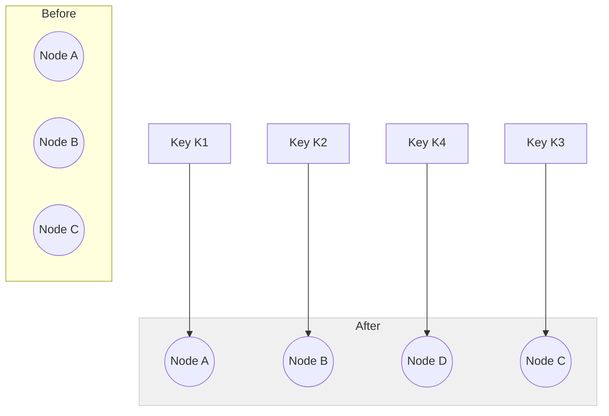
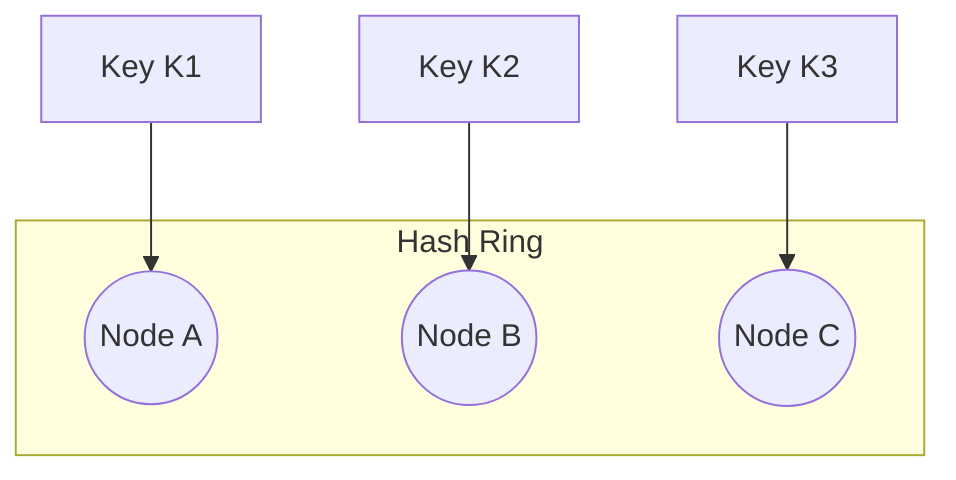

# System Design by GKCS

---

## Evaluation Criteria for System Design

When designing a system, we must evaluate the solution based on three key parameters:

1. **Simplicity**:  
   - Is the system easy to understand and maintain?
   - Are we avoiding unnecessary complexity?
   - Simpler systems are less error-prone and easier to scale and modify.

2. **Fidelity** (Requirement Coverage):  
   - Does the system meet all functional and non-functional requirements?
   - Are edge cases and scalability considered?
   - Ensures the design does not miss critical business needs.

3. **Cost Effectiveness**:  
   - Is the solution economically viable?
   - Are we avoiding overengineering or underutilizing resources?
   - Crucial for startups and small businesses with limited budgets.

---

## Cloud vs Local Machine (Server) – For Startups and Small Businesses

### Cloud Solution

- **Simplicity**: Cloud platforms (like AWS, GCP, Azure) offer serverless and managed services that reduce the need for infrastructure management.
- **Fidelity**: Both cloud and on-premise can offer similar fidelity in terms of functionality and features.
- **Cost**: Cheaper initially due to pay-as-you-go pricing, reduced operations cost, and built-in scalability.

#### Benefits:
- Serverless architectures reduce devops burden.
- Automatic scaling, managed services like databases, queues, and caching.
- Global accessibility and easier integration with CI/CD tools.

#### Drawbacks:
- Costs may increase at scale.
- Slightly higher latency compared to local hosting in specific regions.
- Less control over the underlying hardware.

### Local Server

- **Efficiency**: Can be faster and more responsive for small local user bases.
- **Complexity**: Higher setup and maintenance effort.
- **Cost**: Potentially higher upfront cost but predictable expenses.

---

## Where Are the Pages Hosted?

### UI Code Hosting

- **CDN (Content Delivery Network)**:  
  Examples: Akamai, CloudFront  
  - Ideal for hosting **static files** like HTML, CSS, JS, images, and videos.
  - Files are cached on edge servers across the globe, reducing latency.
  - Updates require cache invalidation, which might take time.

- **Cloud Hosting (AWS, GCP, etc.)**:  
  - Used for **dynamic content** such as APIs and server-side rendering.
  - Offers compute, storage, and advanced deployment options.
  - More expensive and complex than CDN hosting.

---

## How Are Files Added to the CDN?

- **Amazon S3** is commonly used as the origin storage.
- **CloudFront** (or similar) pulls files from S3.
- Diff checking ensures only changed files are updated.
- CDN then distributes the files across global edge servers.

---

## How Does the Internet Work?

1. User enters a domain (e.g., www.google.com).
2. Request goes through ISP to a **router**.
3. Router contacts the **DNS (Domain Name System)**.
   - DNS is like the phonebook of the internet.
   - Resolves domain names to IP addresses (e.g., facebook.com → 192.5.6.8).
4. Response returns with the resolved IP address.
5. Browser connects to that IP and loads the webpage.

### DNS Providers:
- GoDaddy
- Amazon Route 53
- Cloudflare

---

## What Kind of Database Should We Use?

### Recommendation:
- Choose a **database you’re comfortable with**.
- For most cases, start with **SQL** (e.g., PostgreSQL, MySQL).

### SQL vs NoSQL:

- **SQL**:
  - Relational, structured schema.
  - ACID compliance for transactional systems.
  - Great for analytics and complex queries.

- **NoSQL**:
  - Schema-less, supports horizontal scaling.
  - Good for document storage, key-value pairs, large-scale apps.
  - Examples: MongoDB, Cassandra, DynamoDB.

---


## How to Debug the Systems

Debugging and maintaining distributed systems is crucial for reliability. Here are key strategies:

### 1. Add Logging and Monitoring

- Capture logs at different levels (INFO, DEBUG, ERROR).
- Logs help track system behavior, errors, and performance issues.
- **Example Tool**: AWS CloudWatch, ELK Stack (Elasticsearch, Logstash, Kibana)

### 2. Observability and Anomaly Detection

- Observability is the ability to understand internal states from external outputs.
- Monitor metrics such as CPU usage, memory, request latency, error rates.
- **Example Tools**: Prometheus + Grafana, Datadog, New Relic

### 3. Business Analytics and Dashboards

- Visual tools to identify anomalies and trends in usage or performance.
- **Example Tools**: Power BI, Google Analytics, Looker

### Best Practices:

- Set up alerts for threshold breaches.
- Implement distributed tracing for microservices (e.g., Jaeger, Zipkin).
- Maintain structured and centralized logging.

## How Reliable Is This System?

Reliability refers to the system’s ability to function correctly and consistently over time. Consider the following when evaluating reliability:

### 1. Single Point of Failure (SPOF)

- A **single point of failure** is any component that, if it fails, brings down the entire system.
- **Example**: If your system relies on one database instance without a replica, database failure causes a full outage.

### Strategies to Avoid SPOFs:
- Use load balancers with multiple backend instances.
- Implement database replication and automatic failover.
- Ensure high availability zones and redundancy.

### 2. External Dependencies

- Any **third-party service** your system depends on (e.g., payment gateways, CDN, email services) is a potential failure point.
- Even if your internal system is robust, an external service outage can impact users.

### Mitigation Techniques:
- Implement retries and exponential backoff.
- Fallback mechanisms and circuit breakers (e.g., Hystrix).
- Use service meshes like Istio for better control over service communication.

---

Points to note when choosring any architectural decisions

- always list then pros and cons
- talk with data what #a does and #b does
- do a cost benefit analysis with the founder or product manager


### Serverless vs Server (More)

#### Purchasing Reserved Instances in the Cloud

Example:  
`api.fancytshirts.io/purchase?id=32456&userId=5413`

- `api.fancytshirts.io` → Resolves the server.
- `/purchase` → Determines which function to invoke.
- Additional data is passed via **query parameters** (`GET`) along with **authentication parameters**.

#### Compute Consideration for Reserved Instances

- Monitor actual usage vs. estimated compute.
- If compute usage is higher than expected, we need to **upgrade to a larger instance** (e.g., extra-large).
- However, large instances have limitations:

#### Drawbacks of Reserved Servers

1. Inefficient capacity reservation.
2. Lack of auto-scaling → leads to under-utilization.
3. **Single Point of Failure**.
4. Using **multiple small servers** can provide **better computation** for the same cost.

---

### Solution: Use Multiple Small Servers

#### Problems with Multiple Small Servers

1. Redirecting traffic if an instance crashes.
2. Efficiently utilizing all available compute resources.

#### Solution: Use a Load Balancer

- Load balancers can distribute traffic to multiple instances.
- Support regional distribution (e.g., **AWS ELB** – Elastic Load Balancer).

---

### Load Balancing Algorithms

##### 1. Stateless Algorithms

> Routing logic is embedded within each function.

- **Round Robin** – Requests are distributed in a circular order.
- **Consistent Hashing** – Uses hashing logic for predictable request routing.

##### 2. Stateful Algorithms

> Routing logic maintains runtime information (e.g., connections).

- **Least Connections** – Routes traffic to the server with the fewest active connections (requires memory to store connection counts).

---

- Adding more servers to solve the latency the problem is called horizontal scaling
- increasing the size of server is vertical scaling

# Caching

Caching is the technique of storing copies of data in a temporary storage layer for faster access, reducing load on the main database or backend services.

---

## Types of Caching

### 1. In-Memory Caching

> Stores data directly in the memory (RAM) of the server where the application is running.

#### ✅ Advantages:
- **Blazing fast access** – Memory reads are significantly faster than disk/database reads.
- **No network latency** – Data is local to the application.
- Useful for **frequently accessed, small-sized data**.

#### ❌ Drawbacks:
- **Limited scope** – Only accessible within the same server/process.
- **No persistence** – Data is lost on server restart or crash.
- **Scalability issues** – Doesn’t work well in distributed systems unless synchronized.

#### 💡 Examples:
- `HashMap`, `LRUCache`, `Guava Cache` in Java
- `Node-cache` in Node.js
- Local application-level caching in microservices

---

### 2. Centralized Caching

> Cache is stored in a **dedicated cache server or service** shared across multiple application servers.

#### ✅ Advantages:
- **Shared access** – Multiple services/instances can access the same cached data.
- **Persistence options** – Some centralized caches offer durability.
- **Horizontal scalability** – Better suited for distributed systems and microservices.

#### ❌ Drawbacks:
- **Network latency** – Requires a network call to fetch data.
- **Infrastructure overhead** – Needs separate setup and monitoring.

#### 💡 Examples:
- **Redis** – In-memory, key-value store with optional persistence.
- **Memcached** – High-performance, distributed memory object caching system.

---

## When to Use Which?

| Use Case                              | In-Memory Caching           | Centralized Caching        |
|--------------------------------------|-----------------------------|----------------------------|
| Single instance, fast access         | ✅                          | ❌                         |
| Distributed system (e.g., microservices) | ❌                          | ✅                         |
| Need for cache persistence           | ❌                          | ✅                         |
| Low latency access (no network call) | ✅                          | ❌                         |
| Shared data between instances        | ❌                          | ✅                         |

---

## Caching Best Practices

1. Use **TTL (Time To Live)** to avoid stale data.
2. Implement **cache invalidation** strategies carefully.
3. Consider **LRU/MRU** policies for eviction.
4. Monitor **cache hit/miss ratios**.
5. Avoid over-caching — not all data needs to be cached.

---


# Sharding

**Sharding** is a technique to **horizontally partition** data across multiple databases or servers to improve scalability and performance.

---

## What is Sharding?

- Each shard is a **subset of the entire data**.
- Shards can live on **different machines or regions**.
- Data is distributed using a **sharding key** (e.g., userId, geoId).

#### Example:
```
User IDs 1-10000  → DB1  
User IDs 10001-20000 → DB2  
User IDs 20001+ → DB3  
```

---

## Advantages of Sharding

1. **Improved scalability** – Distributes data load across multiple machines.
2. **Increased throughput** – Each shard handles a smaller data set.
3. **Failure isolation** – A failure in one shard doesn’t bring down the entire system.
4. **Faster queries** – Smaller datasets improve query performance.

---

## Drawbacks of Sharding

1. **Complex joins** – Cross-shard joins are hard or inefficient.
2. **Rebalancing needed** – When data distribution becomes uneven.
3. **Operational complexity** – Harder to manage backups, schema changes, and monitoring.
4. **Hotspot risk** – Poor choice of sharding key can cause some shards to be overloaded.

---

## Sharding + Caching

### 🔗 How Caching Works with Sharding

- Each shard can have its own **in-memory cache** (e.g., local Redis or LRU).
- Or use a **centralized cache layer** (like Redis Cluster) in front of all shards.

### 🔄 Common Pattern:

```
Client → Cache (Redis) → If miss → Sharded DB
                          ↳ Write-through or write-behind
```

- Cache keys can be structured as: `shardId:key` or `user:{userId}`.
- Avoid caching cross-shard data unless absolutely necessary.

---

## Cache + Sharding Properties

| Property               | Description                                                                 |
|------------------------|-----------------------------------------------------------------------------|
| **Partition Tolerance**| Each shard can work independently. Cache invalidation is isolated per shard.|
| **Consistency**        | Write-through cache improves consistency across cache and DB.               |
| **Availability**       | Even if one shard is down, others can still serve data.                     |
| **Scalability**        | Easily scale horizontally by adding more shards or cache nodes.             |
| **Latency**            | Cache reduces latency; sharding distributes DB load.                        |

---

## Best Practices

1. Choose a **good sharding key** to avoid hotspots (e.g., use hashed userId instead of raw userId).
2. Always **cache frequently accessed shard-specific data**.
3. Use **Redis Cluster** for sharded cache support.
4. Keep **shard metadata or discovery logic** in a service registry.
5. Monitor **shard health**, **cache hit ratios**, and **query patterns**.

---

## Load Balancer with Caching (Hash-Based Routing)

- A **load balancer** can be used to route requests **based on consistent hashing**.
- Ensures the same client or resource ID is always routed to the same cache node or backend.

### Benefits:

1. **Better cache hit ratio** – Requests consistently hit the right cache.
2. **Avoids cache duplication** – Only one node holds the cache for a key.
3. **Simple and stateless** – Routing logic is deterministic.

### Example Flow:

```
Client Request → Load Balancer (Consistent Hashing) → Redis Node X
                                        ↳ Cache hit → Serve response
                                        ↳ Cache miss → Query DB → Update Redis
```

- This is especially useful in **distributed cache clusters** (e.g., Redis Cluster or Memcached with hashing).

# Consistent Hashing and Cache Scaling

**Consistent Hashing** is a hashing technique used to distribute data across nodes (e.g., cache servers) in a way that **minimizes remapping** when nodes are added or removed.

---

## How It Works

1. All cache nodes are placed on a **hash ring** using a hash function (e.g., `hash(nodeId)`).
2. Each key is also hashed: `hash(key)`.
3. A key is stored in the **first node found in a clockwise direction** from its hash value.

---

## Scaling Up (Adding a Node)

When a new node is added:
- Only the **keys that fall between the new node and its predecessor** on the ring are moved to the new node.
- **Most keys remain on their original nodes**, preserving cache locality.

### 🔄 Example:

- Original ring: A → B → C  
- Add node D between B and C  
- Only keys that map between B and D now move to D.



---

## Scaling Down (Removing a Node)

When a node is removed:
- Its keys are redistributed to the **next node in the clockwise direction**.
- Again, **only a subset of keys is affected**.

### 🔄 Example:

- Original ring: A → B → C → D  
- Remove B  
- All keys that were going to B now go to C.


---


## Benefits

- **Minimal disruption**: Only `O(K/N)` keys (where K = total keys, N = nodes) are remapped.
- **Highly scalable**: Easily add/remove nodes without full rebalancing.
- **Works well with cache clusters** like **Redis Cluster**, **Memcached**, etc.

---

## Virtual Nodes

To avoid uneven load distribution:
- Each physical node is assigned **multiple virtual nodes** on the hash ring.
- This improves **uniformity** and **resilience**.

### Example:
- Node A has virtual nodes A1, A2, A3
- Each virtual node is placed separately on the ring

---

## Visual Representation

```text
         [Hash Ring]
             |
    K1 --> Node A
    K2 --> Node B
    K3 --> Node C

    Add Node D:
    Only keys between B and D now go to D.
```




#### Summary

| Action            | Key Impact                 |
| ----------------- | -------------------------- |
| Add Node          | Reassign \~K/N keys        |
| Remove Node       | Reassign \~K/N keys        |
| Use Virtual Nodes | Balanced load distribution |
