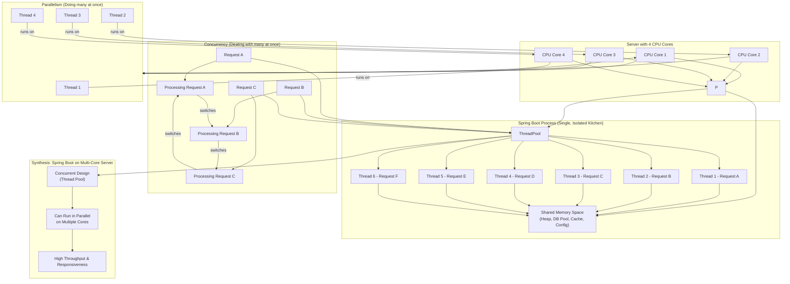

# Notes: Hour 1 - Processes, Threads, Concurrency, and Parallelism

**I. Processes vs. Threads**

* **Process:**
    * **Definition:** An independent, self-contained execution environment for a program. Think of it as an entire running application (e.g., your web browser, a Spring Boot server instance).
    * **Isolation:** Each process has its **own dedicated, independent memory space** (heap, stack, code, data). They are isolated from each other by the Operating System (OS).
    * **Resource Heavy:** Creating and managing processes involves significant overhead in terms of memory and CPU cycles.
    * **Communication:** Processes communicate via Inter-Process Communication (IPC) mechanisms (e.g., pipes, sockets, shared memory), which are generally slower than inter-thread communication.
    * **Fault Tolerance:** If one process crashes, it typically does not directly affect other processes.

* **Thread:**
    * **Definition:** A lightweight unit of execution *within* a process. Threads are often called "lightweight processes."
    * **Resource Sharing:** Threads **within the same process share the same memory space** (code, data, heap) but have their own separate stack and registers.
    * **Lightweight:** Creating and managing threads is much faster and less resource-intensive than processes.
    * **Communication:** Communication between threads is easier and faster due to shared memory.
    * **Fault Tolerance:** If one thread crashes due to unhandled errors, it can bring down the entire process.

* **Why the Difference Matters for Web Apps (e.g., Spring Boot):**
    * Spring Boot applications typically run as a **single process**.
    * Within this single process, Spring Boot (via its embedded server like Tomcat) spawns **multiple threads** to handle concurrent incoming HTTP requests.
    * This multi-threaded model is efficient because all threads can quickly share application resources (e.g., database connection pools, in-memory caches, configuration) from the shared memory space, reducing overhead and improving responsiveness compared to a multi-process model for each request.

**II. Concurrency vs. Parallelism**

* **Concurrency:**
    * **Definition:** Dealing with *many things at once*. It's about structuring a program to handle multiple tasks seemingly simultaneously by rapidly switching between them.
    * **Execution:** Can be achieved on a **single CPU core** through time-slicing (the OS scheduler rapidly switches which thread/process is running).
    * **Analogy:** A single chef juggling multiple dishes by switching between them quickly.
    * **Focus:** Design and composition of independently executing tasks.

* **Parallelism:**
    * **Definition:** Doing *many things at once*. It involves the true simultaneous execution of multiple tasks.
    * **Execution:** Requires **multiple CPU cores** or multiple processing units to run tasks at the exact same instant.
    * **Analogy:** Multiple chefs (or assistants) working on different dishes at the same time.
    * **Focus:** Execution and throughput.

* **Relationship in Modern Systems (e.g., 4-core server running Spring Boot):**
    * A Spring Boot application is **concurrent** by design (it uses a thread pool to *handle* many requests).
    * On a multi-core server, these concurrently handled requests can also execute in **parallel** (multiple threads running on different CPU cores simultaneously).
    * So, most modern server applications leverage both: a concurrent design to manage multiple tasks, and a parallel execution environment to run them truly simultaneously.

---

### **Mermaid.js Diagram: Processes, Threads, Concurrency, and Parallelism**

### Deep Dive: Processes, Threads, Concurrency, and Parallelism

#### **I. Processes: The Independent Execution Units**

At its core, a **process** is an executing instance of a program. It's the operating system's fundamental unit of resource allocation. When you launch an application, you're usually starting a new process.

* **Further Details & Implications:**
    * **Resource Ownership:** A process owns its own dedicated virtual address space, memory (including its own heap, stack, code, and data segments), file descriptors, network connections, and other resources. This isolation is a cornerstone of OS security and stability.
    * **Process Control Block (PCB):** The OS maintains a data structure for each process called a PCB. This contains vital information about the process, such as:
        * Process ID (PID)
        * Process State (e.g., New, Ready, Running, Waiting, Terminated)
        * Program Counter (pointer to the next instruction to be executed)
        * CPU Registers (values of the CPU's internal registers when the process was last suspended)
        * Memory Management Information (pointers to page tables or segment tables)
        * I/O Status Information (list of open files, I/O devices allocated)
        * Accounting Information (CPU time used, real time used, time limits)
    * **Context Switching (Process):** When the OS switches from one process to another, it's called a process context switch. This is a relatively *expensive* operation because the OS has to:
        1.  Save the complete state of the currently running process (all CPU registers, program counter, stack pointer, memory management unit state, open files, etc.) into its PCB.
        2.  Load the complete state of the next process to be run from its PCB into the CPU.
        This involves flushing CPU caches, updating memory management hardware, and generally more overhead than a thread context switch.
    * **Inter-Process Communication (IPC):** Since processes are isolated, they need explicit mechanisms to communicate:
        * **Pipes:** Unidirectional or bidirectional channels for data flow.
        * **Message Queues:** A list of messages stored within the kernel, accessible by processes.
        * **Shared Memory:** Fastest IPC, but requires careful synchronization to avoid race conditions. Processes map a region of memory into their respective address spaces.
        * **Sockets:** Used for network communication, but also for local process communication.
        * **Signals:** Software interrupts.
    * **Forking (in Unix-like systems):** A common way to create a new process is `fork()`, which creates a copy of the calling process. The child process typically then calls `exec()` to load a new program.

#### **II. Threads: Lightweight Units of Execution within a Process**

Threads are the fundamental units of CPU utilization. Each thread has its own thread ID, program counter, register set, and stack. However, threads *within the same process* share the process's code section, data section, open files, and other OS resources.

* **Further Details & Implications:**
    * **Shared Resources:** The most significant aspect. Threads share the parent process's memory space, meaning they can directly access and modify the same global variables, heap objects, and file descriptors. This is why synchronization is critical for threads.
    * **Thread States:** Similar to processes, threads also have states (Ready, Running, Blocked, Terminated).
    * **Context Switching (Thread):** Switching between threads *within the same process* is much *less expensive* than switching between processes. The OS only needs to save/restore the thread-specific context (program counter, registers, stack pointer). The memory management unit context (e.g., page tables) typically remains the same since they share the same address space.
    * **Types of Threads:**
        * **User-Level Threads (ULTs):** Managed by a user-level library without kernel involvement. Fast to create and switch, but if one ULT blocks, the entire process blocks.
        * **Kernel-Level Threads (KLTs):** Supported and managed directly by the OS kernel. Slower to create and switch, but if one KLT blocks, other KLTs in the same process can still run. Most modern OSes use KLTs (e.g., Pthreads on Linux, Win32 threads on Windows). Java threads are typically implemented using KLTs.
    * **Thread Pools:** Crucial for server applications. Instead of creating a new thread for every request (which is still costly compared to reusing threads), a pool of pre-created threads is maintained. When a request comes, a thread from the pool handles it; when done, it returns to the pool. This significantly reduces overhead and improves performance. Spring Boot's embedded Tomcat, Jetty, or Undertow servers use thread pools.

#### **III. Concurrency: The Art of Managing Multiple Tasks**

Concurrency is a property of a program's design, indicating that it can *deal with* multiple tasks that may overlap in execution time. It's about structuring your program to make progress on multiple independent tasks, even if actual parallel execution isn't happening.

* **Further Details & Implications:**
    * **Interleaving Execution:** On a single-core CPU, concurrency is achieved by rapidly interleaving the execution of different tasks (processes or threads). The OS scheduler decides which task runs at any given moment, creating the *illusion* of simultaneous execution.
    * **Challenge: Synchronization:** The primary challenge with concurrency (especially with shared-memory threads) is ensuring data consistency and correctness when multiple tasks access shared resources. This leads to issues like race conditions, deadlocks, and livelocks, necessitating synchronization primitives.
    * **Asynchronous Programming:** A common way to achieve concurrency without necessarily using multiple threads. Tasks are initiated, and control immediately returns to the caller, with a callback or promise signaling completion (e.g., Node.js event loop, Java's `CompletableFuture`). This allows a single thread to handle many I/O-bound operations concurrently.

#### **IV. Parallelism: The Act of Simultaneous Execution**

Parallelism is a property of the *system* (hardware) and the *execution* of a program. It means genuinely simultaneous execution of multiple tasks or parts of a task at the exact same instant in time.

* **Further Details & Implications:**
    * **Hardware Requirement:** True parallelism requires multiple processing units (CPU cores, GPUs, multiple machines).
    * **Scalability:** Exploiting parallelism is key for scaling applications to handle high loads, as it directly increases throughput.
    * **Types of Parallelism:**
        * **Bit-level parallelism:** Increasing word size.
        * **Instruction-level parallelism:** Pipelining, out-of-order execution (handled by CPU hardware).
        * **Data parallelism:** Performing the same operation on different parts of a data set simultaneously (e.g., processing a large image).
        * **Task parallelism:** Different tasks are performed concurrently on different processors (most common in multi-threaded server applications).
    * **Relationship with Concurrency:**
        * A concurrent program can *potentially* be run in parallel on a multi-core machine. The concurrent *design* allows for the effective *exploitation* of parallel hardware.
        * You can have **concurrency without parallelism** (single-core CPU, multiple threads).
        * You can have **parallelism without concurrency** (e.g., two completely separate, non-interacting programs running on different CPU cores).
        * The ideal for modern high-performance systems is **both concurrency and parallelism** (a concurrent design running on parallel hardware).

---

**Applying to Spring Boot on a 4-Core Server (Revisiting the Question):**

Now, with this deeper understanding, your explanation of how a Spring Boot application on a 4-core server demonstrates both becomes even richer:

* **Concurrency (Design):** The Spring Boot application is architecturally designed to be concurrent. When it starts, its embedded server (e.g., Tomcat) initializes a **thread pool**. This pool contains a set of pre-created worker threads. When user requests (e.g., HTTP GET, POST) hit the server, each request is assigned to an available thread from this pool. If all threads are busy, new requests might wait in a queue or new threads might be created (up to a limit). This rapid switching between handling different requests by the OS scheduler (even if only one core were available) makes the system *concurrently* manage many incoming demands. This prevents one slow request from blocking all others.

* **Parallelism (Execution):** Because the server has **4 CPU cores**, multiple threads from the Spring Boot application's thread pool can execute *truly simultaneously* on these different cores. For example, Thread A (handling Request 1) could be running on Core 1, Thread B (handling Request 2) on Core 2, Thread C (handling Request 3) on Core 3, and Thread D (handling Request 4) on Core 4 – all at the exact same microsecond. This simultaneous execution is parallelism and directly increases the server's **throughput** (number of requests processed per unit of time) and reduces average **latency** (time taken for a single request).

In essence, the concurrent design (using threads) allows the application to *deal with* many requests efficiently, and the parallel hardware (multiple cores) allows it to *do* many of those requests at the same time.

# Deep Dive: Hour 2 & 3 Content - Synchronization and Application

## Hour 2: Introduction to Synchronization Primitives

The core reason we need synchronization primitives is to manage access to **shared resources** in a concurrent environment (where multiple threads or processes might try to access the same data simultaneously). Without proper synchronization, we risk data corruption and unpredictable behavior.

### **2.1. The Need for Synchronization: Race Conditions**

* **Core Problem:** When multiple threads (or processes) try to read from and write to the same shared data concurrently, and the final outcome depends on the unpredictable order of execution, this is a **Race Condition**.
* **Why it Happens:** The OS/CPU can context-switch between threads at any point, even in the middle of an operation that appears "atomic" in code but isn't at the CPU instruction level (e.g., `counter++` is actually read, increment, write).
* **Simple Example: Counter Increment**
    * Imagine a shared variable `counter = 0`.
    * **Thread 1:** Reads `counter` (value is 0).
    * **Thread 2:** Reads `counter` (value is 0).
    * **Thread 1:** Increments its local copy (0 + 1 = 1). Writes `1` to `counter`. (`counter` is now 1).
    * **Thread 2:** Increments its local copy (0 + 1 = 1). Writes `1` to `counter`. (`counter` is still 1).
    * **Result:** Expected `counter` to be 2, but it's 1. This is a race condition.
* **Critical Section:** The segment of code where shared resources are accessed and modified. It's crucial to ensure that only one thread executes its critical section at any given time to prevent race conditions.

### **2.2. Mutexes and Semaphores - The Basics**

These are fundamental synchronization primitives used to control access to critical sections and shared resources.

#### **Mutex (Mutual Exclusion Lock)**

* **Purpose:** Ensures **mutual exclusion**. Only *one* thread can acquire the mutex (and thus enter the critical section) at any given time.
* **Analogy:** A **single key to a single bathroom.** Only one person can hold the key at a time, meaning only one person can be in the bathroom. If someone else wants to use it, they must wait until the current occupant unlocks and releases the key.
* **Mechanism:**
    * `acquire()` / `lock()`: A thread tries to acquire the mutex. If it's available, the thread gets it and proceeds. If not, the thread blocks (waits) until the mutex is released.
    * `release()` / `unlock()`: The thread that acquired the mutex must release it after finishing its work in the critical section.
* **Ownership:** A mutex is typically *owned* by the thread that acquires it. Only the owning thread can release it.
* **Use Cases:** Protecting a single shared resource (e.g., a shared variable, a database connection being used exclusively by one thread, an in-memory cache).

#### **Semaphore**

* **Purpose:** A more generalized synchronization tool. It controls access to a resource with a **limited number of available "slots" or permits**. It can be used for both mutual exclusion and signaling.
* **Analogy:** **Limited number of chairs in a waiting room.** A semaphore with a count of `N` means `N` threads can access a resource simultaneously. If `N` threads are using it, the (N+1)th thread must wait.
* **Mechanism:**
    * **Counter (Value):** An integer variable that can only be accessed through two atomic operations:
        * `wait()` (or `P()` / `acquire()` / `down()`): Decrements the semaphore's counter. If the counter becomes negative, the calling thread blocks.
        * `signal()` (or `V()` / `release()` / `up()`): Increments the semaphore's counter. If there are blocked threads, one is unblocked.
    * **Binary Semaphore:** A special case of a semaphore where the counter is initialized to `1`. It behaves exactly like a mutex.
* **Ownership:** Semaphores do **not** have ownership. Any thread can call `signal()` on a semaphore.
* **Use Cases:**
    * **Resource Counting:** Limiting access to a pool of resources (e.g., database connections, printer access).
    * **Signaling:** One thread signals another that an event has occurred or a resource is ready.

### **2.3. Deadlocks - What They Are (High-Level)**

A **deadlock** occurs when two or more threads (or processes) are perpetually blocked, each waiting for a resource that the other holds. It's a classic problem in concurrent programming.

* **Analogy:** Two cars approaching a single-lane bridge from opposite directions. Each waits for the other to move, but neither can proceed.
* **Four Necessary Conditions for Deadlock (all must be present):**
    1.  **Mutual Exclusion:** At least one resource must be held in a non-sharable mode. Only one thread can use the resource at a time. (e.g., a mutex protecting a resource).
    2.  **Hold and Wait:** A thread holding at least one resource is waiting to acquire additional resources that are currently held by other threads.
    3.  **No Preemption:** Resources cannot be forcibly taken away from a thread; they must be explicitly released by the thread holding them.
    4.  **Circular Wait:** A set of threads `T1, T2, ..., Tn` exists such that `T1` is waiting for a resource held by `T2`, `T2` is waiting for a resource held by `T3`, ..., and `Tn` is waiting for a resource held by `T1`.
* **Impact:** Deadlocks bring parts of or entire systems to a halt, leading to unresponsiveness and degraded performance.

---

## Hour 3: Application of Concepts & Self-Assessment

This hour is about connecting these OS-level concepts to your practical work as a full-stack developer, especially with Spring Boot.

### **3.1. Revisit your Spring Boot Knowledge**

* **Where might a race condition occur in Spring Boot?**
    * **Shared In-Memory State:** If you have static variables, or singleton beans with mutable instance variables that are accessed and modified by multiple concurrent requests (each handled by a different thread).
        * *Example:* A simple `int counter;` in a `@Service` bean (which is a singleton by default) without synchronization. If multiple users hit an endpoint that increments this counter, you'll likely see incorrect values.
    * **Non-thread-safe Collections:** Using `ArrayList`, `HashMap`, `HashSet` directly as shared, mutable state without external synchronization when multiple threads are adding/removing/modifying elements.
        * *Solution:* Use `java.util.concurrent` collections like `ConcurrentHashMap`, `CopyOnWriteArrayList`, or ensure external synchronization (e.g., using `Collections.synchronizedList`).
    * **Caching:** If you implement a custom in-memory cache that multiple request threads update without proper locking.
* **How does Spring (or the JVM) typically handle thread management for you?**
    * **Embedded Servers (Tomcat, Jetty, Undertow):** By default, Spring Boot uses one of these, which come with pre-configured **thread pools**.
        * When an HTTP request arrives, the server dispatches it to an available thread from its internal pool. This thread then executes your controller, service, and repository logic.
        * This abstraction largely shields you from direct thread creation/management (`new Thread()`).
    * **JVM's Native Thread Support:** Java threads are typically mapped to Kernel-Level Threads (KLTs) by the underlying OS, meaning the OS scheduler manages their execution and context switching.
    * **Spring's `@Async`:** For asynchronous methods, Spring provides an `@Async` annotation. It uses an internal `ThreadPoolTaskExecutor` (or a custom one you configure) to run method calls in a separate thread, offloading work from the main request thread.
* **If you needed to protect a shared resource (like an in-memory cache) in Spring Boot, what synchronization primitive would you *think* about using?**
    * For **exclusive access** (only one thread can modify the cache at a time while others wait, or only one writer but multiple readers), you'd think of:
        * A **`java.util.concurrent.locks.ReentrantLock`** (more flexible than `synchronized` keyword, allows for tryLock, timed waits).
        * A **`synchronized` block/method** (simpler for basic mutual exclusion).
        * A **`java.util.concurrent.ConcurrentHashMap`** if the "resource" is indeed a map, as it's designed for concurrent access.
        * A **`java.util.concurrent.locks.ReadWriteLock`** if you have many readers and few writers, to allow multiple readers concurrently but only one writer.
    * For **limiting concurrent access** to a pool of resources (e.g., allowing only 5 concurrent database connections if your pool size is custom managed, which it typically isn't directly like this in Spring Data sources), you *might* consider a **`java.util.concurrent.Semaphore`**. However, for database connections, Spring/JDBC connection pools (like HikariCP) handle this automatically using their own internal mechanisms (often based on semaphores or similar constructs).

### **3.2. Reflect & Consolidate**

This is your personal time for active recall and self-assessment.

* **Self-Explain:**
    * **Processes vs. Threads:** Clearly articulate the differences in memory, overhead, and isolation.
    * **Concurrency vs. Parallelism:** Explain the "dealing with" vs. "doing" distinction, and the hardware requirement for parallelism.
    * **Mutexes vs. Semaphores:** Use the analogies to differentiate their primary use cases (exclusive access vs. resource counting/signaling).
    * **Race Condition:** Describe what it is and illustrate with the counter example.
    * **Deadlock Conditions:** Briefly list and define the four conditions.
* **Jot Down Questions:** Identify any remaining fuzzy areas. Examples: "How exactly does `synchronized` work under the hood?", "What are more complex deadlock examples?", "When would I *never* use a static variable in Spring Boot?"
* **Refine Your Answer:** **"Can you explain how a Spring Boot application running on a server with 4 CPU cores demonstrates both concurrency and parallelism?"**
    * Start with Spring Boot's design for **concurrency** (using thread pools to *handle* many requests by rapidly switching between them, even on one core). Mention threads share memory within the single process for efficiency.
    * Then, transition to **parallelism**: How the 4 CPU cores enable *true simultaneous execution* of multiple of these threads, boosting throughput and responsiveness.
    * Conclude by synthesizing: The concurrent design allows effective management, and the parallel hardware enables simultaneous execution for performance. 