Think of **TCP (Transmission Control Protocol)** as the overly responsible adult of networking: it keeps track of who said what, in what order, and whether anything went missing. From a **developer’s point of view**, TCP is the invisible contract that lets you pretend the network is a reliable pipe—even though the internet itself is a noisy, packet-dropping jungle.

---

### What TCP gives you (and why devs care)

TCP sits at the **transport layer**, below HTTP, gRPC, databases, and message brokers. Most of the time you don’t “use TCP” directly—you lean on its guarantees.

TCP provides:

* **Reliable delivery**: data arrives, or the connection fails loudly.
* **Ordered bytes**: you read data in the same order it was written.
* **No duplicates**: TCP removes accidental replays.
* **Flow control**: slow receivers don’t get drowned.
* **Congestion control**: the network doesn’t melt when traffic spikes.

To a developer, TCP feels like a **byte stream**, not packets. That detail matters more than people expect.

---

### TCP is a *stream*, not messages (important mental model)

When you call `send()` twice:

```text
send("Hello")
send("World")
```

The receiver might see:

```text
HelloWorld
```

or

```text
HelloWor
ld
```

TCP does **not** preserve message boundaries.
**You must design your own framing**:

* length-prefix (common in binary protocols)
* delimiters (`\n` in Redis, SMTP)
* higher-level protocols (HTTP, gRPC)

This single fact explains many “works on localhost, breaks in prod” bugs.

---

### Connection lifecycle (what’s really happening)

**1. Connection setup – 3-way handshake**

* Client: `SYN`
* Server: `SYN + ACK`
* Client: `ACK`

Only after this does your `connect()` succeed.

**2. Data transfer**

* Bytes flow both directions.
* TCP splits data into segments, retransmits losses, reorders silently.

**3. Connection close**

* `FIN → ACK → FIN → ACK`
* Half-close is possible (one side stops writing, still reads).

As a dev, a `close()` doesn’t mean “data is gone instantly.” It means “I’m done writing.”

---

### Ports, sockets, and identity

A TCP connection is uniquely identified by:

```
(source IP, source port, destination IP, destination port)
```

From code:

* **Server**: `bind()` → `listen()` → `accept()`
* **Client**: `connect()`

Each `accept()` gives you a **new socket** per client. This is why servers scale via threads, event loops, or async runtimes.

---

### Flow control: protecting the receiver

TCP uses a **sliding window**:

* Receiver advertises how much buffer space it has.
* Sender never exceeds that window.

Dev consequence:

* If the other side stops reading, your `write()` can **block** or return partial writes.
* In async systems, backpressure propagates upward (Node.js streams, Netty, Tokio).

Ignoring backpressure = memory explosions.

---

### Congestion control: protecting the network

TCP probes the network:

* **Slow start**: begin cautiously
* **Congestion avoidance**: increase slowly
* **Back off** when packets drop

Dev consequence:

* First requests on a new connection are slower.
* Connection reuse (keep-alive, pools) matters for latency.
* Opening thousands of short-lived connections is expensive.

---

### Common developer mistakes

* Assuming `read()` returns a full message.
* Ignoring partial writes.
* Forgetting timeouts → hung connections.
* Treating TCP as low-latency under packet loss (it’s not).
* Recreating connections instead of reusing them.

---

### TCP vs UDP (quick dev intuition)

* TCP: correctness, order, reliability → **HTTP, DBs, gRPC**
* UDP: speed, control, loss tolerance → **DNS, media, games**

If correctness matters more than speed, TCP wins. If speed matters more than certainty, TCP becomes a liability.

---

### Practical takeaway

As a developer, TCP’s superpower is **letting you think less about the network**—but only if you respect its rules:

* bytes, not messages
* blocking and backpressure are real
* connections are stateful and expensive
* reliability comes with latency costs

Once this mental model clicks, HTTP, WebSockets, database drivers, and even distributed systems suddenly make more sense.


Let’s zoom in on two ideas every backend developer eventually trips over (usually at 2 a.m.): **connection establishment** and **file descriptors**. They’re simple, but they hide a lot of power.

---

## Connection establishment (what really happens when `connect()` works)

From your code, a TCP connection feels like a single call. Under the hood it’s a careful little ritual.

**Client side**

* `socket()` → creates a socket object (not connected yet).
* `connect()` → kernel sends a **SYN** packet.
* Kernel waits.
* Server replies **SYN+ACK**.
* Client replies **ACK**.
* Now the connection is **ESTABLISHED** and `connect()` returns success.

Your code only wakes up *after* all that choreography finishes.

**Server side**

* `socket()` → create socket.
* `bind()` → attach it to an IP:port.
* `listen()` → “I am now a passive socket; queue incoming handshakes.”
* Client sends **SYN**.
* Kernel replies **SYN+ACK** automatically.
* Client replies **ACK**.
* Connection is established, but **your code still doesn’t have it yet**.
* `accept()` → hands you a brand-new socket for that client.

Key idea:

* `listen()` socket = doorbell
* `accept()` socket = actual conversation

---

## Why the server gets *two* sockets

This confuses almost everyone once.

* **Listening socket**

  * One per port.
  * Never used to send/receive app data.
  * Exists just to accept new connections.

* **Connected socket**

  * Created by the kernel per client.
  * This is what you `read()` and `write()` on.

That separation is what lets one server handle thousands of clients simultaneously.

---

## File descriptors (FDs): the unifying abstraction

A **file descriptor** is just an integer index into a per-process table.

In Unix philosophy:

> “Everything is a file.”

So these all look the same to the kernel:

* regular files
* sockets
* pipes
* terminals

They’re all accessed with:

* `read(fd, …)`
* `write(fd, …)`
* `close(fd)`

When you call:

```c
int fd = socket(...);
```

You’re getting a file descriptor.

When you call:

```c
int clientFd = accept(serverFd, ...);
```

You get **another** file descriptor.

Different number. Different connection.

---

## Typical FD lifecycle for a TCP server

1. Process starts.
2. `socket()` → `fd = 3`
3. `bind()`, `listen()` → still `fd = 3`
4. Client connects.
5. `accept()` → `clientFd = 4`
6. `read(4)` / `write(4)` → talk to client.
7. `close(4)` → client disconnected.
8. `fd = 3` stays alive, waiting for more clients.

If you forget step 7, congratulations—you’ve invented a **file descriptor leak**.

---

## Why file descriptors matter for scalability

* Each TCP connection consumes **one FD**.
* OS limits exist (`ulimit -n`).
* High-traffic servers must:

  * raise FD limits
  * reuse connections
  * close idle ones aggressively

Event-driven servers (epoll, kqueue, Node.js, async Rust):

* Watch **many FDs**
* React when one becomes readable or writable
* Avoid one thread per connection

Threads are heavy. FDs are cheap.

---

## Subtle but important details

* `accept()` **blocks** by default.
* Non-blocking sockets return immediately.
* A connection can be **half-open**:

  * peer closed write side
  * you can still read remaining data
* `close(fd)` sends **FIN**, not instant death.
* TCP guarantees delivery *before* close completes (unless the process crashes).

---

## Mental model to keep

* TCP connection = kernel state + buffers + one FD
* Handshake happens **before** your app sees the connection
* Listening socket ≠ data socket
* File descriptors are the glue that lets networking look like file I/O

Once this clicks, async I/O, epoll, Node.js event loops, and even database connection pools stop feeling magical and start feeling mechanical—in a comforting, predictable way.

When a TCP connection ends, it doesn’t just vanish into the ether. It bows out politely, with a little choreography called the **TCP connection termination handshake**. Think of it as two peers agreeing—explicitly—that the conversation is truly over and no words are left unsaid.


Here’s the clean mental model.

A TCP connection is **full-duplex**. Each direction (A → B and B → A) is independent. Closing is therefore a *four-step dance*, not three like connection setup.

---

### The classic four-way close

Imagine **Client** and **Server** are connected.

**1. FIN (I’m done sending)**

* Client sends a segment with the **FIN** flag.
* Meaning: “I have no more data to send.”
* Client enters **FIN_WAIT_1**.

**2. ACK (I heard you)**

* Server replies with **ACK**.
* Meaning: “Got it. You’re done sending.”
* Server enters **CLOSE_WAIT**.
* Client enters **FIN_WAIT_2**.

At this point, the connection is *half-closed*:

* Client → Server is closed.
* Server → Client is still open.
  The server can continue sending remaining data.

**3. FIN (I’m done too)**

* When the server finishes, it sends its own **FIN**.
* Server enters **LAST_ACK**.

**4. ACK (All done)**

* Client ACKs the server’s FIN.
* Client enters **TIME_WAIT**.
* Server goes straight to **CLOSED**.

After waiting long enough, the client also goes to **CLOSED**. Curtain down.

---

### Why is TIME_WAIT a thing?

TIME_WAIT feels annoying until you see why it exists.

The side that sends the **final ACK** waits for **2 × MSL** (Maximum Segment Lifetime).

This ensures:

* The last ACK wasn’t lost (if it was, the peer will retransmit FIN).
* Old, delayed packets from this connection don’t contaminate a future connection using the same 4-tuple (src IP, src port, dst IP, dst port).

In short: **TIME_WAIT is TCP being paranoid for your own good**.

---

### Who enters TIME_WAIT?

Always the side that sends the **final ACK**.

Common case:

* Client initiates close → **Client gets TIME_WAIT**

But if the server closes first:

* **Server gets TIME_WAIT**

This explains why busy servers sometimes complain about “too many sockets in TIME_WAIT”.

---

### Abrupt close: RST (the emergency exit)

There’s also the nuclear option.

* **RST** (Reset) immediately tears down the connection.
* No handshake. No grace period.
* Used when:

  * A process crashes
  * A port isn’t listening
  * Protocol state is totally broken

RST is not polite. It’s TCP flipping the table.

---

### From a developer’s point of view

* `close()` on a socket → sends **FIN**
* You may still **receive data** after calling `close()` (half-close!)
* `shutdown(SHUT_WR)` explicitly says “I won’t send more, but I’ll still receive”
* Seeing lots of TIME_WAIT is usually **normal**, not a bug

---

### The core intuition

Connection setup is **agreement to talk**.
Connection teardown is **agreement that silence has meaning**.

TCP insists on hearing “I’m done” from *both sides*, and then waits a little longer just to be sure the echoes are gone. It’s slow, careful, and extremely civilized—for a protocol born in the 1970s.

If you want, the next natural rabbit hole is drawing the **state machine** (CLOSE_WAIT, FIN_WAIT_2, LAST_ACK, etc.) and mapping it directly to socket APIs—where bugs and leaks usually hide.

Let’s dissect a **TCP segment** the way a watchmaker dismantles a chronometer: one gear at a time, then step back and admire the whole machine ticking.

Below is the **anatomy of a TCP segment** — headers first, payload last — followed by a **Mermaid diagram** you can actually paste into docs or Markdown renderers.


---

## Big picture: what is a TCP segment?

A **TCP segment** is what TCP hands to IP.

```
[ IP Header ][ TCP Header ][ Application Data ]
```

TCP itself only cares about:

* Reliable delivery
* Ordering
* Flow control
* Congestion control

All of that intelligence lives in the **TCP header**.

---

## TCP header anatomy (byte-level intuition)

Minimum TCP header size: **20 bytes**
Maximum (with options): **60 bytes**

Let’s go field by field, in wire order.

---

### 1. Source Port (16 bits)

Who is sending this segment (process-level identity).

Example: `52344`

---

### 2. Destination Port (16 bits)

Who should receive it.

Example: `443` (HTTPS)

Ports bind TCP to **processes**, not machines.

---

### 3. Sequence Number (32 bits)

The byte number of the **first data byte** in this segment.

Key idea:

* TCP counts **bytes**, not packets.
* If `SEQ = 1000` and payload is 500 bytes → next SEQ = 1500

---

### 4. Acknowledgment Number (32 bits)

“If ACK flag is set, I am expecting **this byte next**.”

ACK = cumulative:

* `ACK = 1500` means “I have received everything up to byte 1499.”

---

### 5. Data Offset (Header Length) (4 bits)

How long the TCP header is.

* Value × 4 bytes
* Minimum: `5` → 20 bytes
* Needed because **options are variable-length**

---

### 6. Reserved (3 bits)

Future-proofing. Must be zero. TCP is optimistic about tomorrow.

---

### 7. Flags / Control Bits (9 bits)

These are TCP’s mood swings:

| Flag          | Meaning                  |
| ------------- | ------------------------ |
| **SYN**       | Start connection         |
| **ACK**       | Acknowledgment valid     |
| **FIN**       | Graceful close           |
| **RST**       | Abort connection         |
| **PSH**       | Push data to app now     |
| **URG**       | Urgent pointer valid     |
| **ECE / CWR** | Congestion control (ECN) |

Most real traffic:

* SYN
* ACK
* FIN
* occasional RST

---

### 8. Window Size (16 bits)

“How much more data I can receive.”

This is **flow control**, not congestion control.

* Prevents sender from overwhelming receiver buffers.

Window scaling (via options) lets this grow beyond 65,535 bytes.

---

### 9. Checksum (16 bits)

Detects corruption.

Covers:

* TCP header
* TCP data
* A pseudo-header from IP (source IP, destination IP, protocol)

Yes, TCP double-checks IP. Trust, but verify.

---

### 10. Urgent Pointer (16 bits)

Used only if **URG** flag is set.

Mostly historical. Rare in modern applications.

---

### 11. Options (0–40 bytes)

Where TCP hides its cleverness:

Common options:

* MSS (Maximum Segment Size)
* Window Scale
* SACK Permitted
* Timestamps

Padding is added to keep header length a multiple of 4 bytes.

---

### 12. Application Data (Payload)

This is opaque to TCP.

Examples:

* HTTP bytes
* TLS records
* gRPC frames
* Your protobuf dreams

TCP does not care what it is. It just delivers bytes, faithfully.

---

## Mermaid diagram: TCP segment layout

Paste this directly into a Mermaid-enabled renderer:

```mermaid
flowchart TB
    subgraph TCP_Segment["TCP Segment"]
        H1["Source Port (16 bits)"]
        H2["Destination Port (16 bits)"]
        H3["Sequence Number (32 bits)"]
        H4["Acknowledgment Number (32 bits)"]
        H5["Data Offset (4) | Reserved (3) | Flags (9)"]
        H6["Window Size (16 bits)"]
        H7["Checksum (16 bits)"]
        H8["Urgent Pointer (16 bits)"]
        H9["Options (0–40 bytes)"]
        D["Application Data (Payload)"]
    end

    H1 --> H2 --> H3 --> H4 --> H5 --> H6 --> H7 --> H8 --> H9 --> D
```



---

## Mental model to keep it straight

* **Ports** → who is talking
* **Sequence / ACK** → what bytes exist and what’s missing
* **Window** → how fast you’re allowed to talk
* **Flags** → lifecycle (start, talk, end, panic)
* **Data** → the reason any of this exists

TCP is not packet delivery.
TCP is **byte-stream bookkeeping with opinions**.

A natural continuation is mapping this header to **real tcpdump output** and watching sequence numbers advance as bytes flow. That’s where TCP stops being abstract and starts feeling alive.

Flow control in TCP is one of those ideas that sounds obvious until you realize how much quiet machinery is humming underneath. It answers a very specific question:

**“How fast may I send *you* data, given *your* capacity to receive it?”**

Not the network. Not the router. **You.**


---

## What problem flow control solves

Imagine a fast sender and a slow receiver.

* Sender can push data at gigabits/sec
* Receiver reads from the socket slowly (busy CPU, small buffer)

Without flow control:

* Receiver’s buffer overflows
* Data is lost
* Reliability collapses

Flow control prevents this by letting the **receiver set the pace**.

---

## The core idea: the receive window (rwnd)

TCP uses a **sliding window** driven by the receiver.

* The receiver advertises a value called **rwnd** (receive window)
* It lives in the **Window Size** field of the TCP header
* Meaning:

  > “You may send at most *rwnd* more bytes beyond what I’ve already ACKed”

So the sender’s rule is simple:

```
bytes_in_flight ≤ rwnd
```

---

## How rwnd is calculated (receiver side)

Internally:

```
rwnd = receive_buffer_size − bytes_currently_buffered
```

If the application is slow to read:

* `bytes_currently_buffered` grows
* `rwnd` shrinks

If the buffer fills completely:

* `rwnd = 0`

The receiver is saying:

> “Stop. I’m full.”

---

## Zero window & the probe paradox

When **rwnd = 0**:

* Sender must stop sending data
* But how does it know when the window opens again?

TCP solves this with **zero-window probes**:

* Sender periodically sends a tiny segment (often 1 byte)
* Receiver replies with an ACK advertising the new window

This avoids deadlock without flooding the network.

---

## Sliding window intuition

Picture a ruler sliding over a byte stream:

* Left edge → last byte ACKed
* Right edge → last byte allowed by rwnd

As the receiver:

* ACKs data
* Frees buffer space

…the window slides forward, permitting more bytes.

---

## Flow control vs congestion control (do not mix these up)

This confusion causes real bugs.

| Flow Control          | Congestion Control     |
| --------------------- | ---------------------- |
| Protects **receiver** | Protects **network**   |
| Based on **rwnd**     | Based on **cwnd**      |
| Receiver-driven       | Sender-driven          |
| About buffers         | About routers & queues |

Actual send limit is:

```
send_window = min(rwnd, cwnd)
```

Two different fears. One sender.

---

## Window scaling (why 16 bits isn’t enough)

The TCP Window Size field is only **16 bits**:

* Max = 65,535 bytes

That’s tiny on modern networks.

Solution:

* **Window Scale option** (negotiated during SYN)
* Multiplies window by `2^scale`

Example:

* Advertised window = 65,535
* Scale = 7
* Effective rwnd ≈ 8 MB

Without scaling, high-bandwidth links starve.

---

## Interaction with the application

This is where theory meets code.

* If your app doesn’t `read()` from the socket:

  * Receive buffer fills
  * rwnd shrinks
  * Sender slows or stops

So:

* A “slow consumer” can throttle a fast producer
* Even on localhost
* Even on perfect networks

Flow control is backpressure, encoded in headers.

---

## What flow control is *not*

* It does **not** detect packet loss
* It does **not** avoid network congestion
* It does **not** care about RTT or bandwidth

It is purely about **receiver capacity**.

---

## One-sentence intuition

Flow control is TCP’s way of letting the receiver say:

> “I trust you, but only up to *this many bytes at a time*.”

Everything else—loss recovery, fairness, bandwidth probing—belongs to congestion control. Mixing the two leads to confident nonsense, and TCP has spent decades carefully not doing that.

A clean next step is to layer **congestion control (cwnd)** on top of this and watch how the two windows wrestle for dominance in real packet traces.

Congestion control is TCP’s survival instinct. Flow control asks *“Can the receiver handle this?”*
Congestion control asks *“Can the network handle this?”*

Two different fears. One shared wire.


---

## The problem congestion control solves

Routers have queues. Queues have limits.

If many senders inject data too fast:

* Router queues fill
* Packets drop
* Latency explodes (bufferbloat)
* Throughput collapses (congestion collapse, seen in the 1980s)

TCP learned the hard way that **politeness is not optional**.

Congestion control exists to keep the network *stable*, not maximally busy.

---

## The core variable: congestion window (cwnd)

The sender maintains a variable:

**cwnd = congestion window**

It limits how much data may be in flight **based on network conditions**.

The actual sending limit is:

```
send_window = min(cwnd, rwnd)
```

* `rwnd` → receiver capacity (flow control)
* `cwnd` → network capacity (congestion control)

If either says “slow down”, you slow down.

---

## How TCP senses congestion (without seeing routers)

TCP cannot see inside routers. It infers congestion indirectly:

1. **Packet loss**

   * Timeout
   * Or 3 duplicate ACKs
2. **Rising RTT**

   * Packets are waiting longer in queues
3. **ECN marks** (if enabled)

   * Routers explicitly warn before dropping packets

Loss is the classic signal. RTT is the early whisper.

---

## Slow Start (yes, badly named)

When a connection begins, TCP is cautious.

Initial state:

* `cwnd` starts small (historically 1 MSS, now often ~10 MSS)

Rule:

* For every ACK received → **increase cwnd**
* Effect: **cwnd doubles every RTT**

This is *exponential growth*.

Why?

* TCP is probing: “How much can the network take?”

Slow Start is not slow. It’s aggressive curiosity with a seatbelt.

---

## ssthresh: the speed limit sign

TCP keeps another variable:

**ssthresh = slow start threshold**

* Below ssthresh → Slow Start
* Above ssthresh → Congestion Avoidance

ssthresh is updated **when congestion is detected**.

---

## Congestion Avoidance (additive increase)

Once past ssthresh, TCP becomes conservative.

Rule:

* Increase cwnd by ~**1 MSS per RTT**

This is *linear growth*.

Why linear?

* To avoid overshooting capacity
* To converge fairly with other flows

This phase is TCP saying:

> “I think I understand the network now. Let’s not be reckless.”

---

## What happens when congestion is detected

### Case 1: Timeout (serious congestion)

* cwnd → 1 MSS
* ssthresh → cwnd / 2
* Go back to Slow Start

This is TCP panicking.

---

### Case 2: 3 duplicate ACKs (packet loss, but not total collapse)

* cwnd → cwnd / 2
* ssthresh → cwnd / 2
* Enter **Fast Recovery**

This is TCP flinching, not fainting.

---

## Fast Retransmit & Fast Recovery

**Fast Retransmit**

* 3 duplicate ACKs imply one packet is missing
* Retransmit *immediately* (don’t wait for timeout)

**Fast Recovery**

* Don’t drop cwnd to 1
* Reduce cwnd by half
* Continue in Congestion Avoidance

This keeps throughput high on mildly congested networks.

---

## AIMD: the philosophy underneath

Classic TCP congestion control follows:

**AIMD — Additive Increase, Multiplicative Decrease**

* Increase slowly
* Decrease sharply

This achieves:

* Stability
* Fairness between flows
* Self-clocking behavior

It’s one of the quiet triumphs of distributed systems design.

---

## Modern variants (same soul, smarter instincts)

Different TCP flavors tweak *how* cwnd grows:

* **Reno** – classic loss-based TCP
* **CUBIC** – default on Linux, aggressive on high-BDP links
* **BBR** – model-based, uses bandwidth & RTT, not loss

Despite differences, all respect the same rule:

> The network sets the pace, not the sender.

---

## What congestion control is not

* Not about receiver buffers (that’s flow control)
* Not about reliability (that’s retransmission & ACKs)
* Not about application logic

It’s about **collective restraint** on a shared medium.

---

## One-sentence intuition

Congestion control is TCP learning the shape of the network by gently pushing on it—then backing off immediately when the network pushes back.

A beautiful next step is to overlay this with **real packet traces** and watch `cwnd` rise, fall, and oscillate like a living system. That’s when TCP stops being a protocol and starts looking like ecology.

Network Address Translation—**NAT**—is one of those ideas that feels like a hack until you realize the modern internet quietly depends on it. It’s the reason billions of devices can exist behind a shortage of IPv4 addresses without the network collapsing into existential despair.


---

## The problem NAT was invented to survive

IPv4 gives us about **4.3 billion addresses**.

Reality gives us:

* Phones
* Laptops
* Servers
* IoT devices that probably shouldn’t exist

We ran out.

NAT is the pragmatic compromise:

> “Many private devices will share a small number of public IPs.”

---

## What NAT actually does

At a boundary device (router, firewall, gateway), NAT **rewrites packet headers**:

* Source or destination **IP address**
* Often the **port number** as well

It keeps a **translation table** so replies can be mapped back to the correct internal host.

Packets lie a little. NAT remembers the lie.

---

## Private vs public IPs (the invisible wall)

Private IP ranges (not routable on the internet):

* `10.0.0.0/8`
* `172.16.0.0/12`
* `192.168.0.0/16`

Public IPs:

* Globally routable
* Assigned by ISPs

NAT lives at the border between these worlds.

---

## Basic outbound NAT flow (home network intuition)

1. Laptop sends packet
   `192.168.1.10:53122 → 142.250.183.14:443`

2. NAT device rewrites it to
   `203.0.113.5:40001 → 142.250.183.14:443`

3. NAT stores a table entry:

   ```
   192.168.1.10:53122 ↔ 203.0.113.5:40001
   ```

4. Reply comes back to `203.0.113.5:40001`

5. NAT reverses the mapping and forwards it internally

To the internet, everything looks like it came from one public IP.

---

## Types of NAT (important distinctions)

### 1. SNAT (Source NAT)

* Changes **source IP/port**
* Used for outbound traffic
* Most common form

Example:

```
192.168.1.10 → 203.0.113.5
```

---

### 2. DNAT (Destination NAT)

* Changes **destination IP/port**
* Used for inbound traffic

Example:

```
203.0.113.5:80 → 192.168.1.100:8080
```

This is how port forwarding works.

---

### 3. PAT / NAT Overload

* Many private hosts share **one public IP**
* Differentiated by ports

This is what your home router almost certainly does.

One IP. Thousands of flows. No chaos.

---

### 4. Static NAT

* One private IP ↔ one public IP
* Fixed, permanent mapping

Simple, predictable, and address-expensive.

---

## NAT translation table (the beating heart)

A typical entry looks like:

```
Protocol: TCP
Inside:   192.168.1.10:53122
Outside:  203.0.113.5:40001
State:    ESTABLISHED
Timeout:  300s
```

If this entry expires:

* Return traffic is dropped
* Connections mysteriously die
* Debugging begins

---

## NAT and inbound connections (why servers hate it)

NAT is **stateful**:

* Outbound traffic creates state
* Inbound traffic without state is dropped

So:

* Servers behind NAT need **port forwarding**
* Or NAT traversal tricks (STUN, TURN, ICE)
* Or tunnels
* Or IPv6 (the dream)

This is why “just SSH into my home PC” is not trivial.

---

## NAT vs firewall (often confused)

They are different, but frequently colocated.

* **NAT** rewrites addresses
* **Firewall** enforces policy

NAT *incidentally* blocks inbound traffic because:

> “If I don’t recognize you, I don’t know where to send you.”

Security by confusion, not by design.

---

## Why NAT is controversial

Pros:

* Saved IPv4
* Simplified address reuse
* Cheap and effective

Cons:

* Breaks end-to-end connectivity
* Complicates protocols
* Makes debugging harder
* Encourages brittle workarounds

NAT is a brilliant bandage—not a cure.

---

## One-sentence intuition

NAT is a translator standing at the network border, swapping names and keeping a notebook so replies don’t get lost.

A natural continuation is seeing **NAT in packet captures**—watching IPs and ports mutate mid-flight—or contrasting this whole mess with **IPv6**, where NAT was never meant to exist at all.
