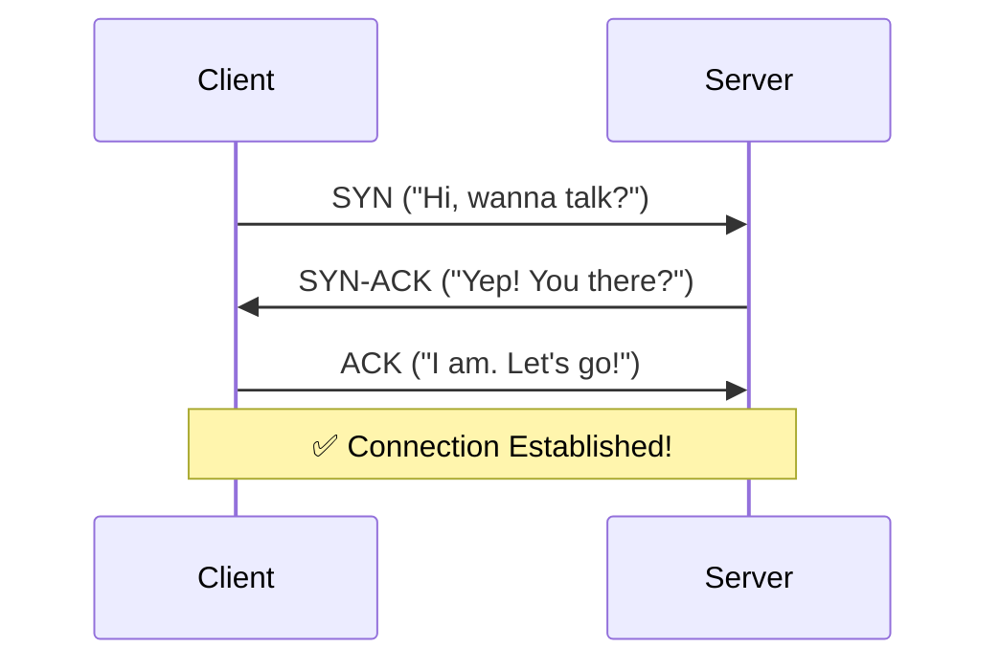
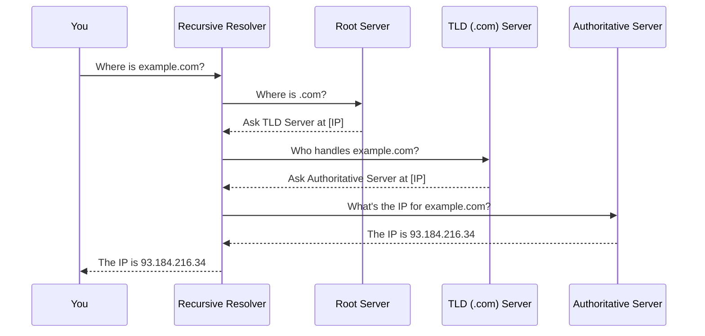

# 📡 Networking Fundamentals: Part 1

---

## 1️⃣ OSI Model (Layers 4–7)

These layers handle the **application-level logic** of network communication.  
📝 Think of it like preparing and managing a letter before it's sent.

### 🔹 Layer 7: Application Layer
- Provides the user interface for network services.
- This is the application itself (e.g., browser, email client).
- **Protocols**: HTTP, HTTPS, FTP, SMTP, DNS

### 🔹 Layer 6: Presentation Layer
- Translates, encrypts, and compresses data.
- Ensures data is in a usable format for the application.
- **Standards**: TLS/SSL, JPEG, PNG, ASCII

### 🔹 Layer 5: Session Layer
- Establishes, manages, and terminates conversations (sessions) between applications.
- **Protocols**: NetBIOS (rare now, often handled by TCP)

### 🔹 Layer 4: Transport Layer
- Provides **reliable or unreliable data transfer**.
- Breaks data into manageable segments.
- **Protocols**: TCP, UDP

---

## 📦 Encapsulation Example: Visiting a Website

When making a request, data is **wrapped** by each layer with its own header.

1. **Application**: Creates the HTTP request  
   `GET /index.html`
2. **Presentation**: Encrypts the request via **TLS**
3. **Transport**: Adds TCP header with source/destination ports (e.g., `443` for HTTPS)  
   → Final package is a **TCP Segment**

---

## 2️⃣ TCP/IP Core Concepts

### 🔁 TCP and the 3-Way Handshake

**TCP** is a reliable, connection-oriented protocol.  
Before data transfer, it establishes a connection:

#### ☎️ Analogy: A Polite Phone Call
1. Client → Server: **SYN** ("Hello, can you hear me?")
2. Server → Client: **SYN-ACK** ("Yes, I can. Can you hear me?")
3. Client → Server: **ACK** ("Yes. Let's talk.")



---

### ✅ How TCP Ensures Reliability

- **Sequence Numbers & ACKs**: Segments are numbered. Receiver confirms receipt.
- **Retransmissions**: If ACK not received, data is re-sent.
- **Sliding Window**: Sends multiple packets before requiring ACKs → improves speed.

---

### ⚔️ TCP vs UDP Comparison

| Feature       | TCP (Transmission Control Protocol) | UDP (User Datagram Protocol)       |
|---------------|-------------------------------------|-------------------------------------|
| **Analogy**   | Registered phone call               | Postcard / Live broadcast           |
| **Connection**| Connection-oriented (handshake)     | Connectionless (no handshake)       |
| **Reliability**| High (guaranteed delivery & order) | Low ("best effort" delivery)        |
| **Speed**     | Slower (reliability overhead)       | Faster (minimal overhead)           |
| **Use Cases** | Web browsing, email, file transfer  | Streaming, gaming, DNS, VoIP        |

---


## 📡 Networking Fundamentals: Part 2

---

## 2️⃣ TCP/IP Core Concepts (Continued)

### 🔢 What is a Port?

A **port** is a number from `0–65535` that identifies a specific application or service on a device.  
It allows a single IP address to support **multiple services or connections** simultaneously.

#### 🏠 Analogy:
- **IP address** = Apartment building address  
- **Port** = Apartment number  
- To reach the correct resident (application), you need both the address and apartment number.

#### 📦 Example:
- HTTPS → `[Server IP]:443`  
- SMTP (email) → `[Server IP]:25`

---

### 🧭 Port Ranges

| Range              | Name              | Purpose                                      | Examples                   |
|--------------------|-------------------|----------------------------------------------|----------------------------|
| `0–1023`           | Well-Known Ports  | Common services & protocols                  | 80 (HTTP), 443 (HTTPS)     |
| `1024–49151`       | Registered Ports  | Assigned to user processes/applications      | 3306 (MySQL), 5432 (Postgres) |
| `49152–65535`      | Ephemeral Ports   | Temporarily assigned by OS for client use    | Dynamic connection ports   |

---

## 3️⃣ HTTP/HTTPS & REST

### 🌐 What is HTTP?

**HTTP** (HyperText Transfer Protocol) is a **text-based, stateless request-response** protocol.  
It is the **language of communication between web browsers and servers**.

---

### 📤 Example HTTP Request

A typical client request contains 3 parts:

```
GET /path/to/resource.html HTTP/1.1      <-- 1. Start-Line (Method, Target, Version)
Host: example.com                        <-- 2. Headers (Metadata)
User-Agent: Firefox/90.0

                                          <-- 3. Body (Empty in GET request)
```

---

### 📥 Example HTTP Response

A typical server response also contains 3 parts:

```
HTTP/1.1 200 OK                          <-- 1. Status-Line (Version, Code, Reason)
Content-Type: text/html                 <-- 2. Headers
Content-Length: 1270

<!DOCTYPE html>                         <-- 3. Body (e.g., HTML content)
<html>
...
</html>
```

---

### 🔨 Common HTTP Methods

HTTP methods act as **verbs** for resource operations and map closely to **CRUD** operations.

| Method  | CRUD Equivalent | Description                                 | Example Use Case                           |
|---------|------------------|---------------------------------------------|--------------------------------------------|
| GET     | Read             | Retrieve a resource                         | View a blog post or fetch a profile        |
| POST    | Create           | Submit new data                             | Submit a form or add a comment             |
| PUT     | Update           | Update an existing resource completely      | Edit an entire user profile                |
| DELETE  | Delete           | Remove a resource                           | Delete a post or remove a photo            |

---

### 📈 HTTP Status Codes (Quick Recap)

- `200 OK` – Success
- `404 Not Found` – Resource doesn't exist
- `500 Internal Server Error` – Something went wrong on the server

✅ These codes help the browser/app understand how to handle the response.

---


## 🔒 Networking Fundamentals: Part 3

---

## 3️⃣ HTTP/HTTPS & REST (Continued)

---

### 🚦 HTTP Status Codes

HTTP status codes are 3-digit numbers sent by the server to indicate the result of a request. They are grouped into categories:

| Code Range | Meaning             | Example Codes and Descriptions                            |
|------------|---------------------|-------------------------------------------------------------|
| `2xx`      | ✅ Success           | `200 OK` – GET request successful  <br> `201 Created` – Resource created (POST) |
| `3xx`      | 🔁 Redirection       | `301 Moved Permanently` – URL has changed permanently       |
| `4xx`      | ❌ Client Error      | `404 Not Found` – Resource doesn’t exist  <br> `403 Forbidden` – Access denied <br> `401 Unauthorized` – Login required |
| `5xx`      | 💥 Server Error      | `500 Internal Server Error` – Something went wrong on server |

---

### 📨 Common HTTP Headers

Headers are key-value pairs in HTTP requests/responses that carry metadata.

#### 📤 Request Headers (from Client)
- `Host`: Domain (e.g., `example.com`)
- `User-Agent`: Browser and OS info (e.g., `Firefox/90.0`)
- `Accept`: Expected response format (e.g., `application/json`)
- `Authorization`: Carries credentials (e.g., Bearer token or API key)

#### 📥 Response Headers (from Server)
- `Content-Type`: Format of response body (e.g., `text/html`)
- `Cache-Control`: Browser caching policy (e.g., `max-age=3600`)
- `Set-Cookie`: Sends a cookie to be stored by the browser

---

### 🔄 REST Principles

**REST (REpresentational State Transfer)** is an architecture style for designing APIs.

#### 🔑 Key REST Principles:
- **Client-Server**: UI and backend are separated
- **Stateless**: Each request contains all necessary information. No sessions stored on server
- **Uniform Interface**:
  - **Resources are Nouns**: Identified by URLs, e.g., `/users/42`
  - **HTTP Methods are Verbs**:  
    - `GET`: Fetch resources  
    - `POST`: Create new resources  
    - `PUT`: Update existing resources  
    - `DELETE`: Remove resources  

---

### 🔐 What is HTTPS?

**HTTPS** = **HTTP over TLS (Transport Layer Security)**. It adds security to normal HTTP.

#### 📦 Analogy:
HTTP is a **postcard** (readable by anyone).  
HTTPS is the same **postcard inside a locked, tamper-proof box**.

#### 🛡️ TLS Provides:
- **Encryption**: Prevents eavesdropping
- **Authentication**: Server proves its identity with a certificate
- **Integrity**: Ensures data hasn’t been tampered with

---

### 🤝 TLS Handshake (Simplified)

Happens **after TCP connection** but **before HTTP exchange**:

1. Client: “Hey server, let’s use encryption. Here are my supported algorithms.”
2. Server: “Cool. Let’s use this algorithm. Here’s my certificate.”
3. Client: “I trust your cert. Let’s agree on a secret key.”
4. Both: Generate a **shared secret**, use it to encrypt all future messages.

---

🎉 By now, you've:
- Built the message (HTTP)
- Sent it reliably (TCP)
- Secured it (TLS/HTTPS)

You’re ready for the **end-to-end flow**!


# 🌐 Networking Fundamentals: Part 4

---

## 4️⃣ DNS Resolution Process

---

### 📖 What is DNS?

**DNS (Domain Name System)** is the *"phonebook of the internet."*

Its job: Translate human-friendly domain names (like `example.com`) into machine-friendly IP addresses (like `93.184.216.34`).

---

### 🧭 DNS Resolution Journey

When your computer looks up a domain name, it follows this step-by-step process:

1. **Browser/OS Cache**  
   🔍 Your computer checks its local memory for recent DNS lookups.

2. **Recursive Resolver (Typically your ISP's)**  
   📦 If not found locally, your system forwards the query to a DNS resolver that performs all remaining steps.

3. **Root Server**  
   🌍 Resolver asks: “Where do I find `.com` TLD info?”

4. **TLD Server**  
   🗂 Resolver asks the `.com` TLD server: “Who handles `example.com`?”

5. **Authoritative Name Server**  
   🧾 Resolver asks: “What’s the IP for `example.com`?”  
   ✅ This server gives the **final answer**.

6. **Response**  
   💡 Resolver returns the IP address to your computer. Now the browser can connect to the web server.

---

### 🧬 DNS Lookup Diagram



---

### 🧾 Common DNS Record Types

| Record Type | Purpose                                | Value Example            | Use Case                            |
|-------------|----------------------------------------|--------------------------|-------------------------------------|
| `A`         | Maps a domain to an **IPv4** address   | `93.184.216.34`          | Finding a website’s server address |
| `AAAA`      | Maps a domain to an **IPv6** address   | `2606:2800:220:1::248`   | Modern IPv6 network routing         |
| `CNAME`     | Alias from one domain to another       | `example.com`            | `www.example.com` → `example.com`  |
| `MX`        | Points to a mail server                | `10 mail.google.com`     | Routing email for the domain       |

---

### 🕒 What is TTL (Time To Live)?

- **Definition**: TTL defines how long a DNS record can be cached before it needs to be refreshed.
- **Analogy**: Like an *expiration date* for each DNS record.

#### ⏳ TTL Trade-offs:
| TTL Type  | Pros                                     | Cons                                     |
|-----------|------------------------------------------|------------------------------------------|
| Long TTL  | Faster response time, less DNS traffic   | DNS changes take longer to propagate     |
| Short TTL | Changes reflect quickly                  | More load on DNS servers                 |

---

🎯 You now understand:
- What DNS is
- How your browser finds a server IP
- Why TTL and record types matter

Next: We bring it all together in an end-to-end walkthrough! 🚀